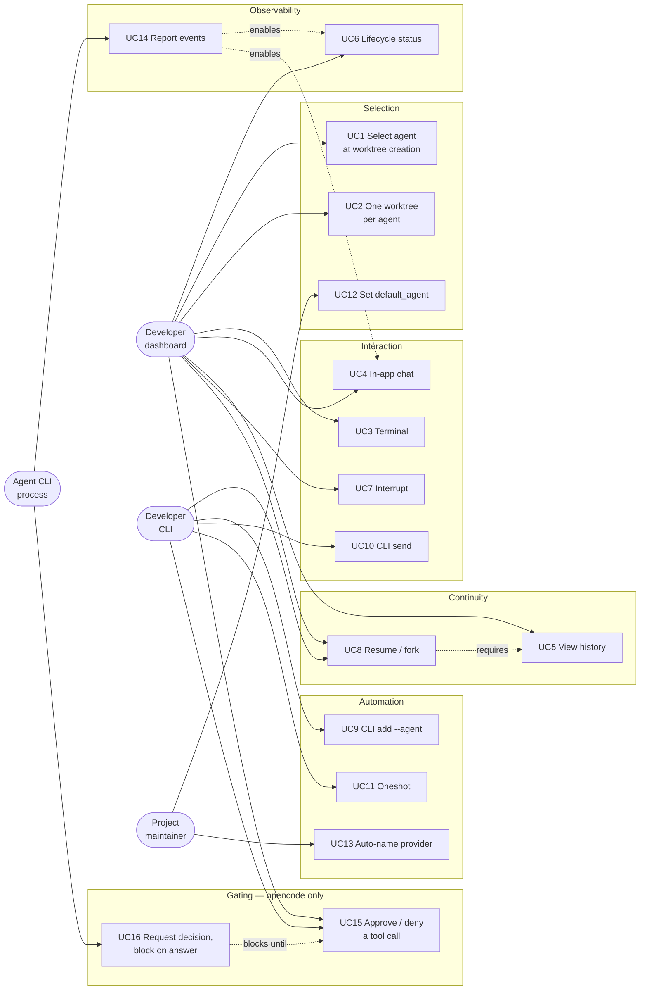
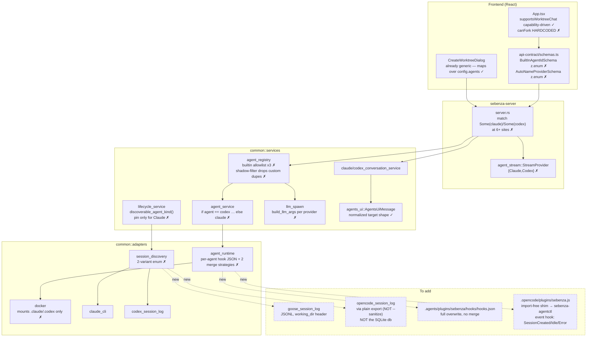
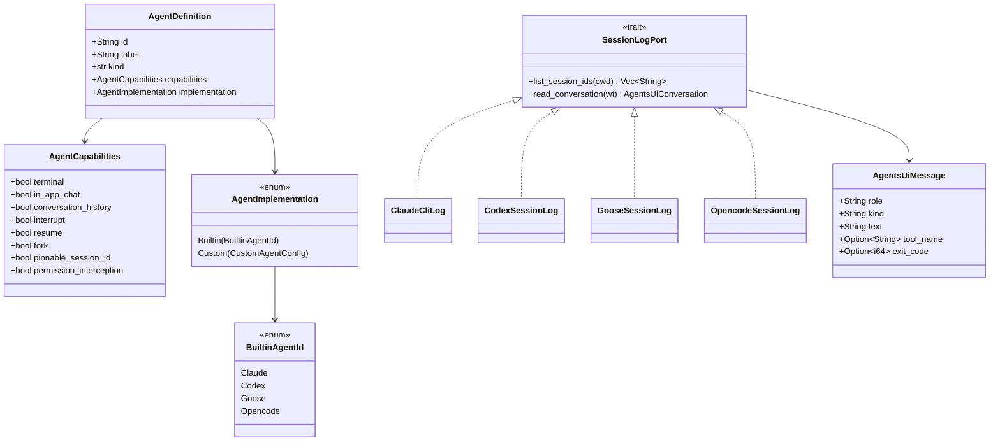
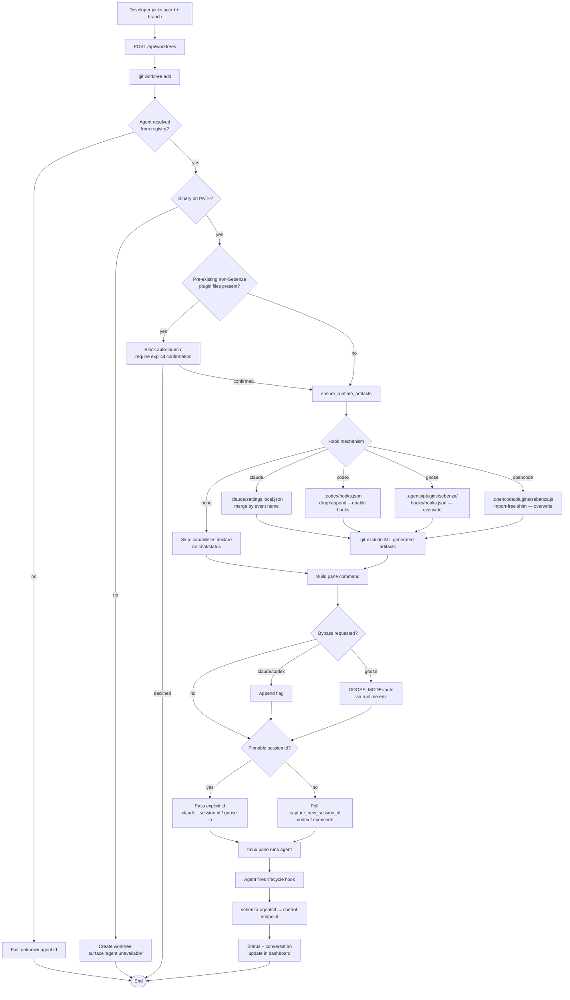
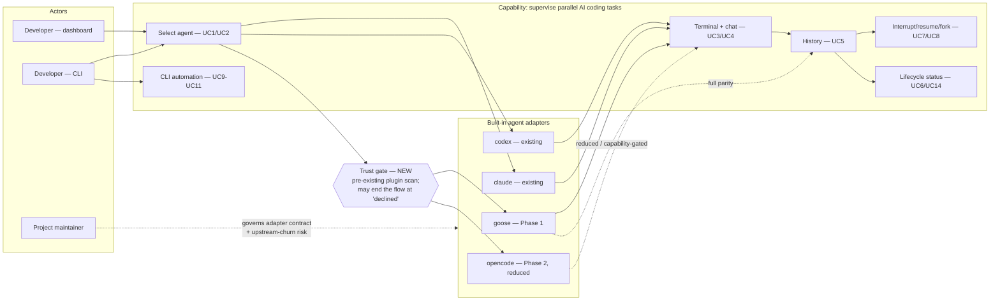
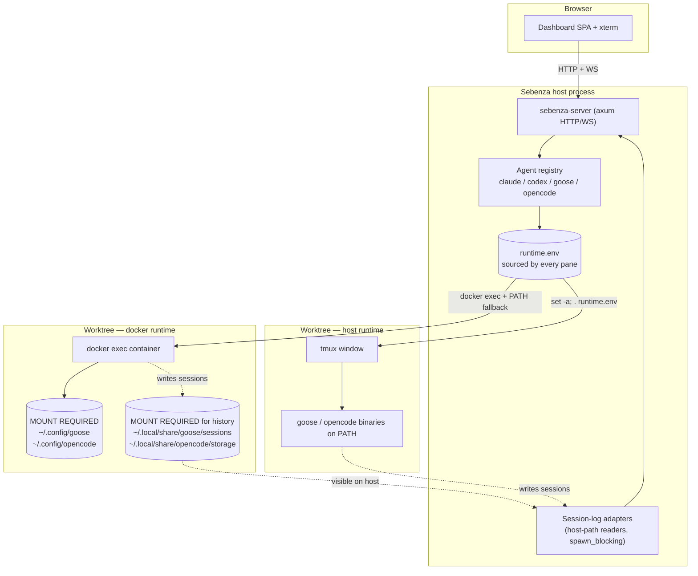
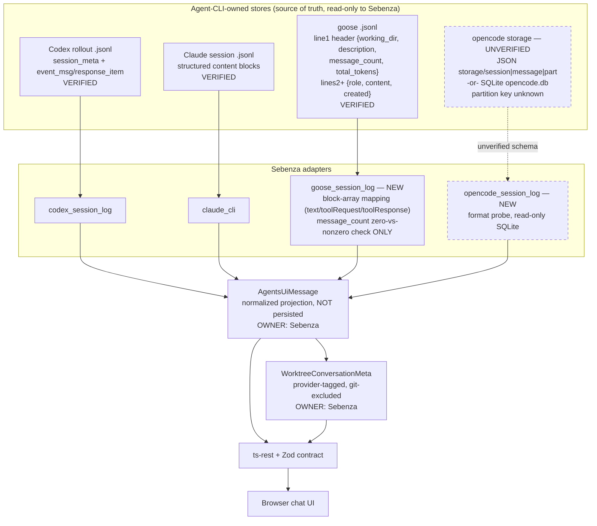
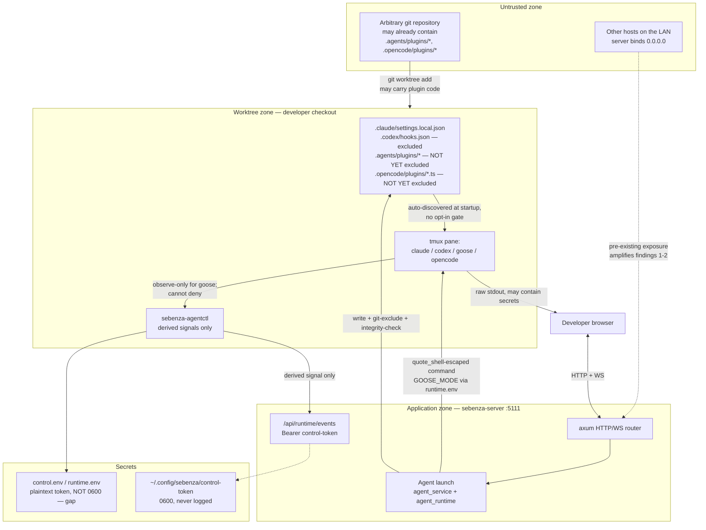

# Design — Embed goose and opencode as first-class agents

**Track:** `goose_opencode_agents_20260727` · **Type:** feature · **Status:** backlog

> ## Scope change — goose deferred
>
> **This track now implements opencode only.** goose was descoped after verification; the follow-up is
> recorded in the repository's `TODO.md`.
>
> **This document is deliberately left intact.** The goose findings below were established by direct
> observation and are the substance of that future track: the Open Plugins hook spec and event list, the
> session JSONL structured-block format, `-n` session pinning, `GOOSE_MODE=auto` semantics and the fact
> that goose hooks **cannot** gate a tool call, and the verified `message_count` under-count constraint
> (19 of 99 real sessions). Deleting them would mean re-doing the research.
>
> Read the goose sections as **research for a deferred track**, and [spec.md](./spec.md) /
> [plan.json](./plan.json) as the authority on what is actually being built. Phase numbering in this
> document predates the descope: the delivered phases are `0` prerequisites → `1` abstraction →
> `2` opencode → `3` permission gating.

## Overview

Sebenza's recorded core goal is **agent-agnostic parallelism** — "Agents are interchangeable…
Adding a new agent should be an adapter, not a fork" ([product.md](../../product.md)). Today that
promise is half-kept. `claude` and `codex` are **built-in** and get the full value stream (terminal,
in-app chat, conversation history, interrupt, resume, fork, lifecycle status). Every other CLI —
including goose and opencode, which `.ai/sebenza.example.yaml` already ships as *custom* agents — is
terminal-only with no chat, no history, no interrupt, and resume only if the user hand-configures a
resume command.

This design makes **goose** (Block / Linux Foundation) and **opencode** genuine peers of
claude/codex: selectable in the Create Worktree dialog and via `sebenza-cli add --agent`, with
capability-appropriate chat, history, status, and resume.

Both agents were **installed locally and verified by direct observation** (goose 1.8.0, opencode
1.18.7). They are asymmetric, but not in the way documentation suggested — opencode turned out to be
the *stronger* integration target on the dimension that matters most for safety.

| | goose 1.8.0 (**verified**) | opencode 1.18.7 (**verified**) |
|---|---|---|
| Hook mechanism | Shell commands via the **Open Plugins** spec; project-scope auto-discovery at `<worktree>/.agents/plugins/<name>/hooks/hooks.json`; no enable flag | **JS/TS plugin loaded in-process** from `.opencode/plugins/`; `~/.config/opencode/` is npm/bun-managed (`package.json`, `bun.lock`, `node_modules/@opencode-ai/plugin`) |
| Events | `SessionStart`, `SessionEnd`, `Stop`, `UserPromptSubmit`, `PreToolUse`, `PostToolUse`, `PostToolUseFailure`, `BeforeReadFile`, `AfterFileEdit`, `BeforeShellExecution`, `AfterShellExecution` | Named hooks `permission.ask`, `tool.execute.before/after`, `tool.definition`, `chat.message/params/headers`, `command.execute.before`, `shell.env`, `experimental.*`, `dispose`, `config`, `auth`, `provider` — **plus a generic `event` hook** carrying the full SDK Event union, incl. `EventSessionCreated`, `EventSessionIdle`, `EventSessionError`, and reasoning/prompt deltas |
| **Can gate a tool call?** | **No** — hooks are observe-only and non-blocking | **YES** — `permission.ask?: (input: Permission, output: { status: "ask" \| "deny" \| "allow" })`. The output is **mutable**, so a plugin can allow or deny. Stronger than goose *and* than codex, whose `PermissionRequest` handler only signals `idle` |
| Session history | `~/.local/share/goose/sessions/<id>.jsonl`; line 1 header `{working_dir, description, message_count, total_tokens, …}`, then `{id, role, content, created}` where **`content` is a structured block array** (`text`, `toolRequest{id,toolCall}`, `toolResponse{id,toolResult{status}}`) — analogous to Claude's content blocks | SQLite `opencode.db`, **`journal_mode = wal`** (concurrent read-only is safe). No JSON `storage/` dir exists in this version. **But direct DB access is unnecessary** — `opencode export <id>` is a stable CLI surface. ⚠ **Use it PLAIN, not `--sanitize`** (corrected 2026-07-28: `--sanitize` redacts text, tool input, output and metadata, making it useless as chat history). `session list` is project-scoped with no directory column |
| Session correlation | Header `working_dir`, exact match | **`session.directory`** — the exact worktree path (verified). `project_id` is **per-repository, NOT per-worktree** (corrected 2026-07-28); `project.worktree` records only the first-seen directory and `project_directory` accumulates siblings. Session rows also carry `parent_id` (fork lineage), `title`, `slug`, `permission`, `agent`, `model` |
| Pinnable session id | **Yes** — `goose session -n NAME` | No pin flag, but **`EventSessionCreated` delivers the id at creation** via the plugin `event` hook → no polling needed either |
| One-shot mode | `goose run -t TEXT --system TEXT --no-session` | `opencode run [message] --format json` (raw JSON events), `--title`, `--agent`, `--model`, `--dir`, `-f/--file` |
| Permission bypass | `GOOSE_MODE=auto` — an **env var, not a flag** | `--auto` — a **flag** ("auto-approve permissions that are not explicitly denied (dangerous!)"), fits the existing append pattern |
| Untrusted-plugin kill switch | None | **`--pure`** — "run without external plugins" (but see Security §2: it would also disable Sebenza's own plugin) |
| Distribution | Native Rust binary | 171 MB **self-contained ELF** — bundles its own JS runtime; no system Bun/Node required for opencode itself |
| Also ships | `goose acp`, `goose web`, `goose session export` | `opencode acp`, `opencode serve`/`attach` (`--hostname` defaults to `127.0.0.1`, auth via `OPENCODE_SERVER_PASSWORD`), `opencode db`, `opencode stats`, `opencode export`/`import` |

**Consequence.** Both agents are now genuinely viable, and the original justification for reducing
opencode's scope — an unverified, mid-migration storage format — **no longer holds**: WAL-mode SQLite
plus a stable `export`/`session list` CLI removes the need to parse anything fragile. opencode is
additionally the only one of the four that can *deny* a tool call from a Sebenza-authored plugin.

The remaining asymmetry is narrower and more practical: goose's hook mechanism is a JSON file invoking
a shell command (a near drop-in for the existing `sebenza-agentctl` pattern), while opencode requires
a generated JS module loaded in-process — a structurally new artifact type for this codebase, and a
larger injection surface. Phasing is therefore still recommended, but on **implementation-shape**
grounds rather than because opencode's capabilities are unknown — **both agents target full parity.**

**Scope note.** Because opencode can genuinely gate a tool call, this track also builds a Sebenza-side
**permission approve/deny flow** for it (UC15/UC16, Application §9, Phase 4). That is the first time
Sebenza can *enforce* a decision rather than observe one, and it is the only substantially new
infrastructure here: a synchronous, authenticated decision channel, since every existing hook path is
fire-and-forget.

## Actors

| Actor | Role |
|---|---|
| **Developer (dashboard)** | Picks an agent at worktree creation; drives it via terminal or in-app chat; watches status |
| **Developer (CLI)** | `sebenza-cli add --agent`, `send`, `oneshot` — the parity surface |
| **Project maintainer** | Configures `default_agent` and custom agents in `.ai/sebenza.yaml` |
| **Agent CLI process** | *(non-human)* goose/opencode in the tmux pane, firing lifecycle hooks back into `sebenza-agentctl` |
| **Existing owner of custom goose/opencode config** | *(impacted party)* Anyone whose `.ai/sebenza.yaml` already defines `agents: { goose: … }` / `{ opencode: … }` — including everyone who started from `.ai/sebenza.example.yaml`. Their customised start/resume command **stops taking effect** when these become builtin |

## Use Cases

| # | Use case | Actor |
|---|---|---|
| UC1 | Select goose/opencode when creating a worktree | Dev (dashboard) |
| UC2 | Create one worktree per agent in multi-agent mode | Dev (dashboard) |
| UC3 | Drive the agent through the embedded terminal | Dev (dashboard) |
| UC4 | Drive the agent through in-app chat | Dev (dashboard) |
| UC5 | View conversation history for a worktree | Dev (dashboard) |
| UC6 | See agent lifecycle status at a glance | Dev (dashboard) |
| UC7 | Interrupt a running agent | Dev (dashboard) |
| UC8 | Resume / fork a previous session | Dev (both) |
| UC9 | `sebenza-cli add --agent goose\|opencode` | Dev (CLI) |
| UC10 | `sebenza-cli send` a prompt to a running agent | Dev (CLI) |
| UC11 | `sebenza-cli oneshot` with goose/opencode | Dev (CLI) |
| UC12 | Set `default_agent` to goose/opencode | Maintainer |
| UC13 | Use goose as the auto-naming LLM provider | Maintainer |
| UC14 | Report lifecycle events back to `sebenza-agentctl` | Agent process |
| UC15 | **Approve or deny an opencode tool call from the dashboard** | Dev (dashboard) |
| UC16 | **Request a permission decision and block on the answer** | Agent process |

**Alternate flows:** agent binary absent → offer but fail clearly; capability unsupported → hide the
UI affordance **and say why**; hook mechanism unavailable → degrade to terminal-only rather than a
dead chat tab; pre-existing untrusted plugin present → block auto-launch pending confirmation.

## Component

Every `✗` marks a site that hardcodes agent identity — collectively, the change surface.

## Class

Three **new** capability flags, now with verified per-agent values:

| Capability | claude | codex | goose | opencode |
|---|---|---|---|---|
| `fork` | ✅ `--fork-session` | ✅ `fork <id>` | ❓ `-n` may only resume (OQ 10) | ✅ `--fork` + `session.parent_id` lineage |
| `pinnable_session_id` | ✅ `--session-id` | ❌ poll | ✅ `-n NAME` | ⚠️ no pin flag, but `EventSessionCreated` returns the id — no poll needed |
| `permission_interception` | ❌ | ❌ (signal only) | ❌ (hooks cannot deny) | ✅ `permission.ask` mutable `status` |

`fork` replaces the hardcoded `canFork` (`App.tsx:230`); `pinnable_session_id` replaces the Claude-only
check at `lifecycle_service.rs:791`. Note `pinnable_session_id` is really answering *"can Sebenza avoid
polling for the id?"* — for which opencode qualifies by a different mechanism than pinning. Consider
naming it accordingly rather than after claude's implementation.

## Activity

---

## Architecture

### Business Architecture

No new business capability is created. The capability — *"supervise many parallel AI coding tasks
from one dashboard, agent of your choice"* — already exists; what changes is its **reach**, from 2
fully-supported agents to 4. This matters because capability-driven UI is a standing product rule
([product-guidelines.md](../../product-guidelines.md), UX principle 3); leaving goose/opencode
permanently degraded is a quiet violation of a commitment the project already made.

**Value.** As an Apache-2.0, self-hosted tool with no billing, value is not revenue. It is
(a) **credible lock-in reduction** — the "no agent vendor lock-in" vision is only believable if the
alternatives to Anthropic/OpenAI-backed tooling get equal treatment; (b) **ecosystem standing** with
the goose and opencode communities; (c) **dogfooding leverage** — a team can pick the agent that fits
a task without losing dashboard features.

**Processes affected.** Worktree creation (UC1–2); interaction/supervision (UC3–8); CLI automation
(UC9–11); and project configuration + dependency onboarding (UC12, `sebenza-cli init`, README).

**Organisational impact.** Git history shows a single active maintainer. Going from 2 to 4 built-in
agents does not double the burden uniformly — goose is close to a drop-in, opencode is not. Bundling
them into one commitment would hide opencode's real cost behind goose's low cost, which is why the
rollout is phased.

**Governance.** "Built-in" implies an unstated support promise: that Sebenza tracks upstream CLI
churn. That promise does not currently exist even for claude/codex. This design recommends
formalising a minimum-supported-version policy per agent rather than leaving it implicit.

**Decisions.** Treat as reach-extension, not a new capability. Phase goose and opencode as separate
go/no-go decisions. Honour capability-driven UI where goose cannot match claude/codex. Extend README
prerequisites and `sebenza-cli init` checks. Establish a per-agent minimum-supported-version policy.

**Phase 2 go/no-go criteria.** With opencode now verified, the gate has narrowed sharply: **Phase 2 is
gated on the four remaining opencode open questions**, of which only #1 (does a linked git worktree get
its own `project` row?) is genuinely blocking. The original gate — an unverified CLI with a churning
storage format — no longer applies.

**Accountability.** With a single active maintainer, the governance items here have no other owner by
default: the minimum-supported-version policy, monitoring upstream hook-spec and storage-format churn,
and clearing the pre-Phase-2 verification backlog all fall to the maintainer unless explicitly
delegated or opened to contributors.

**Risks.** **Existing users lose their custom goose/opencode configuration** *(high / medium)* — every
project started from the example config is affected, there is no automatic migration, and the only
remedy is a durable notice plus the key-rename escape hatch (Data §7). "Built-in" credibility erodes if
opencode breaks on its next storage migration *(medium / high)* → ship opencode capability-gated,
label history/resume provisional. Single-maintainer support load doubles *(high / medium)* → phase the
rollout. Users assume uniform safety guarantees across agents *(medium / medium)* → explicit UI
disclosure, see Security. Licensing/attribution obligations for depending on both CLIs are unverified
*(low / medium)* → verify before release.

### Application Architecture

**1. The abstraction — data-driven enum, not a trait object.** `grep -rn "dyn "` across
`crates/common/src/{services,adapters}` returns **zero matches**: this layer is deliberately free
functions, plain structs, and `match`. Recommendation: promote
`AgentImplementation::Builtin(String)` to `Builtin(BuiltinAgentId)` where `BuiltinAgentId` is a plain
`enum { Claude, Codex, Goose, Opencode }`. **Do not introduce `Box<dyn BuiltinAgent>`.**

The four builtins are known at compile time and are not third-party-extensible — that role is
already filled by `AgentImplementation::Custom`. A single trait would need to span four unrelated
signatures (build a shell string, build hook JSON *or* a TypeScript file, list/capture session ids,
build a one-shot argv); splitting them per concern is just today's `match` blocks with added
ceremony. The payoff of the *enum* over `String` is **exhaustiveness checking**: every
`Some("claude") => …, Some("codex") => …, _ => …` site becomes a compile error when a variant is
added and a site is missed, instead of silently falling through. That is precisely the defect class
this feature risks. A trait object, a plugin registry, or a `HashMap<String, Box<dyn Fn>>` would all
be premature generality — explicitly rejected.

**2. Capability model.** Add `fork`, `pinnable_session_id`, `permission_interception` to
`AgentCapabilities` and `AgentCapabilitiesWire`. These **are wire-visible** — `AgentCapabilitiesWire`
serialises into `AgentDetailsSchema`/`AgentSummarySchema` (`schemas.ts:34-56`), so this is a
coordinated Rust + Zod change in one commit. Because fields are non-optional `z.boolean()`, each new
field needs an explicit `false` in `build_custom_definition` or custom agents fail schema parse. Two
adjacent hardcoded contract enums must widen in the same pass: `BuiltInAgentIdSchema`
(`schemas.ts:22`) and `AutoNameProviderSchema` (`schemas.ts:217`).

**3. Hook artifact generation — simpler than expected.** goose's Open Plugins spec auto-discovers
*per-plugin-named* directories. If Sebenza names its plugin `sebenza`, the whole
`.agents/plugins/sebenza/` subtree is Sebenza-owned by construction — **no merge logic is needed at
all**, just `fs::write` overwrite, unlike `.claude/settings.local.json` and `.codex/hooks.json` which
merge because they are *shared* config files. Same for `.opencode/plugins/sebenza.ts`. So this adds
two writers but **zero** new merge strategies. `opencode_plugin_source()` returns a `String`
(TypeScript), not a `serde_json::Value` — a structurally distinct write path. Generalise
`GENERATED_CODEX_HOOKS_EXCLUDE` into a `&[&str]` list so `ensure_generated_paths_ignored` covers all
generated artifacts.

**4. agentctl subcommands.** The existing 7 agent-prefixed subcommands are thin dispatchers onto
**three generic primitives**: `status-changed --lifecycle {running|idle}`, `agent-stopped`, and
PR-detection via `maybe_send_pr_opened`. Add `goose-*` / `opencode-*` subcommands reusing those
primitives. Do **not** collapse into one generic handler — the real per-agent variation is *which
event maps to which primitive*, which belongs in the Rust hook-settings builders, not moved into the
Python script's argparse. goose's payload (`{event, session_id, tool_name, tool_input, working_dir}`)
is close enough that `maybe_send_pr_opened` may work unmodified — verify against a real session. The
opencode shim must construct that same normalized stdin JSON itself, making **the stdin JSON contract
— not the subcommand names — the true interface**.

**opencode's mapping is now concrete** and lands mostly on the generic `event` hook:

| Sebenza primitive | opencode source *(wire `event.type`, verified 2026-07-28)* |
|---|---|
| session id capture | `session.created` — replaces polling. `run --format json` also echoes `sessionID` on every event |
| `status-changed --lifecycle running` | `tool.execute.before` (named hook), `session.status` |
| `agent-stopped` / idle | **`session.idle`** — fires reliably at end of turn |
| `runtime-error` | `session.error` |
| PR detection | `tool.execute.after` — feed `tool`/args into the existing `maybe_send_pr_opened` |
| permission gate | `permission.ask` — **fires only when the config ruleset evaluates to `ask`, and NOT at all under `--auto`.** Whether its `status` can be driven from a tmux-launched TUI is unconfirmed; see spec *Verified findings* FR-0.2 |

Other observed event types, available on the same generic `event` hook and potentially useful:
`session.updated`, `session.diff` (file-change summary), `message.updated`,
`message.part.updated`/`delta`, `plugin.added`, `catalog.updated`.

The shim also needs **no env var to learn its worktree** — `PluginInput` supplies `directory` and
`worktree` directly, alongside `$`, `client`, `project` and `serverUrl`.

> **There are TWO builtin agent registries, and the design must touch both.**
> `crates/common/src/services/config_view.rs:25-48` defines its own `builtin_agent_summaries()` —
> hardcoded `claude`/`codex`, its own `AgentCapabilities` struct (5 fields), and its own
> `builtin_ids` shadow-filter — and `server.rs:366` serves it via `build_app_config`. **That is what
> populates `config.agents` in the frontend, and therefore what drives the Create Worktree picker.**
> `agent_registry.rs`'s `list_agent_details` is a *different* endpoint (`server.rs:412`). Adding
> agents and capability fields to `agent_registry.rs` alone would leave the picker unchanged.
> **Recommendation: unify the two lists as part of this change** rather than growing a parallel
> hardcoded builtin list a second time — otherwise every future agent must be added in two places
> with two capability structs that can silently drift.

**5. Session/history port.** Both existing `*_conversation_service::read_worktree_conversation`
functions share the identical signature `fn(&WorktreeSnapshot) -> AgentsUiConversationResponse` and
both terminate in `AgentsUiMessage`. Extend that seam: add `DiscoverableAgentKind::{Goose,Opencode}`,
adapters `goose_session_log.rs` / `opencode_session_log.rs`, and matching conversation services.
Then replace **every** string-dispatch site in `server.rs` with one dispatch table keyed on
`BuiltinAgentId`: `refresh_agent_terminal` (1162–63), `agents_conversation` (1233–34, plus the
agent-count-hardcoded 409 message at ~1237), `prepare_agent_send`'s `StreamProvider` selection
(1283–84, backed by `agent_stream::StreamProvider` which also needs new variants and
`run_goose`/`run_opencode`), and `submit_delay_for_branch` (~919–932, which special-cases codex's
200ms delay).

**Route them through the registry, don't just widen the strings.** `submit_delay_for_branch`
(919–933) already resolves `agent_name` → `AgentImplementation` via `get_agent_definition` before
matching — proof the enum approach works at a real call site. But `refresh_agent_terminal`,
`agents_conversation`, and `prepare_agent_send` match `worktree.agent_name.as_deref()` as **raw
strings with no registry lookup**. Each needs an added resolve step first; otherwise an implementer
will simply add `Some("goose") =>` string arms and silently forfeit the exhaustiveness guarantee the
whole recommendation rests on.

> **Latent pre-existing bug, confirmed.** `server.rs:1382` (interrupt) and `~1522` (streaming
> WebSocket) call `claude_conversation_service::read_worktree_conversation` **unconditionally, with
> no agent match**, unlike the paths that do branch. Either codex interrupt/streaming is broken today
> despite `interrupt: true`, or the call is incidentally generic. This predates the feature but would
> propagate silently to two more agents. **Resolve before generalising.**

**6. Frontend.** `CreateWorktreeDialog.tsx` itself needs no change — it iterates `config.agents`
generically and supports multi-agent mode (but see the two-registries note above: its *data source*
does need work). Required changes:

| Site | Change |
|---|---|
| `App.tsx:230` | `canFork` → `agent?.capabilities.fork ?? false` |
| `App.tsx:162-169` | Narrow `supportsWorktreeChat`'s fallback from a hardcoded id list to `false` — **fail closed**, hiding the tab, rather than deleting the fallback outright, since it guards the window before `config.agents` loads |
| `WorktreeConversationPanel.tsx:169-170` | A **third** hardcoded site: `agentName === "claude" ? "Claude" : "Codex"` for the display label, and its own `supportsAgentChat = agentName === "codex" \|\| "claude"` |
| `MobileChatSurface.tsx:90,321` | Dispatches directly on the `WorktreeConversationProvider` wire values (`"codexAppServer"`, `"claudeCode"`) — needs new arms per new provider variant |
| `schemas.ts:22,217,289` | Widen `BuiltInAgentIdSchema`, `AutoNameProviderSchema`, **and `WorktreeConversationProviderSchema`** (plus its two `z.literal` variant schemas at 292, 300) |

**7. Degradation.** Switch the 409 strings in `agents_conversation` and `prepare_agent_send` (which
hardcode *"only available for Claude and Codex worktrees"*) to text generated from which agents
actually declare the capability. When a binary is absent, surface it at creation time — `init.rs:52`
**already probes `goose` and `opencode`**, but nothing downstream acts on it (`init.rs:103-104` only
resolves claude/codex). This feature finishes groundwork that is already half-laid.

**8. CLI/UI parity.** `sebenza-cli add --agent` / `oneshot --agent` already accept an arbitrary id
and forward it to server-side resolution, so parity is largely inherited. Three exceptions:

- `oneshot.rs:564` hardcodes `agent_name == Some("claude")` for history polling → make it a capability.
- **`llm_spawn.rs::build_llm_args`** — a **fourth** dispatch axis, called only from
  `auto_name_service.rs:117` (auto-naming, UC13). goose fits directly via
  `goose run -t … --system … --no-session`; opencode's equivalent is unconfirmed.
- **`init_authoring.rs`** — a **fifth**, separate dispatch axis, not `llm_spawn`. Project-init
  analysis uses `build_init_agent_command()` (165–219) plus `authoring_agent()` (45–51, itself a
  duplicate of `init.rs:105-106`'s claude/codex preference), invoked from `server.rs:1666-69`. It
  builds a materially different argv (`--permission-mode bypassPermissions --output-format
  stream-json --include-partial-messages`) from `llm_spawn`'s. Needs its own `InitAgent` variants.

Also `crates/common/src/config.rs:273-274` (distinct from `domain/config.rs`) holds the YAML-parsing
counterpart match for `auto_name.provider` and needs matching arms.

**9. Permission gating for opencode (UC15/UC16) — needs a new synchronous channel.**

This is in scope by decision, and it is the largest genuinely-new piece of engineering in the track.
Everything Sebenza does today with agent hooks is **fire-and-forget**: `sebenza-agentctl`'s
`send_payload` POSTs to the control endpoint and reads only the HTTP status, **discarding the response
body**. There is no path by which a hook receives an answer.

The existing "ask the user" surface does not help either. `frontend/src/lib/ask-user-question.ts`
(`parseAskUserQuestion`, `formatAskUserQuestionAnswer`) and `AskUserQuestionCard.tsx` operate purely at
**transcript level** — they recognise an `AskUserQuestion` tool call in the conversation text and type an
answer back to the agent. There is no backend counterpart (`grep` for `AskUserQuestion` across `crates/`
returns nothing). Useful as a **visual precedent** for the card; not as plumbing.

What `permission.ask` requires is different in kind: the hook is `async` and mutates `output.status`, so
the plugin **can await** a decision — which means Sebenza must expose a request/response endpoint and
hold the agent's turn open while a human answers.

> ### ⚠ The obvious credential model is broken — split it
>
> **Verified:** `build_control_env_map` (`fs.rs:320-330`) writes `SEBENZA_CONTROL_TOKEN` in plaintext into
> `control.env`, which the agent pane sources — that is precisely how `sebenza-agentctl` authenticates.
> **So the gated opencode process holds the control token.**
>
> If a single shared token authenticates both submitting *and* resolving a permission request, then the
> process being gated can **approve its own request**: it already has the token, and it already knows the
> request id it just created. A prompt-injected tool call, or a tainted binary, calls
> `resolve(request_id, "allow")` and the gate is indistinguishable from a legitimate dashboard click.
> That reduces the control to one that holds only against a *cooperative* agent — i.e. not a security
> boundary against the very threats §1, §2, and §7 of the Security section take seriously.
>
> **Required design: asymmetric credentials.**
> - **Submit** may be authenticated by the existing control token (the pane legitimately needs it).
> - **Resolve** must require a **per-request resolver secret minted server-side and delivered only in the
>   WS push payload and the CLI response** — never written to `control.env`, `runtime.env`, or any file the
>   agent process can read. Alternatively, accept resolutions only over the authenticated WS connection
>   that received the push.
>
> This is the same tamper principle already stated for the untrusted-plugin scan: *state Sebenza uses to
> make a trust decision must not be reachable by the process it is deciding about.* It was not carried
> through to this channel on the first pass.

| Component | Responsibility |
|---|---|
| Generated opencode shim | On `permission.ask`, POST the request (control-token auth) and **await** the verdict via `fetch`; write it into `output.status`; fail **closed** on any failure |
| Submit route | Register a pending request; `.await` a per-request `oneshot::Receiver` — **never** hold a lock across the await; return `allow`/`deny` |
| Resolve route | Accept a verdict **only** with the per-request resolver secret (not the control token); single-use; bound to session + request id |
| Pending-decision store | In-memory, keyed by session + request id. **Mirror `agent_stream.rs`'s `AgentStreamManager`/`RunState`**, which already implements exactly this idiom (a map of ids to senders resolved by a side-channel call — see its `interrupt()`). Do not reinvent it. Not durable across restart, matching `RunState` |
| Event push | Surface the pending request over the existing WS event stream, carrying the resolver secret |
| Dashboard UI | Prompt card modelled on `AskUserQuestionCard`'s **look** (its plumbing is transcript-level and not reusable), wired to the resolve route |
| `sebenza-cli` | Parity per Guiding Principle 8 — list pending requests and answer them |

**Implementation constraints.**
- **Concurrency:** per-request `oneshot` channel in a concurrent map. A coarse mutex held across a
  multi-minute wait would stall unrelated submits and resolutions — a self-inflicted DoS, and a violation
  of the project's own no-blocking-the-async-runtime rule that this design cites for SQLite reads.
- **Cap pending requests** per session and server-wide, with explicit overflow behaviour (auto-deny beyond
  the cap) and an audit event when the cap is hit. Without a cap, a looping tool-call chain can hold many
  blocked handlers for the full timeout window.
- **Server timeout is authoritative.** The shim may keep a longer network backstop, but the server's clock
  decides, so the verdict and the audit record cannot disagree.
- **Every failure mode maps to deny** — timeout, HTTP error, and connection reset from a server restart
  alike. A naive shim might treat "connection reset" differently from an HTTP 408; it must not.
- **Timeout enforcement is independent of WS delivery.** If the push fails, the clock still runs and the
  CLI list/answer path is the designed fallback.
- **`fetch` is available to an import-free shim.** Verified: opencode 1.18.7 bundles Bun, where `fetch`
  and `AbortController` are runtime globals rather than module imports — so the no-imports constraint does
  **not** conflict with the blocking round-trip.

**The fail-safe policy is a real product tension, not a detail.** If the user never answers — browser
closed, gone to lunch, running twelve worktrees in parallel — then:
- **Fail-closed (deny)** is the safe default but silently stalls or breaks unattended work, which is the
  product's entire reason to exist.
- **Fail-open (allow)** preserves throughput but converts a safety feature into a delayed rubber stamp,
  which is worse than not having it.

Recommendation: **fail-closed with an explicit, per-profile timeout**, and make the denial *visible* in
the transcript and worktree status rather than silent — so a stalled worktree is legible as "waiting for
you, then denied" instead of looking like a hung agent. Users who want unattended throughput have
`--auto`, which is the honest way to express that preference.

**Unverified interaction to check:** does `permission.ask` still fire when `--auto` is passed? The flag
auto-approves what is "not explicitly denied", which implies the hook is still consulted — but if it
fires *and* Sebenza gates, `--auto` and gating would conflict. Confirm before wiring both (Open Question
opencode-5).

**Phase separability at the enum boundary.** Rust exhaustiveness means every match site touched when
adding a variant must handle *all* variants. To keep the phases genuinely separate: **Phase 1 adds
only `Goose`** to `BuiltinAgentId`; **Phase 2 adds `Opencode`** as its own compile-error-driven sweep.
Introducing `Opencode` as an all-capabilities-false stub in Phase 1 would quietly make Phase 1 do
Phase 2's work.

**Decisions.** `Builtin(BuiltinAgentId)` enum over trait objects (compile-time exhaustiveness at
every dispatch site), resolved via `get_agent_definition` at each site rather than string-matched.
Unify the two duplicate builtin registries. Three new wire-visible capability flags. Full-overwrite
artifacts for goose/opencode (they own their paths). opencode plugin is a thin shim delegating to the
existing Python `sebenza-agentctl` — never reimplement PR-detection or auth in TypeScript. One enum
variant per phase.

**Risks.** Missing one dispatch site *(medium / high)* → the enum makes it a compile error. opencode
storage format wrong at ship time *(medium / high)* → runtime format probe. Bun/Node absent so the
shim errors on every tool call *(medium / medium)* → probe at artifact-generation time and skip with
a warning rather than writing a shim guaranteed to fail.

### Technical Architecture

**1. New external dependencies.** `init.rs:52` already lists both as optional — the existing
`✓`/`○` pattern needs no new mechanism. README and `tech-stack.md` must name them.

**Resolved: opencode needs no system JS runtime.** The distributed binary is a **171 MB self-contained
ELF executable** (dynamically linked against libc only) that bundles its own JS runtime. No `bun` or
`node` prerequisite for opencode itself, so no informational probe is required for that.

**But there is a real, different dependency.** `~/.config/opencode/` is an **npm/bun-managed package
root** — `package.json` (depending on `@opencode-ai/plugin`), `package-lock.json`, `bun.lock`, and a
populated `node_modules/`; `opencode plugin <module>` installs into it. A plugin that *imports*
`@opencode-ai/plugin` therefore depends on that resolution working. **Mitigation: Sebenza's generated
shim should import nothing** — a plain exported object literal using only the APIs handed to it — which
sidesteps module resolution entirely and keeps the artifact self-contained.

**New finding — the `PATH` probe will likely fail.** opencode installs to **`~/.opencode/bin/`**, not a
conventional directory. It is on the *login-shell* `PATH` via a profile entry, but `sebenza-server`
started from systemd/launchd may not inherit it, so a plain `which("opencode")` can return nothing even
when opencode is installed. Two consequences: `init.rs`'s probe must consider `~/.opencode/bin`
explicitly, and **`DOCKER_PATH_FALLBACK` must add `/root/.opencode/bin`** (it currently lists
`/root/.local/bin`, `/usr/local/bin`, `/root/.bun/bin`, `/root/.cargo/bin`).

**2. Docker runtime — two confirmed gaps.**
- **Credentials.** `docker.rs:123-125` bind-mounts `~/.claude`, `~/.claude.json`, `~/.codex` — and
  nothing else. goose (`~/.config/goose`) and opencode (`~/.config/opencode`) get **no credential
  mount**, so a containerised run has no provider auth. This is a required code change, not a
  hypothetical.
- **History.** Sebenza parses session logs on the **host**, but under docker the agent writes them
  **inside the container**. claude/codex history works under docker *only because* `~/.claude` and
  `~/.codex` are dual-purpose (config *and* session data) and already mounted. goose and opencode
  **separate** config from session storage, so history under docker additionally requires
  `~/.local/share/goose/sessions` and `~/.local/share/opencode/storage` mounts.
  **This does not require a runtime-dependent capability model.** `docker.rs:123-125` mounts the
  claude/codex paths *unconditionally* (unlike the existence-gated `.gitconfig`/`.ssh`/`.config/gh`
  mounts at 137–149). Adding the goose/opencode config **and** session-data mounts the same
  unconditional way restores flat host/docker parity exactly as it already holds for claude/codex, so
  `conversation_history` stays a plain boolean.
- Binary presence in the image remains the user's responsibility, consistent with today's
  bring-your-own-image posture.

**3. Environment propagation.** `built_in_invocation` expresses yolo as a **string flag appended to
the command**. goose has no such flag — `GOOSE_MODE=auto` is an env var, and appending a bogus flag
would be ignored or error. Do **not** invent an inline `VAR=value` prefix. Route it through the
existing `runtime.env` mechanism (already sourced via `set -a; . <path>; set +a` before every agent
invocation, already escaped by `quote_env_value`/`is_safe_env_char`) via a companion
`agent_env_overrides(agent, yolo) -> HashMap<String,String>` merged into `runtime_env_extras`. Guard
the key against `env_passthrough` clobbering, following the `reserved` denylist precedent in
`docker.rs:86-90`.

**opencode needs none of that machinery.** Its bypass is `--auto`, a plain flag, so it fits the existing
string-append pattern in `built_in_invocation` exactly as claude and codex do. Only goose requires the
env route — so `agent_env_overrides()` has exactly one non-empty case today, which is the right size
for it.

**4. Cross-platform.** goose follows XDG on this Linux box, but whether it (a Rust CLI, likely using
the `directories` crate, which diverges to `~/Library/Application Support` on macOS) or opencode (JS,
often forcing `~/.config` everywhere) honours XDG **on macOS is unconfirmed**. Session-log adapters
**must not hardcode a single path** — probe both the XDG and platform-native locations and use
whichever exists. Must be verified on real macOS before release.

**5. Version coupling and operability.** Both CLIs move fast; opencode's storage is mid-migration. A
silently-empty history pane is indistinguishable from "no conversation happened," which violates
workflow.md's "failures surface to the dashboard rather than dying silently." Probe version at
registration (`goose --version` / `goose info`, `opencode --version`), cache it in the instance
registry, and report it next to `init`'s `✓`. In the parser, detect which storage form is present and
surface an explicit **"history unavailable — unsupported version"** state rather than an empty pane.
Document a minimum supported version per agent in `tech-stack.md`.

**6. Performance.** goose should **pin** via `-n` and skip `capture_new_session_id` entirely,
avoiding the 3s worst-case poll (20 × 150ms) codex needs only because it cannot pin. For any
SQLite-backed opencode store: open **read-only** (`mode=ro` / `PRAGMA query_only`), never write, use
a bounded `busy_timeout`, treat `SQLITE_BUSY` as transient, and run it under `spawn_blocking` —
workflow.md forbids blocking I/O on the async runtime.

**7. Build/release.** No change to the frontend-before-backend embedding order; no new `Cargo.toml`
dependency (Sebenza only shells out). Release-note text should spot-check opencode's Apple-Silicon
availability before claiming platform support.

**8. Testing.** Follow the existing pattern, all of which is CI-safe with no real binary present:

- **Command construction** — pure string assertions, extending `agent_service.rs`'s existing test
  table for goose/opencode invocations and the `agent_env_overrides` mapping.
- **Parser fixtures** — `testdata/`, as `claude_cli.rs:526` already does via
  `include_str!("testdata/claude_stream.jsonl")`. A goose JSONL fixture can be captured **now**, and
  must cover: a session with `toolRequest`/`toolResponse` blocks, a 0-byte file, and a session whose
  `message_count` under-counts its lines.
- **Docker mounts** — a pure-function assertion on `build_docker_run_args` output, following
  `docker.rs`'s existing test module (341–354). No Docker daemon needed. This is the regression test
  that protects the history-under-docker fix.
- **opencode SQLite fixture** — **cannot be authored yet**; capture from a real install during
  implementation. An explicit spec-time task, not something to invent from documentation.

**Decisions.** Express yolo through each agent's real mechanism (env for goose via `runtime.env`,
flag for claude/codex). Pin goose session ids rather than polling. Add config **and** session-data
mounts for docker, and add `/root/.opencode/bin` to the docker PATH fallback. Version-probe and degrade to
an explicit state, never silent empty history. Open any SQLite read-only, off the async runtime.

**Risks.** Docker history silently empty without the new mounts *(high / medium)* → add mounts, cover
with a docker-path test. `GOOSE_MODE` swallowed by a flag-only abstraction so yolo never activates
*(high if unfixed / medium)* → env path plus a unit test. macOS path divergence *(medium / medium)* →
probe multiple candidates, verify on real hardware. opencode SQLite lock contention *(medium /
medium)* → read-only + busy timeout + transient handling.

### Data Architecture

**1. Entities and fidelity.** `AgentsUiMessage` carries `{id, turn_id, order, role, kind:
text|thinking|toolUse|toolResult, text, status, created_at, phase, tool_name, tool_call_id, command,
cwd, exit_code, duration_ms}`. The existing adapters populate most of it from rich sources — Codex's
rollout JSONL has explicit `function_call`/`function_call_output` records; Claude's has structured
`content` block arrays.

**goose's format is richer than first assumed — verified against 99 real local sessions.** Each
message line is `{id, role, content, created}`, and **`content` is a structured block array**, not
opaque text:

| goose block | Fields | Maps to |
|---|---|---|
| `text` | `type`, `text` | `kind: "text"` |
| `toolRequest` | `type`, `id`, `toolCall` | `kind: "toolUse"`, `tool_call_id` ← `id`, `tool_name`/`command` ← `toolCall` |
| `toolResponse` | `type`, `id`, `toolResult` | `kind: "toolResult"`, correlated by `id`, `status` ← `toolResult.status` |

This is directly analogous to Claude's content blocks, so **goose history can target full tool-call
fidelity in Phase 1** — collapsible tool cards, status badges, request/response correlation by `id` —
using the same block-mapping approach as `claude_cli.rs`. No text-only fallback is needed, and no
Codex-style string-scraping for exit codes.

The line-1 header remains **a new entity kind** (a session summary, not a message) with no existing
analogue; it carries more than the four documented fields (also `schedule_id`, token counters,
`extension_data`, `recipe`) — harmless, but parsers must ignore unknown keys. New adapters must also
decide what populates `phase`, which the Codex adapter uses for dedup.

**2. Ownership.** The agent CLI is sole owner of its session data; Sebenza is a strictly read-only
downstream consumer with **no schema control and no migration path**. Both existing parsers already
skip-and-continue on unparseable lines (`let Ok(record) = … else { continue }`); the new parsers must
do the same — never `unwrap()`/`expect()`. goose's observed **0-byte `.jsonl`** is a concrete
instance: "file exists, no content" is a legitimate state, not an error.

**3. Identity and correlation.** goose is better-positioned than claude/codex: `goose session -n
NAME` pins the id deterministically at creation, so `capture_new_session_id` polling is unnecessary,
and the header `working_dir` becomes an **integrity check** rather than the lookup key. Correlation
must use **exact string equality**, never prefix matching — `/repo/wt-1` vs `/repo/wt-10` would
collide. > **⚠ CORRECTED 2026-07-28 by phase-0-task-1 — the claim below was wrong.**
>
> This section originally asserted that each Sebenza worktree becomes its own opencode project, so
> repo-level commingling "does not occur." **Direct experiment disproved it.** Two linked worktrees of one
> throwaway repo produced sessions under a **single shared `project_id`**; `project.worktree` recorded only
> the first-seen directory, and `project_directory` accumulated all three sibling paths. The feared
> commingling **does** occur at the project level.
>
> **`project_id` must never be used as a per-worktree key.** Correlation instead uses
> `session.directory` — verified to be the exact worktree path, and exposed over the CLI as
> `opencode export <id>` → `info.directory`. Note also that `opencode session list` is **project-scoped
> with no directory column**, so it cannot correlate on its own.
>
> The practical design is therefore **record-what-we-started**: capture the session id at launch
> (`run --format json` echoes `sessionID` on every event; `EventSessionCreated` does the same
> interactively) and persist it in `WorktreeConversationMeta`. Discovery-by-directory still works but
> costs one `export` per candidate, so it is an orphan-adoption fallback, not the hot path.
> See [spec.md](./spec.md) → *Verified findings* and the revised FR-3.5/FR-3.6.

opencode does not need polling: **`EventSessionCreated`** arrives via the plugin `event` hook, so the
generated shim can report the new session id to Sebenza the moment it exists — and `run --format json`
echoes it synchronously for one-shot runs. Combined with goose's `-n` pinning,
**`capture_new_session_id` remains necessary only for codex.**

**4. opencode storage — read through the CLI, not the database.** Verified on 1.18.7: storage is a
single SQLite `opencode.db` with `journal_mode = wal` (so concurrent read-only access is safe), and the
JSON `storage/` layout no longer exists. Tables include `session`, `message`, `part`, `project`,
`project_directory`, `permission`, `event`, `workspace`.

**But Sebenza should not read the database at all.** Two stable CLI surfaces exist and are strictly
preferable:

- **`opencode session list`** — enumeration, no schema coupling.
- **`opencode export <id>`** — full session as JSON. Use it **plain**.
  ⚠ **Corrected 2026-07-28:** an earlier draft here claimed `--sanitize` was "a materially better answer to
  the secrets-adjacency problem than anything Sebenza could implement itself." That is **wrong for this use
  case.** Verified: `--sanitize` redacts message text, tool input, tool output *and* metadata, yielding
  `[redacted:…]` placeholders. It is a transcript-**sharing** feature. **opencode therefore provides no
  usable redaction for Sebenza's read path**, and the secrets-adjacency risk stands unmitigated — the same
  position as claude and codex, not better.

Parsing `opencode.db` directly would couple Sebenza to an undocumented, fast-moving internal schema
for no benefit. Use the CLI; treat direct DB access as a rejected alternative. If a future need forces
it, WAL mode makes read-only access viable.

**Retained caution:** `opencode export`'s JSON shape is itself a contract that could change, so the
parser must still tolerate unknown fields, and a version probe should still gate the capability.

**5. Classification.** No PHI and no end-user PII — this is a developer tool. But session logs are a
**secrets-adjacent surface**: they capture full shell commands and their output, which routinely
include `cat .env`, curl calls with bearer headers, and printed env dumps. Neither existing adapter
redacts (they *truncate* for size — 12000 chars Codex, 2000 Claude — which is not scrubbing). Adding
two agents widens the number of sources this applies to; it does not change the kind of exposure.

| Data element | Sensitivity | Where it lives | Owner | Handling rule |
|---|---|---|---|---|
| Raw agent session log | Confidential (may contain secrets) | `~/.local/share/{goose,opencode}`, `~/.claude`, `~/.codex` | Agent CLI | Read-only; never copy into the worktree; parse-on-demand, no second on-disk copy |
| goose session header | Internal | Line 1 of the `.jsonl` | Agent CLI | `message_count` as parse-integrity check; `working_dir` as exact-match correlation |
| Prompts / assistant text | Internal (proprietary code) | Session log → `AgentsUiMessage.text` | Agent CLI / Sebenza projection | Rendered to the authenticated browser only; no third-party egress |
| Shell command + stdout/stderr | **Potentially secret** | Session log → `AgentsUiMessage.command`/`text` | Agent CLI | No redaction exists today; accepted pre-existing risk that widens. Do not add persistent server-side caching |
| Control token | Secret | `~/.config/sebenza/control-token` (0600) | Sebenza | Never logged; hooks must never echo it into a command the agent then logs verbatim |
| `WorktreeConversationMeta` | Internal (paths reveal usernames) | `.sebenza/`, `~/.ai/sebenza/` | Sebenza | Git-excluded; on-disk contract |
| Generated artifacts (hook configs, plugin shims, `sebenza-agentctl`) | Internal/operational | Inside the worktree | Sebenza | Idempotent writes; **must stay git-excluded**; cleaned up on worktree removal |

**6. Retention.** Sebenza cannot and should not own retention of agent-owned logs. opencode's
reported unbounded-growth issue is upstream; Sebenza's obligation is to **not compound it** — keep
parse-on-demand with no server-side persistent history cache, and never spin up throwaway sessions to
poll. What Sebenza *does* own — hook configs, plugin shims, `sebenza-agentctl` — must be written
idempotently, git-excluded, and cleaned up via the existing `pre_remove` lifecycle hook.

**7. Config schema evolution.**
- `WorkspaceConfig.default_agent` is already a free `String` — backward-compatible by construction;
  only the doc comment and the validation/enumeration site change.
- **`ProjectConfig.agents` is the real migration hazard.** `.ai/sebenza.example.yaml:26-42` ships
  `goose` and `opencode` as custom agents *today*, and `agent_registry.rs:73,77` **filters out custom
  entries whose id shadows a builtin**. Making them builtin therefore **silently discards existing
  user config**. Per decision: **builtin wins, and `example.yaml` drops both entries** — but the
  override must be **reported loudly**, never silent. A compatibility test must load the current
  example config.
- `AutoNameProvider` gaining `Goose`/`Opencode` is additive for readers of *old* data but **one-way**:
  an older Sebenza binary cannot deserialise a config written with `provider: goose`. State this in
  release notes rather than calling it "backward compatible" unqualified.
- `WorktreeConversationProvider` / `WorktreeConversationMeta` (`model.rs`) is the tagged enum this
  actually lands on (`codexAppServer`/`claudeCode` today). Extension is additive, and the
  `conversation_session_id()` match is a compile-time forcing function. Don't assume the new variants
  mirror Claude's shape — opencode may need an extra `project_id` correlation field.
- Wire contract: new provider tags and capability flags need matching additive Zod entries plus an
  `api.ts` wrapper.

**8. Quality.** "Good" means: non-empty messages whenever the session has content, and a way to
**distinguish "no conversation yet" from "parser produced nothing."** goose's header provides this —
but **only as a zero-vs-nonzero check, never an exact-count comparison.**

> **Verified constraint.** Across 99 real local goose sessions, **19 have `message_count` strictly
> less than the actual message-line count** (offsets of +1, +2, +4), including sessions with clean
> user/assistant alternation and no parse errors — goose appears to append messages (e.g. after an
> interruption) without updating the header. Exact-match validation would therefore misclassify
> roughly **one in five legitimate sessions** as "history unavailable." Root cause unconfirmed.

So: `message_count > 0` with **zero** parsed messages is a parser-bug signal → surface "history
unavailable". `message_count == 0`, or a 0-byte file, is legitimately empty. Any other relationship
between the two numbers carries no signal and must not be treated as an error. No equivalent
integrity check is known for opencode until its schema is inspected.

**Decisions.** Pin goose ids via `-n <worktree_id>`, header `working_dir` as exact-match integrity
check. Map goose's `content` block array to full `AgentsUiMessage` tool fidelity in Phase 1.
`message_count` used **only** zero-vs-nonzero. opencode version-probed and best-effort with read-only
SQLite access. Parse-on-demand, no persistent history cache. Builtin wins over shadowed custom
config, reported **durably** (see below), `example.yaml` updated. Extend
`WorktreeConversationProvider` additively without assuming field parity.

**The override notice needs a durable sink.** "Reported loudly" is insufficient if it is only a
transient startup log line — a user who misses it at upgrade time has no way to later discover why
their custom `goose`/`opencode` command stopped applying. Route it through the same persisted
runtime-events store the Security section proposes, as a `shadowed_custom_agent_detected` event.
**Escape hatch to document explicitly:** because `ProjectConfig.agents` is a `HashMap` keyed by an
arbitrary string, a user who needs a divergent command can simply rename the key (e.g. `goose-custom`)
and keep it as a custom agent alongside the builtin. This should be stated in the notice itself, not
left for users to discover.

**Risks.** opencode partition may be per-repo, commingling worktrees → verify before shipping
resume/fork. Broken parse renders as empty conversation → zero-vs-nonzero `message_count` check.
goose's header carries undocumented extra fields → ignore unknown keys rather than failing.

### Security Architecture

**Scope.** Self-hosted, single-user developer tool. No PHI, no end-user PII, no multi-tenant data.
The real threat model is **local code-execution and supply-chain trust**, not data breach. HIPAA/GDPR
do not apply and are not invoked. The applicable "compliance" surface is the project's own rules in
`workflow.md`: shell construction must be quoted/escaped, the control token must never be logged, and
generated artifacts must stay git-excluded.

**1. Code generation into the repo.** Sebenza already writes `sebenza-agentctl` (chmod 0755) and two
hook configs. This feature changes the *kind* of artifact: a goose `hooks.json` whose `command` is an
executable shell string, and an opencode `.ts` file that opencode **imports and executes in-process
with full Bun capabilities**. Controls:
- **Git-exclude everything generated.** Only `.codex/hooks.json` is excluded today.
  `.agents/plugins/`, `.opencode/plugins/`, and (retroactively) `.claude/settings.local.json` must
  join it. Otherwise `git add -A` ships executable code to teammates and CI, who then execute it
  having never consented to Sebenza.
- **No untrusted interpolation.** Today `cmd()` only ever composes `shell_quote(agentctl)` plus a
  **fixed literal** subcommand — there is no injection surface, and that must hold for goose.
  TypeScript is a *different* escaping problem: never `format!("const b = \"{branch}\";")`. Prefer a
  **byte-identical static** `.ts` file with per-worktree data passed via the existing `SEBENZA_*`
  env vars, eliminating the interpolation surface rather than escaping it. If a literal is
  unavoidable, encode via `serde_json::to_string`.
- **Plugin directory name must be a Sebenza-owned constant** (`sebenza`), never derived from a
  profile/agent name, or a crafted name could traverse out of `.agents/plugins/`. Apply the existing
  traversal guard pattern from `fs.rs`.
- **Integrity check before launch.** Content is deterministic, so hash/diff the Sebenza-owned
  artifact; on mismatch warn and log rather than silently relaunching code something else modified.

**2. Auto-discovery blast radius — the highest-severity new exposure.** goose auto-discovers
project-scope plugins with **no opt-in flag**; opencode auto-loads `.opencode/plugins/*.ts`. Sebenza's
entire purpose is creating worktrees of **arbitrary user-selected repositories** (forks, PR branches,
unvetted code) and **auto-launching an agent pane**. That turns "clone a repo and look at it" into
"clone a repo and it runs embedded code" — no LLM turn, no tool call, no prompt required. This is
worse than the claude/codex posture: Claude Code has its own project-trust gating for committed
hooks; goose has none.

**Control (per decision): scan and require confirmation.** Before launching goose/opencode, scan for
pre-existing `.agents/plugins/**/hooks/hooks.json` and `.opencode/plugins/**/*.{ts,js,mjs}` that
Sebenza did not write. On detection, **block auto-launch** and require explicit per-repo confirmation
(remembered thereafter), stating plainly that the repository ships agent plugin code that will execute
automatically. Treat user-scope `~/.config/opencode/plugins/` as a separate, machine-global trust
boundary warranting its own one-time warning.

**opencode ships a kill switch: `--pure`** ("run without external plugins"), available on both the root
command and `run`. It is the cleanest possible answer to an untrusted repo — but it is **all-or-nothing**:
it would also disable Sebenza's own generated plugin, taking chat, history correlation, and lifecycle
status with it. Recommended use: offer `--pure` as the **safe fallback when the user declines the
confirmation**, so a worktree on an untrusted repo still gets a working terminal with no plugin
execution at all, rather than either running the repo's code or refusing to launch. goose has no
equivalent, so for goose "declined" means terminal-only with hooks unwritten.

Two details determine whether the scan is a durable control or a one-time speed bump:

- **Compare against what Sebenza *last wrote*, not a freshly recomputed expectation.** Generation is
  deterministic-per-input, not literally static — goose's `hooks.json` bakes in the per-worktree
  `agentctl` absolute path via `cmd()` (`agent_runtime.rs:15-17`). If the check recomputes "what
  Sebenza would generate now," then any future change to the generator (a new hook event, a format
  tweak) makes **every previously-approved worktree mismatch on the next Sebenza upgrade**, training
  users to click through reflexively. Persist a hash of the bytes actually written, outside the
  worktree (alongside `meta.json` in `<git-common-dir>/.ai/sebenza/`), and compare against that.
  *Optional hardening:* pass the agentctl path via a `SEBENZA_AGENTCTL_PATH` env var instead of baking
  it into the file, which would make the artifacts byte-identical across worktrees and simplify the
  comparison. No such env var exists in `build_control_env_map` today.
- **Store the remembered confirmation at control-token trust tier, never inside the repo.** Under
  `GOOSE_MODE=auto` the agent runs fully unsupervised and Sebenza cannot deny it anything — so if the
  confirmation record (or the audit log) is writable from the worktree, a single run could forge its
  own approval, or its siblings', and permanently silence the scan. **Design principle: any state
  Sebenza uses to make a trust decision about a repo must not be writable by that repo's agent
  process.** This applies equally to the audit events below.

**3. Shell injection.** `quote_shell` and `shell_quote` are byte-identical correct POSIX
single-quote escapes, and every reviewed interpolation point routes through them. New code must reuse
them, not hand-roll. The **new** risk is `GOOSE_MODE=auto` being an env var: there is no precedent
for an inline `VAR=value` command prefix. Route it through `runtime.env` (already audited, already
escaped via `quote_env_value`/`is_safe_env_char`, already sourced with `set -a`), and validate the
value against goose's **closed set** (`auto`, `approve`, `chat`, `smart_approve`) server-side —
eliminating the surface rather than escaping it. Never accept a free-form string here.

**4. Permission-bypass semantics differ dangerously.**

| Agent | Mechanism | What it disables | Sebenza can observe? | Sebenza can **gate**? |
|---|---|---|---|---|
| claude | `--dangerously-skip-permissions` | Claude's own prompts | Yes | No |
| codex | `--yolo` | Codex's approval prompts | Yes — incl. `PermissionRequest` | No — the handler only emits `idle`; approve/deny happens in codex's own PTY UI |
| **goose** | `GOOSE_MODE=auto` (env) | goose's permission inspector, annotations, **and LLM detection — every tool call allowed, no prompt** | Yes, after the fact (hooks still fire) | **No, categorically** — hooks cannot deny, with or without bypass |
| **opencode** | `--auto` (flag) | Auto-approves permissions "not explicitly denied" — so a **deny rule still wins**. ⚠ Verified 2026-07-28: `--auto` also **bypasses `permission.ask` entirely** | Yes — generic `event` hook | **Type-level yes, runtime unconfirmed** — `permission.ask` returns a mutable `status`, but it is ruleset-gated and was not observed firing in `run` mode. Gated behind `phase-3-task-1` |

The critical asymmetry: **even with no bypass, goose hooks cannot intercept a permission request** —
that capability does not exist in the Open Plugins spec. So goose's toggle is not "skip prompts
Sebenza also mediates" (as it effectively is for codex); it is "there was never a Sebenza-mediated
gate, and now goose's own last human checkpoint is gone too." A goose worktree runs **unsupervised by
construction**. This finding is specific to goose and does **not** generalise to opencode.

**opencode is the opposite case, and it is an opportunity.** Because `permission.ask` hands the plugin
a mutable `status`, a Sebenza-authored opencode plugin can genuinely **gate** tool calls — surfacing an
approve/deny prompt in the dashboard and enforcing the answer. No other agent in Sebenza can do this
today: claude and codex bypass flags are unmediated, codex's `PermissionRequest` handler only emits a
lifecycle status, and goose cannot gate at all. This means:
- `permission_interception` is genuinely `true` for opencode and `false` for the other three.
- opencode's `--auto` is **less dangerous** than `GOOSE_MODE=auto`, because it auto-approves only what
  is "not explicitly denied" — a deny rule still wins, and `permission.ask` still fires.
- **Building the gating plugin is in scope** (see Application §9). It is the strongest safety control
  available anywhere in the product: for the first time Sebenza can *enforce* a decision rather than
  merely observe one. Security consequences of taking it on:
  - **Fail-closed on timeout or channel failure.** A gate that fails open is worse than no gate,
    because it advertises protection it does not deliver.
  - **The decision channel is security-critical, and needs asymmetric credentials.** The agent process
    holds the control token (`control.env`), so a shared-token design would let it approve its own
    request. Submit may use the control token; **resolve must require a per-request resolver secret
    delivered only via the WS push / CLI response.** See Application §9 for the full treatment — this is
    a Critical finding, not a detail.
  - **It does not extend to the other three agents.** claude, codex, and goose cannot be gated. The UI
    must not imply otherwise — this is exactly the capability-driven-UI rule, and the asymmetry now runs
    in opencode's favour.

**Control (per decision): offer it, with distinct disclosure.** Never the same label, copy, or UX
weight as the claude/codex yolo checkbox. Use explicit copy — *"full autonomy: no permission prompts
of any kind; Sebenza cannot intercept or deny any action"* — require a confirmation step separate
from the general yolo toggle, re-confirm per project (the property is standing, not point-in-time),
and show a **persistent in-session indicator** on the pane/tab, because the risk is ongoing.

**5. Secrets.** The control token is generated once, stored 0600, never logged, and sent only as a
`Bearer` header — sound, and must not be disturbed. But **`control.env` and `runtime.env` are written
with plain `fs::write` and no mode hardening** (`fs.rs:309-317`; `set_mode_600` exists only in
`control_token.rs:31`), inheriting the umask. The blast radius is wider than just the control token:
`control.env` holds `SEBENZA_CONTROL_TOKEN` in plaintext, **and `runtime.env` merges in
`dotenv_values` from `.env.local`** (`build_runtime_env_map`, `fs.rs:78-96`) — i.e. arbitrary project
secrets, not just `GOOSE_MODE`. Pre-existing, but this feature adds two more consumers and one more
writer. **Hook payload discipline is currently good and must be
preserved:** `sebenza-agentctl.py` reads `tool_input`/`tool_response` only to run a narrow regex or
fixed-string check, and forwards **only derived signals** — never the raw payload. Any goose/opencode
hook or shim must adopt the same discipline; `tool_input` can trivially contain API keys or `.env`
contents. `env_passthrough` is already key-allowlisted and agent-agnostic, but broad passthrough plus
goose auto mode compounds risk and should be documented as such.

**6. Auditing.** Add to the existing runtime-events pipeline, **persisted** (not just
`tracing::info!`) under `<git-common-dir>/.ai/sebenza/` alongside `meta.json` — outside the worktree,
so it cannot be `git add -A`'d and cannot be rewritten by the agent process (see the tamper principle
above):

| Event | Payload |
|---|---|
| `agent_launched` | agent id, bypass mode + value, worktree, branch, timestamp |
| `artifact_written` / `artifact_overwritten` | which file, and whether it overwrote content that did not match the stored hash |
| `untrusted_plugin_detected` | paths found, whether the user proceeded |
| `shadowed_custom_agent_detected` | which custom-agent id was overridden by a builtin (see Data §7) |
| `permission_decision` *(Phase 4)* | request id, verdict, and **resolution source** — browser session / CLI / timeout-deny. Without the source field a self-approval would be undetectable |
| `pending_permission_cap_hit` *(Phase 4)* | session, cap value — makes a request flood visible rather than silently absorbed |

None of these carry secrets: the bypass mode is a closed enum, artifact events log filenames and a
mismatch boolean rather than content, and paths are already classified Internal. That property must be
preserved — never log `tool_input`, command text, or env values into these events.

**7. Supply chain.** Two more third-party CLIs, plus — for opencode — a JS runtime and **in-process
plugin loading that can pull in whatever the plugin imports**, a strictly larger transitive-trust
surface than a shell hook. Follow the existing optional-dependency posture: detect via `which`,
degrade gracefully, and **never auto-install** the binaries or their dependencies without explicit
consent.

#### Threat model (STRIDE)

| Threat | Category | Component | Likelihood | Impact | Mitigation |
|---|---|---|---|---|---|
| Repo ships malicious plugin; auto-executes on agent start | Elevation of Privilege | goose/opencode auto-discovery | Medium | **Critical** | Scan + block + explicit per-repo confirmation |
| Generated artifacts committed and shipped to teammates/CI | Tampering / EoP | Generated artifacts | High (git default) | High | Add all generated paths to `info/exclude` |
| Untrusted string interpolated into generated `.ts` / hook command | Tampering | Artifact generator | Low today, High if added carelessly | High | Fixed literals + `shell_quote`; static `.ts` + env vars; JSON-encode any literal |
| `GOOSE_MODE` injected via ad hoc inline `VAR=value` prefix | Tampering | Pane-command construction | Low if guidance followed | Medium | Route via `runtime.env`; closed-enum validation |
| `GOOSE_MODE=auto` disables all gating; Sebenza cannot deny | EoP / Repudiation | goose runtime | High when opted into | **Critical** | Distinct disclosure, separate confirmation, persistent indicator |
| `control.env`/`runtime.env` not 0600; leaks control token | Information Disclosure | `fs.rs` writers | Medium | High | Apply `set_mode_600` as done for the token file |
| Hook code forwards raw `tool_input` to control endpoint or UI | Information Disclosure | New hooks/shim | Low if pattern followed | High | Preserve derived-signal-only discipline |
| Server binds `0.0.0.0`; dashboard/PTY reachable from LAN | Spoofing / EoP | `main.rs:82` | Medium (shared network) | **Critical** | Pre-existing; bind `127.0.0.1` by default and/or authenticate all routes |
| Agent echoes a secret to stdout | Information Disclosure | PTY → browser WS | Medium | Medium | Inherent to a terminal bridge; residual |
| No integrity check between artifact writes | Tampering | Generated artifacts | Low-Medium | Medium | Hash/diff before launch; log mismatch |

#### Findings by severity

**Critical**
0. **The permission-gate channel must not share one credential with the gated process** *(Phase 4)*. The
   agent holds `SEBENZA_CONTROL_TOKEN` via `control.env` (`fs.rs:320-330`), so a shared-token design lets
   it approve its own request — reducing the gate to protection only against a cooperative agent. *Fix:*
   asymmetric credentials (submit = control token; resolve = per-request server-minted secret delivered
   only over WS/CLI), plus a `permission_decision` audit event recording resolution source.
1. **`GOOSE_MODE=auto` has no gate at all** — not Sebenza's, and (in auto mode) not goose's. Offering
   it with claude/codex's UX weight would materially mislead users. *Fix:* distinct disclosure,
   separate confirmation, persistent indicator.
2. **Auto-execution of pre-existing plugin code in arbitrary repos** the moment a pane starts.
   *Fix:* scan, block, require explicit confirmation.
3. **Generated executable artifacts not git-excluded** (`.agents/plugins/`, `.opencode/plugins/`) —
   if committed, ships executable code to every teammate and CI runner. *Fix:* extend `info/exclude`
   before shipping.

**High**
4. **`control.env`/`runtime.env` not chmod 0600** while the token file is — and `runtime.env` carries
   `.env.local` project secrets, not just the control token. *Fix:* apply `set_mode_600` to both.
5. **Server binds `0.0.0.0` and only ONE route is authenticated.** Confirmed: `main.rs:82` binds all
   interfaces, and a grep of `server.rs` finds exactly one Bearer check — `/api/runtime/events`
   (1735–36). **Every other route is open to any reachable client**: worktree creation, terminal PTY,
   chat send, interrupt, streaming WebSocket. Pre-existing and cross-cutting, so it is not this
   track's to fix — but it is **not defensible to treat as merely parallel**, because this track
   specifically adds an ungated unsupervised bypass mode (#1) and auto-executing plugin code (#2), and
   LAN-reachability turns both from local-developer risk into anyone-on-the-network risk.
   ***Recommendation: make a loopback-default bind (with explicit opt-in for LAN) a blocking
   prerequisite for shipping `GOOSE_MODE=auto` specifically*** — the rest of Phase 1 need not wait.
   **This scope now extends to Phase 4's two new routes**, whose whole purpose is to grant or deny code
   execution. If the server still binds `0.0.0.0` when Phase 4 ships, any LAN host that obtains the token
   can submit or resolve permission requests for any worktree — strictly more dangerous than the
   `GOOSE_MODE=auto` case, because it subverts the mechanism advertised as enforcement. Bind those two
   routes to loopback unconditionally if the general bind decision is still outstanding.
6. **No integrity check on Sebenza-authored artifacts** between writes. *Fix:* stored-hash comparison
   before launch, per §2.
7. **Sebenza's own trust state and audit log are tamper-exposed** if placed where the agent process
   can write them. *Fix:* store both outside the worktree at control-token trust tier.

**Medium**
8. `GOOSE_MODE` env injection pattern is new — route via `runtime.env`, and enforce the closed-enum
   validation **where `agent_env_overrides()` builds the map**, not merely as a documented rule.
9. No durable audit trail for bypass launches, artifact overwrites, or untrusted-plugin detections.
10. opencode's in-process TS execution is a different injection surface than shell hooks, and is
    **unverified**.

**Low**
11. Supply-chain surface grows by two CLIs plus a JS runtime with its own dependency resolution.

**Decisions.** Reuse existing escaping primitives, never new ones. `GOOSE_MODE` via `runtime.env` with
enforced closed-enum validation. Git-exclude all generated artifacts, retroactively including
`.claude/settings.local.json`. Distinct UI treatment for goose's bypass. Pre-launch scan comparing
against a **stored hash of what Sebenza last wrote**, with the confirmation record and audit log held
outside the worktree at control-token trust tier. Loopback-default bind as a blocking prerequisite for
`GOOSE_MODE=auto`.

---

## Impact Analysis

**Modified — backend (`crates/common`)**

| File | Change |
|---|---|
| `services/agent_registry.rs` | `Builtin(BuiltinAgentId)` enum; 4 builtin definitions; per-agent capabilities; 3 new capability fields; **builtin-wins shadow resolution with a durable override event** |
| `services/config_view.rs` | **Second builtin registry** — `builtin_agent_summaries()` (25–48), its own `AgentCapabilities`, its own shadow filter. Feeds `build_app_config` → `config.agents` → the Create Worktree picker. **Unify with `agent_registry.rs` rather than duplicating again** |
| `services/init_authoring.rs` | Fifth dispatch axis — `InitAgent`, `authoring_agent()` (45–51), `build_init_agent_command()` (165–219) |
| `services/auto_name_service.rs` | Sole caller of `build_llm_args` (117) — goose provider path |
| `config.rs` (crate root, ≠ `domain/config.rs`) | YAML-parsing match for `auto_name.provider` (273–274) |
| `services/agent_service.rs` | Split `built_in_invocation` into per-agent functions dispatched on the enum; goose/opencode invocations; `agent_env_overrides()` for env-based bypass |
| `services/lifecycle_service.rs` | `discoverable_agent_kind()` for 4 agents; replace the Claude-only pin check with `pinnable_session_id` |
| `services/llm_spawn.rs` | goose arm for one-shot auto-naming; `AutoNameProvider` variants |
| `services/{goose,opencode}_conversation_service.rs` | **New** — emit `AgentsUiMessage` |
| `adapters/agent_runtime.rs` | `goose_hook_settings()` (overwrite, no merge); `opencode_plugin_source()` (static TS); generalise git-exclude to a path list; pre-launch untrusted-plugin scan; artifact integrity check |
| `adapters/session_discovery.rs` | Two new `DiscoverableAgentKind` variants |
| `adapters/goose_session_log.rs` | **New** — JSONL parser: block-array mapping, `working_dir` exact match, `message_count` zero-vs-nonzero only |
| `adapters/opencode_session_log.rs` | **New** — shells out to plain `opencode export <id>` (**not** `--sanitize`); **does not touch `opencode.db`**. Maps `text`/`reasoning`/`tool` parts to `AgentsUiMessage`, with `exit_code` from `state.metadata.exit` |
| `adapters/docker.rs` | Mount `~/.config/{goose,opencode}` **and** the session-data dirs (`~/.local/share/goose/sessions`, `~/.local/share/opencode`); add `/root/.opencode/bin` to `DOCKER_PATH_FALLBACK` |
| `adapters/fs.rs` | `set_mode_600` on `control.env`/`runtime.env` |
| `adapters/testdata/sebenza-agentctl.py` | `goose-*` / `opencode-*` subcommands over the 3 existing primitives |
| `domain/config.rs` | `AutoNameProvider` variants; `default_agent` doc comment |
| `domain/model.rs` | `WorktreeConversationProvider` variants |

**Modified — server / CLI / frontend**

| File | Change |
|---|---|
| `sebenza-server/src/server.rs` | Replace 6+ string-dispatch sites with one enum-keyed table; capability-derived 409 messages; **resolve the unconditional `claude_conversation_service` calls at 1382 / ~1522** |
| `sebenza-server/src/services/agent_stream.rs` | `StreamProvider` variants + `run_goose` / `run_opencode` |
| `sebenza-server/src/server.rs` (Phase 4) | **New** submit + resolve routes, loopback-bound; pending-decision store mirroring `agent_stream.rs`'s `RunState` idiom; WS push. **Asymmetric auth** — submit uses the control token, resolve requires a per-request server-minted secret; verdicts single-use |
| `frontend` (Phase 4) | Permission prompt card modelled on `AskUserQuestionCard.tsx`'s look (its plumbing is transcript-level and not reusable); wired to the resolve route |
| `sebenza-cli` (Phase 4) | List and answer pending permission requests — CLI/UI parity |
| `domain/config.rs` (Phase 4) | Per-profile permission-decision timeout |
| `sebenza-cli/src/init.rs` | Act on the goose/opencode probes already at line 52; informational Bun/Node probe; report versions |
| `sebenza-cli/src/oneshot.rs` | Replace the `Some("claude")` history-polling check with a capability |
| `frontend/src/App.tsx` | `canFork` → capability; narrow `supportsWorktreeChat` fallback to fail-closed |
| `frontend/src/lib/WorktreeConversationPanel.tsx` | Third hardcoded site (169–70): display label and its own `supportsAgentChat` id list |
| `frontend/src/lib/MobileChatSurface.tsx` | Dispatches on provider wire values (90, 321) — new arms per provider variant |
| `frontend/src/lib/api-contract/schemas.ts` | Widen `BuiltInAgentIdSchema` (22), `AutoNameProviderSchema` (217), `WorktreeConversationProviderSchema` (289 + literals at 292, 300); add 3 capability fields |
| `.ai/sebenza.example.yaml` | **Remove** the now-builtin goose/opencode custom-agent entries |
| `README.md`, `.ai/sebenza/tech-stack.md` | Prerequisites, minimum supported versions |

**Breaking changes.** Existing `agents: { goose: … }` / `{ opencode: … }` config stops taking effect
(builtin wins) — must be reported loudly, with a compatibility test loading today's example config.
Configs written with `provider: goose` cannot be read by older Sebenza binaries (one-way enum).

**Not in scope.** Authenticating all routes — a separate security track. **But a loopback-default bind
is a blocking prerequisite for shipping `GOOSE_MODE=auto`** (Security High #5); the rest of Phase 1
does not wait on it. Also out of scope: `goose acp` as a deeper integration path; a Rust style guide.

**Phasing.** *(Final order — opencode leads; see `plan.json`.)*
- **Phase 0 — Verification & prerequisites.** The two blocking opencode checks, fixture capture, the
  latent `claude_conversation_service` dispatch investigation, and the loopback-default bind.
- **Phase 1 — Agent abstraction & capability model.** Registry/enum refactor carrying **only** `Claude`
  and `Codex`, unify the two builtin registries, add the three capability fields, route every `server.rs`
  dispatch site through the registry, and replace all four hardcoded frontend identity checks. A **pure
  refactor** — behaviour for the existing agents must be unchanged.
- **Phase 2 — opencode at full parity, plus the shared controls.** `Opencode` enum variant, import-free
  JS shim on the generic `event` hook (`EventSessionCreated` → id capture, `EventSessionIdle` → idle,
  `EventSessionError` → runtime error, `tool.execute.*` → running/PR detection), history via
  plain `opencode export <id>`, `--auto` bypass, `--pure` as the decline-path
  fallback, `~/.opencode/bin` probing. **Carries the shared security and runtime work** — git-exclusion,
  `set_mode_600`, untrusted-plugin scan with stored-hash comparison, audit events, docker config +
  session mounts, shadow resolution — because whichever agent lands first pays for that infrastructure,
  and opencode's in-process JS execution needs it more than a shell hook does.
- **Phase 3 — goose at full parity.** `Goose` variant, invocations with `-n` pinning, hooks JSON,
  JSONL parser with full tool-block fidelity, `GOOSE_MODE` via `runtime.env` with distinct disclosure.
  Inherits Phase 2's shared controls.
- **Phase 4 — permission gating for opencode (UC15/UC16).** In scope for this track, sequenced last
  because it depends on Phase 2's shim and introduces the only new *infrastructure* in the design: a
  synchronous, authenticated decision channel (new control route, pending-decision store, WS push,
  dashboard card, CLI parity), plus a fail-closed timeout policy. See Application §9. Verify the
  `--auto` / `permission.ask` interaction before wiring both.
- **Resolve before either phase:** the unconditional `claude_conversation_service` calls at
  `server.rs:1382` / `~1522` (Open Question 13).

## Open Questions for Refinement

**opencode — resolved by direct verification against v1.18.7 (installed 2026-07-27)**
- ~~Bundles its own JS runtime?~~ **Yes** — 171 MB self-contained ELF. No system Bun/Node needed.
- ~~Can a plugin deny a tool call?~~ **Type-level yes, runtime UNCONFIRMED.** `permission.ask`'s output
  `status` is a mutable `"ask" | "deny" | "allow"` in the shipped plugin types, and no other agent has an
  equivalent. But phase-0-task-2 could not observe the hook firing: `--auto` bypasses it, the default
  ruleset wildcard-allows, and an `ask` rule hangs non-interactive `run`. **Treated as a hard gate
  (`phase-3-task-1`) rather than an established capability.**
- ~~One-shot mode?~~ **Yes** — `opencode run [message] --format json`, plus `--title`, `--agent`,
  `--model`, `--dir`, `-f`.
- ~~Project-id derivation?~~ **Per repository, NOT per worktree** (corrected by phase-0-task-1). All
  worktrees of a repo share one `project_id`. Correlate on `session.directory` /
  `export`→`info.directory` instead; never on `project_id`.
- ~~WAL mode? Stable export path?~~ **`journal_mode = wal`**, and plain `opencode export <id>` makes
  direct DB access unnecessary. **`--sanitize` must NOT be used** — it redacts the message text and tool
  output the chat UI needs (corrected by phase-0-task-3).
- ~~Session id pinnable?~~ No pin flag, but `EventSessionCreated` via the plugin `event` hook returns
  the id at creation — no polling.
- ~~Bypass mechanism?~~ **`--auto`**, a flag. Auto-approves only what is not explicitly denied.
- ~~Plugin dir needs a lockfile / `node_modules`?~~ Only if the plugin **imports** `@opencode-ai/plugin`.
  A shim that imports nothing avoids it. `~/.config/opencode/` is npm/bun-managed.

**opencode — still open**
0. **Does `permission.ask` still fire when `--auto` is passed?** Determines whether bypass and Sebenza-side gating can coexist or are mutually exclusive. Blocks the permission-gating phase. *(phase-0-task-2)*
1. ~~Does opencode resolve a linked git worktree to its own `project` row?~~ **RESOLVED 2026-07-28: no.** Worktrees of one repo share a project; correlate on `session.directory`. See spec *Verified findings*.
2. ~~Does `run --format json` echo the session id synchronously?~~ **RESOLVED: yes** — `sessionID` appears on every emitted event.
3. What is the `opencode export` JSON shape, and how does it map onto `AgentsUiMessage`? Needs a real authenticated session to capture (this install has 0 credentials).
4. Minimum supported opencode version to declare, given 1.18.7 is the verified baseline.

**Resolved during verification — recorded so they are not re-asked**
- ~~Is goose's `content` a plain string or structured blocks?~~ **Structured block array** (`text`,
  `toolRequest{id,toolCall}`, `toolResponse{id,toolResult{status}}`), verified against real local
  sessions. Full tool fidelity is achievable in Phase 1.
- ~~Can `message_count` serve as an integrity check?~~ **Only zero-vs-nonzero.** 19 of 99 real
  sessions under-count; exact matching would misclassify ~1 in 5.
- ~~Does a `runtime_env_extras` injection point exist for `GOOSE_MODE`?~~ **Yes** —
  `worktree_service.rs:32` / `lifecycle_service.rs:510,570` flow into `build_runtime_env_map`, and
  `refresh_managed_artifacts_from_meta` (563–591) rewrites `runtime.env` before every
  `materialize_runtime_session`.
- ~~Does history-under-docker need a runtime-dependent capability model?~~ **No** — docker mounts are
  unconditional, so adding the goose/opencode mounts restores flat boolean parity.

**Verifiable against goose, not yet done**
9. Does `maybe_send_pr_opened` work unmodified against a real goose `PostToolUse` payload?
10. Is `goose session -n NAME` usable as a **fork** primitive (new session branched off existing history), or only resume/rename of the same session? Determines whether `fork` can be `true`.
11. Do goose/opencode honour XDG on macOS, or use `~/Library/Application Support`?
12. What causes `message_count` to drift below the true line count — interrupt handling, retries, or something else? Not blocking, but worth knowing before relying on the header for anything further.

**Codebase questions**
13. Is the unconditional `claude_conversation_service` call in the interrupt (`server.rs:1382`) and streaming (~1522) handlers an intentional codex limitation or a latent bug? **Must be answered before generalising** — no codex branch exists at all in either handler.
14. Should `permission_interception` be wire-visible at all, or stay Rust-internal with no current UI consequence?
15. Should the two duplicate builtin registries (`agent_registry.rs` and `config_view.rs`) be unified in this track, or is that a separate refactor? The design recommends unifying; it does add scope.
16. Should the generated goose `hooks.json` take the `agentctl` path via a new `SEBENZA_AGENTCTL_PATH` env var so artifacts become byte-identical across worktrees, simplifying integrity comparison?

**Product / governance**
17. Does "built-in" imply a support and versioning commitment that doesn't yet exist even for claude/codex — should this design formalise it retroactively?
18. Who monitors upstream hook-spec and storage-format churn post-launch?
19. Licensing/attribution obligations for depending on goose and opencode?
20. Should the untrusted-plugin confirmation be per-repo (remembered) or per-worktree? Remembered is lower friction but weaker; per-worktree is safer but trains click-through.
21. Confirmed as a **recommendation, needs your ratification**: a loopback-default bind gates shipping `GOOSE_MODE=auto`. Accept, or ship the bypass mode with disclosure only?
