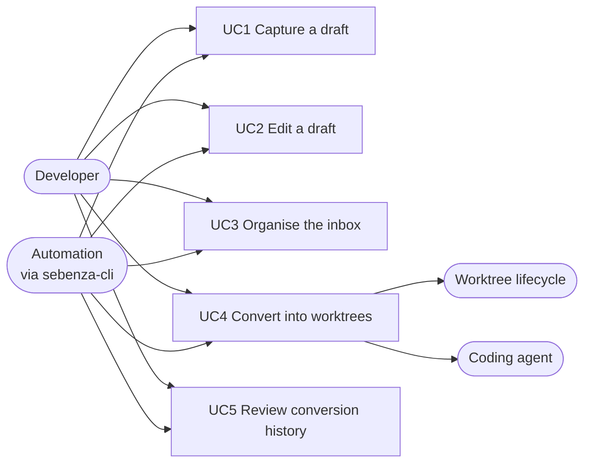
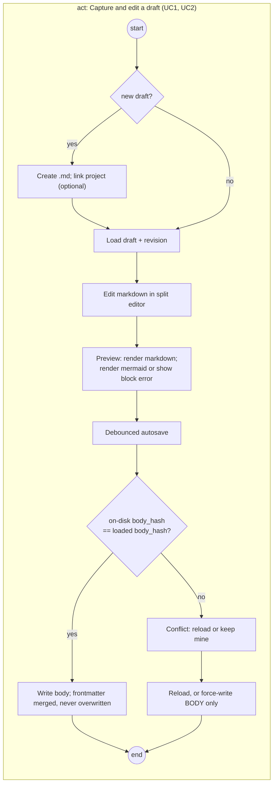
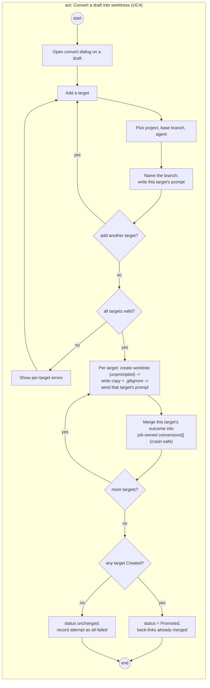
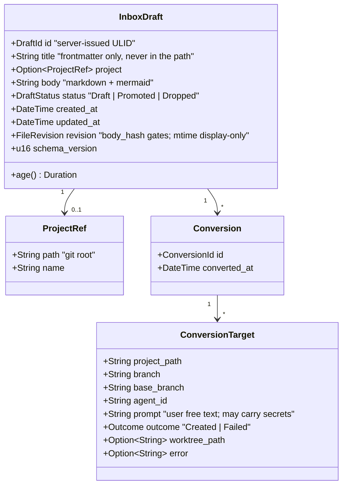
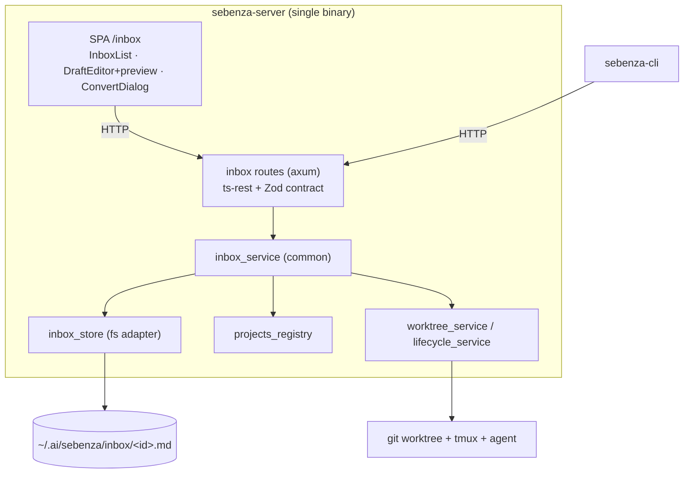
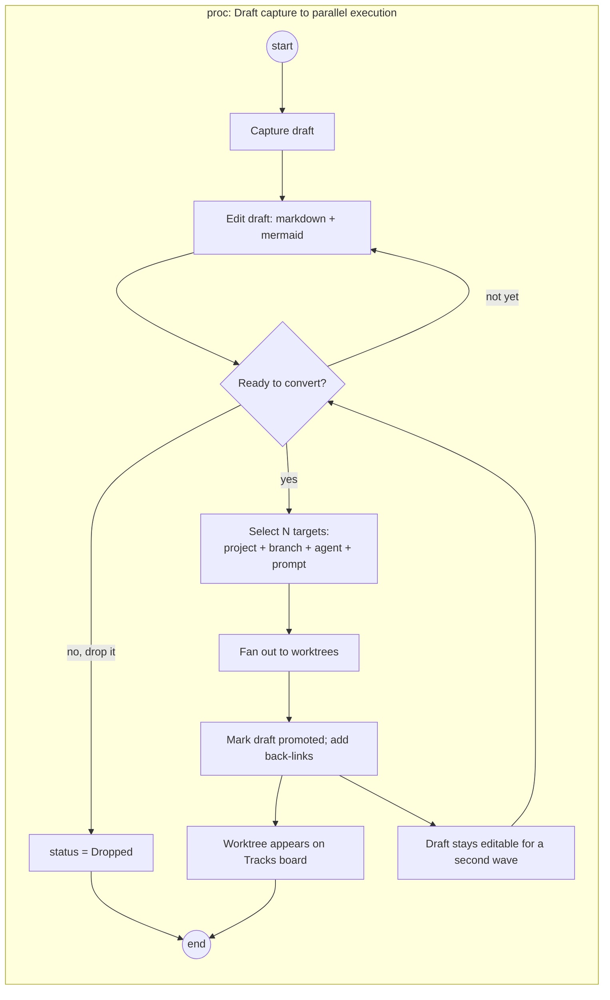
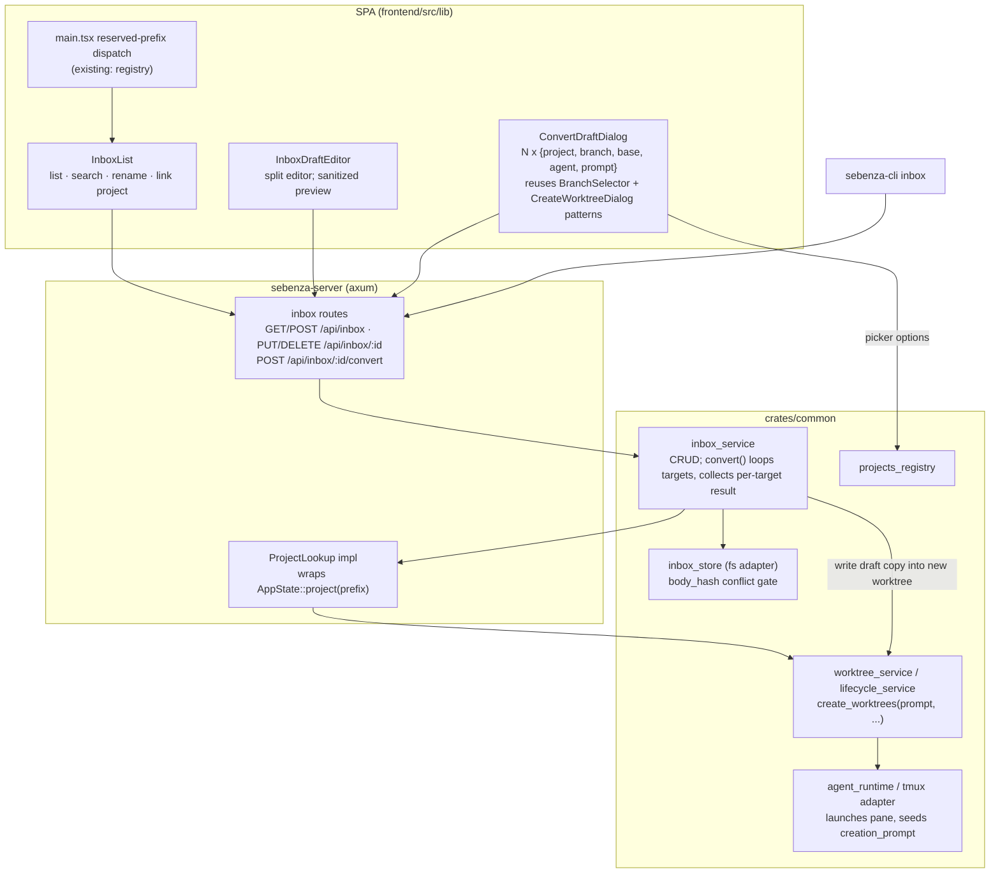
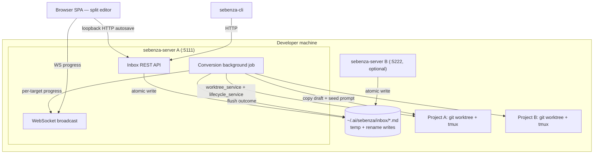
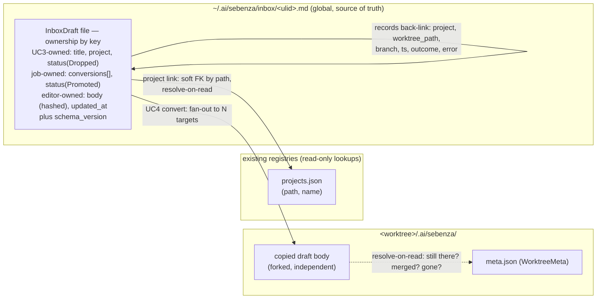
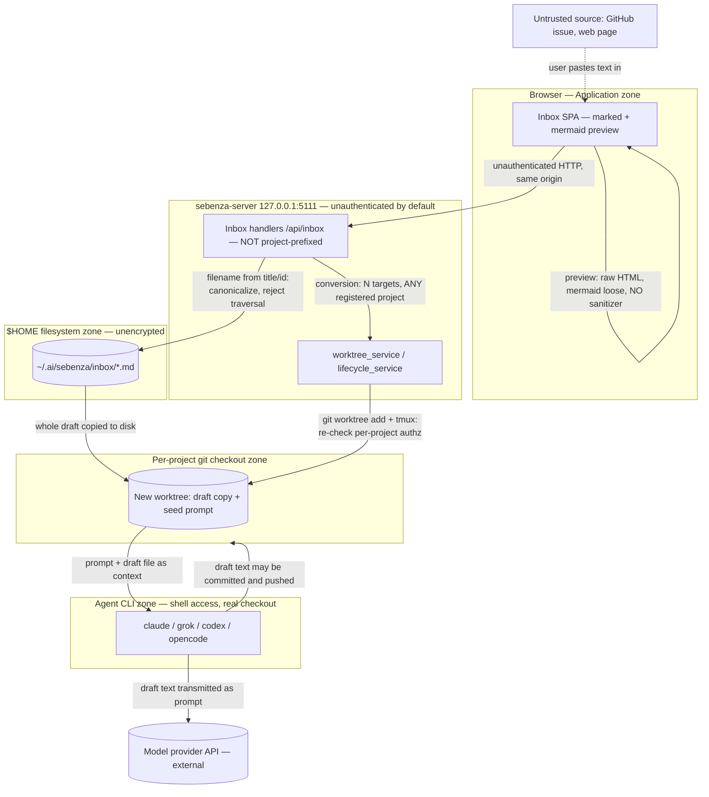

# Design — Inbox

## Overview

The inbox is a global store of markdown drafts that exists before any worktree does. A draft is a
plain `.md` file carrying markdown and mermaid, authored in a split editor in the dashboard or in any
external editor, and optionally linked to a project. When the thinking is ready, one draft converts
into any number of worktrees — each target picking its own project, branch name, agent, base branch,
and seed prompt. Every created worktree receives that prompt plus a copy of the whole draft. The
draft survives conversion, marked promoted with back-links, and can be converted again.

## Actors

| Actor | Kind | Role |
|---|---|---|
| Developer | person | Captures, edits, organises, and converts drafts. |
| Automation | system | Scripts driving the same operations through `sebenza-cli`, per the CLI/UI parity principle. |
| Coding agent | system | Receives the seed prompt and the draft copy when a converted worktree launches. |
| Worktree lifecycle | system | Existing `lifecycle_service` / `worktree_service`; conversion calls it rather than reimplementing creation. |

## Use Cases

| ID | Use case | Primary flow | Alternate flows |
|---|---|---|---|
| UC1 | Capture a draft | New draft, optional title and project link, empty body. | Capture from the CLI; capture with no project yet. |
| UC2 | Edit a draft | Edit markdown in a split editor with live mermaid preview; autosave to disk. | File changed externally while open; mermaid fails to parse. |
| UC3 | Organise the inbox | List, search, rename, (re)link to a project, delete. | Delete a promoted draft; unlink a project. |
| UC4 | Convert a draft into worktrees | Choose N targets — project, branch name, agent, base branch, prompt — and create each. | Partial failure; re-conversion (a later wave); name collision. |
| UC5 | Review conversion history | Read which worktrees a draft produced, when, and in which projects. | A linked worktree no longer exists. |

Mermaid has no use-case notation; this is a `flowchart LR` approximation — actors left, use cases as
nodes, system actors right receiving from UC4.

## Activity

UC3 and UC5 are straight-line CRUD and reads with no meaningful branching, so they are deliberately
not drawn.

### act: Capture and edit a draft

### act: Convert a draft into worktrees

## Class

A draft is one self-contained `.md` file with YAML frontmatter — no sidecar. `DraftId` is a
**server-issued opaque id** (ULID) and the file is `<id>.md`; `title` is a frontmatter field that never
touches the path. `FileRevision` is `{mtime, body_hash}`; only `body_hash` gates a save, so the
conversion job's frontmatter writes never trip the editor's conflict check.

## Component

One new service and one new store; worktree creation is delegated to the existing services.
`sebenza-cli` drives the same routes, satisfying CLI/UI parity.

## Architecture

### Business Architecture

Capture upstream of commitment is the capability the platform lacks. Today a thought requires a
worktree — a real branch and agent session — before the developer knows which project, or whether the
idea is worth pursuing.

Conversion is additive, not consumptive: the draft is a durable record of intent, not a queue item
dequeued. That is what keeps Inbox from duplicating the Tracks board — Inbox governs pre-commitment
ideation, Tracks post-commitment execution — and the boundary holds only as well as the triage
discipline applied to it.

**Decisions**

- Global store, project link optional; one draft fans out to N targets across projects — the idea is a unit distinct from the worktree.
- Conversion is additive: the draft survives as the audit trail, and the new worktree's `meta.json` records its id so the trail reads from both ends.
- A draft carries `status` — `Draft | Promoted | Dropped` — and `Promoted` requires at least one target actually Created.
- Inbox is strictly upstream of Tracks; deleting a promoted draft warns but never blocks.
- Agent collaboration deferred — capture stays solo and human-authored.

**Risks**

- `status` and age are surfaced but unenforced; triage discipline is still the only thing keeping the Inbox from becoming a shadow backlog.
- An optional project link lets a draft sit indefinitely with no destination.
- Re-conversion without prominent back-links obscures which wave produced what.
- With the design buddy deferred, pre-fan-out prompt quality rests entirely on the developer.

### Application Architecture

Inbox is one vertical slice, not a new layer.

Conversion never touches git or tmux directly. Per target, a new `ProjectLookup` port resolves the
project — `AppState::project(prefix)` returns `Arc<ProjectApp>`, from which a `LifecycleService` is
constructed, a real step rather than a pass-through — then calls `create_worktrees()` with
`CreateWorktreesInput.prompt` set to that target's prompt. That field is the *existing* path by which a
prompt reaches a freshly launched agent pane (`creation_prompt` → tmux `send-keys`). The port's impl
must live in `sebenza-server`: `project()` is private and calls `app.touch()`.

A worktree cannot hold a file before it exists, and `create_worktrees()` launches *and* prompts the
agent the instant it returns — so a target runs in three steps: create the worktree with **no** creation
prompt, write the draft copy and its `.gitignore` entry, then send that target's prompt through the
existing `send_worktree_prompt` path. Same mechanism, later in the sequence; the copy is ignored and
present before the agent is ever prompted. Targets report independently; one failure rolls back nothing.

`/api/inbox/*` registers globally beside `/api/projects` — the flat `Router` already mixes both tiers —
served by the single `apiContract` through a root-baseURL client, as `hubApi` and `api` already do.

**Decisions**

- A `ProjectLookup` port resolves each target's project; its impl stays in `sebenza-server`, where `project()` lives.
- Seed via the existing `send_worktree_prompt` path, not `creation_prompt`, so the copy and `.gitignore` land first.
- `/api/inbox/*` are global routes reusing the live `hubApi`/`api` dual-client and `registry` reserved-prefix precedents.
- Create worktree unprompted → write copy + `.gitignore` → send prompt; no window with an un-ignored copy.
- Conflict detection echoes `{mtime, body_hash}` from GET back on PUT; frontmatter is merged, never overwritten.

**Risks**

- A per-target outcome must be flushed as it happens, or a crash mid-fan-out loses that back-link.
- The three-step target sequence is untransacted — a crash can leave a worktree with no copy and no prompt.
- Two ts-rest clients sharing one contract invite a future route wired to the wrong base URL.
- `inbox` must be reserved server-side as `registry` already is, or a project of that name collides.
- `inbox_service` needs the target worktree path before `create_worktrees()` returns it — a real data dependency.

### Technical Architecture

The store needs no server-side owner: every write — autosave, external editor, or a second
`sebenza-server` instance — goes through temp-file-then-atomic-rename. That is a **new** pattern here;
existing state in `fs.rs` uses plain `fs::write`. A save conflicts **iff `body_hash` differs** — mtime
rides along in `FileRevision` for display and ordering but is never part of the gate, because it is at
once too coarse (it hides same-tick saves) and too eager (every frontmatter flush changes it). Hashing
the body alone is what lets the job merge into `conversions[]` without raising a spurious conflict in
an editor that is *expected* to stay open during a fan-out.

Conversion fans `git worktree add` plus a tmux launch across N targets — too slow to hold a request
open. `ws_agents_stream` is project-prefixed and keyed by conversation id, so only its shape carries
over: this needs a new manager keyed by job id and the server's **first non-project-prefixed WS route**.
There is no background-job convention to inherit either — `spawn_background_loops` is fire-and-forget
polling — so job identity, cancellation and shutdown behaviour are originated here. Each outcome is
merged into frontmatter as it completes, which doubles as the restart story: a job resumes from the
draft, not from memory.

**Decisions**

- Atomic temp+rename per file, no lock or daemon — new to this codebase, which writes state with `fs::write`.
- A save conflicts iff `body_hash` differs; mtime is display-only, so frontmatter writes never raise a conflict.
- The job merges into `conversions[]` per target; frontmatter state *is* the restart story.
- A new job-id-keyed manager and the first non-project-prefixed WS route are originated here, not reused.
- Job-id-correlated `tracing` spans are originated too — the crate has no `#[instrument]` or spans today.

**Risks**

- If an implementation folds mtime back into the conflict gate, every flush raises a spurious conflict again.
- If the editor's force-write ever covers frontmatter, it silently erases a flushed back-link.
- The store is deliberately outside git, so it has no automatic backup or version history.
- Directory-scan listing degrades linearly, and nothing flags the operator at thousands of drafts.
- A cross-project job holds `BusyGuard` locks across projects with no per-target timeout today.

### Data Architecture

The draft file is the sole source of truth — no sidecar, no index, no cache. `DraftId` is a
server-issued ULID and the file is `<id>.md`; `title` lives in frontmatter and never reaches the path,
which is what makes the path-traversal defence implementable. An externally renamed file is therefore
an orphan, not a re-identified draft. `ProjectRef.path` is a soft foreign key into `projects.json`:
resolved on read, never validated on write; a moved path degrades to *unresolved* rather than blocking.

Two writers share the file, so every write is a read-merge-write scoped to the keys its author owns.
The editor owns the **body** and `updated_at`; UC3's handlers own `title`, `project` and the
`Draft → Dropped` transition; the conversion job owns `conversions[]` and the `Draft → Promoted`
transition. No writer rewrites a region it does not own, and only `body_hash` gates a save — so a flush
mid-edit is invisible to the editor and a force-write can never regress a back-link. The one field two
writers can reach is `status`: `Promoted` wins over a racing `Dropped`, because worktrees existing is a
fact rather than a preference. Back-links are point-in-time facts resolved on read, so a
removed worktree shows stale-but-truthful. `schema_version` carries frontmatter forward; parsing stays
best-effort per the `normalize_worktree_meta` precedent.

**Classification** — no clinical data, no PHI, no customer PII. What it does hold:

| Field | Contains | Classification | Note |
|---|---|---|---|
| `title`, `body` | free-text notes written while thinking | Internal, user-authored | Sensitive only if the user pastes secrets |
| `ConversionTarget.prompt` | free-text agent instruction | Internal, user-authored | Persists in back-links — a secret pasted once survives every wave |
| `project_path`, `worktree_path` | absolute filesystem paths | Internal | Usually embeds the OS username; never echo to a remote surface |
| `branch`, `base_branch` | git branch names | Internal | May carry ticket ids or feature names |
| `agent_id` | which agent CLI | Configuration | Not sensitive |
| `meta.json` draft back-reference | the originating `DraftId` | Internal | An opaque ULID crossing into the per-project zone; reveals that a worktree came from a draft, not its content |
| `error` | captured failure text | Internal | Opaque diagnostic; may carry paths or env fragments |
| timestamps | `created_at` / `updated_at` / `converted_at` | Non-sensitive | — |

File permissions follow the process default (user-only), as for the rest of `~/.ai/sebenza/`.

**Decisions**

- `DraftId` is a server-issued ULID; the filename is `<id>.md` and the title never touches the path.
- Every frontmatter write is a read-merge-write scoped to its author's keys; `Promoted` beats a racing `Dropped`.
- `schema_version` gives older or hand-edited frontmatter a migration story; malformed frontmatter still degrades to a raw view.
- The project link is a soft FK by absolute path; a broken path renders *unresolved*, never fatal.
- The worktree copy forks immediately; no reconciliation or diff-back to the draft is attempted.

**Risks**

- Back-links grow unbounded across re-conversion waves, with no pagination or archival.
- Dangling worktree references never self-heal once the worktree is removed or merged.
- An externally renamed file becomes an orphan draft, and nothing reunites it with its history.
- Nothing distinguishes a worktree copy that matches its draft from one that has diverged.

### Security Architecture

Inbox extends an already-unauthenticated, single-host control plane with a global, non-project-scoped
surface. The job is not to invent authn — a larger track — but to stop Inbox widening the blast radius
of the existing model.

Three controls carry it. Every path derived from user input is canonicalized server-side, and the draft
filename comes from a server-issued ULID so user text never reaches a path at all. Conversion gets a
**real** origin control, because there is nothing to inherit: `AppState::project(prefix)` is an
existence lookup, not authorization, and the codebase has no CORS layer, CSRF token or Origin check
anywhere — so mutating `/api/inbox` routes require **both**, always: a bearer secret, and an
`Origin`/`Referer` that is same-origin or absent. Absent is not an exemption — `sebenza-cli` sends no
`Origin` and still must present the secret. The secret follows the existing `control_token` precedent:
generated on first use, persisted `0600` at `~/.config/sebenza/control-token`, one value for the
process lifetime, not per-session — this system has no sessions. `sebenza-cli` reads that file; the SPA
receives it at page load from the same origin, which a cross-origin page cannot do. Draft content is untrusted by construction — pasted
secrets and injected instructions are the expected case, not the edge case.

Verified in the code: `TrackMarkdown.tsx` renders unsanitized `marked` output through
`dangerouslySetInnerHTML` with mermaid `securityLevel: "loose"`, under a comment asserting the content
is trusted. Inbox breaks that assumption and must not reuse it unmodified.

**Threat model (STRIDE)**

| STRIDE | Threat | Severity | Mitigation |
|---|---|---|---|
| Elevation of privilege | One unauthenticated conversion POST creates worktrees and launches agents — arbitrary command execution — across *every* registered project, turning a CSRF or an exposed port into fleet-wide RCE | **Critical** | Require **both** on every mutating `/api/inbox` route: a bearer secret (the existing `control_token` file, `0600`, process-lifetime) and an `Origin`/`Referer` that is same-origin or absent — absent never exempts a request from the secret. A confirmation field naming the project is **not** a mitigation — the forging page controls the body. Nothing usable is inherited from the per-project routes: `AppState::project` is an existence check, not authorization |
| Tampering | Path traversal / arbitrary file write via draft id, branch name or project path — writing outside the store or the worktree root, into `$HOME` | **Critical** | The filename is a server-issued ULID, so no user text reaches a path (this is why `DraftId` is not a title slug); canonicalize every derived path anyway (reject `..`, absolute, symlink escape, null bytes, non-`.md`); validate branch names against git ref rules before shelling out |
| Information disclosure | The conversion progress WebSocket is the first non-project-prefixed channel; as a true broadcast it would leak project paths, branch names and prompt text for targets an unrelated connected client has no relationship to — isolation the per-project channels previously gave for free | **High** | Scope the channel per job, subscription gated on a job id that is a ULID issued to the requester — the same opacity commitment `DraftId` gets; the identical rule binds whatever job-status endpoint `sebenza-cli` uses (Open Question 4) |
| Tampering / EoP | XSS via the live preview: `marked` output injected unsanitized, mermaid `securityLevel: "loose"` permitting raw HTML and `click` directives that execute page JS | **High** | Do not reuse `TrackMarkdown.tsx` unmodified — sanitize (DOMPurify) before `dangerouslySetInnerHTML` and set mermaid `securityLevel: "strict"` on the Inbox path, accepting the loss of `click` diagrams |
| Information disclosure | Secrets pasted into draft free text persist unencrypted in `$HOME`, are copied verbatim into a real git checkout where they can be committed and pushed, and are sent to a third-party model provider by the agent CLI | **High** | `0600`/`0700` on the store; an advisory pre-conversion secret-pattern scan that warns before the copy and the launch; document plainly that Inbox is not a secrets vault |
| Elevation of privilege | Prompt injection: draft text pasted from an untrusted source becomes an agent's seed prompt, with the draft file on disk beside a real checkout and a shell-capable agent | **High** | Not solvable at this layer; bound the blast radius — prefer the existing sandboxed runtimes (`lxc` / Apple `container`), keep filesystem scope to the one worktree, and record draft provenance for a future review step |
| Information disclosure | The draft copy lands in a real checkout; the likeliest leak is not an agent but an ordinary `git add -A` by the developer | Medium | The copy lands at `<worktree>/.ai/sebenza/inbox-note.md`, written together with its `.gitignore` entry after creation and before the agent is prompted — never un-ignored |
| Repudiation | Nothing records which draft — and which pasted source — produced which worktree and agent launch | Medium | Conversion writes a structured audit line (draft id, target project, branch, agent, timestamp); frontmatter back-links and the worktree's `meta.json` carry the same |
| Denial of service | A conversion request can be sized arbitrarily, multiplying `git worktree add` + agent launch | Low | Cap targets per request (≈10), enforced in the Zod request schema and re-checked server-side |

**Compliance.** Self-hosted developer tooling holding source-adjacent free text and file paths, so no
regulatory regime attaches *by design*. But "no PHI" is an assumption about intended use enforced only
by developer discipline, not a technical control: `body` and `prompt` are unrestricted free text, and a
pasted log line or ticket excerpt travels the same route to a git checkout and a model provider that
the secrets row describes. The obligation is self-imposed and identical in both cases.

**Decisions**

- Mutating `/api/inbox` routes require an `Origin`/`Referer` check plus a shared secret — folded into this track, not deferred.
- The draft filename is a server-issued ULID; no user-supplied text ever reaches a filesystem path.
- The conversion WS channel is per-job, gated on a ULID job id, not a server-wide broadcast.
- The Inbox preview gets its own sanitized path (DOMPurify + mermaid `strict`), not `TrackMarkdown` as-is.
- Secrets get advisory scanning and `0600`; prompt injection is bounded by sandboxed runtimes and carried as residual risk.

**Risks**

- The `Origin` check and shared secret guard `/api/inbox` only; the rest of the control plane stays unauthenticated.
- The advisory secret scanner will have false negatives; a credential can still reach a commit and a provider.
- Sandboxed runtimes are optional, so on hosts without them injection-driven shell access is unconstrained.
- If a later refactor merges the Inbox preview back into `TrackMarkdown.tsx`, the XSS gap silently reopens.
- Nothing stops a draft being converted into a project the user meant only to reference.

## Impact Analysis

- **Deferred by explicit decision:** agent collaboration on drafts (the "design buddy"). The seam is
  `InboxDraftEditor` plus the existing `agent_service`/tab mechanism.
- New `common` slice — `InboxDraft`, `inbox_store`, `inbox_service` — no new layer.
- First non-project-prefixed actuator: `/api/inbox/*` is global, yet one request reaches into any
  registered project.
- New `ProjectLookup` port resolving a `LifecycleService` per target; `contract.ts`/`schemas.ts`/`api.ts` gain the routes.
- `/inbox` extends the existing reserved-prefix dispatch (`registry`) in `api.ts`/`main.tsx`; `inbox` must be reserved server-side too.
- Three new components: `InboxList`, `InboxDraftEditor`, `ConvertDraftDialog`.
- A **sanitized** markdown path (DOMPurify + mermaid `strict`) diverges from `TrackMarkdown.tsx`; the
  divergence must be documented or it will be re-merged.
- First long-running background fan-out job, the first job-id-keyed WS manager, and the server's first non-project-prefixed WS route.
- First `Origin`/`Referer` + shared-secret check in the codebase, and the first `tracing` spans and temp+rename writes.
- `~/.ai/sebenza/inbox/` is new global state outside git; `sebenza-cli` gains an `inbox` subcommand.

## Open Questions for Refinement

1. Should the `Origin` + shared-secret check extend to the whole control plane, not just `/api/inbox`?
2. Is ≈10 the right cap on conversion fan-out, or does a legitimate workflow need more?
3. Should a sandboxed runtime be mandatory, not merely preferred, for Inbox-created worktrees?
4. Does `convert` return a per-target array or a job id — and how does `sebenza-cli`, not a WebSocket client, see progress?
5. What is the job's cancellation and shutdown-draining contract while a `git worktree add` is in flight?
6. On a second wave, does the convert dialog pre-fill from the prior wave's targets or start blank?
7. Should `conversions[]` ever be capped or archived, or is unbounded growth accepted?
8. Can an orphaned draft (renamed externally) be reunited with its history, or is that loss accepted?
9. Does a `Dropped` draft stay listed, or move out of the default view?
10. Should the Tracks board surface the originating draft, now that `meta.json` records its id?
