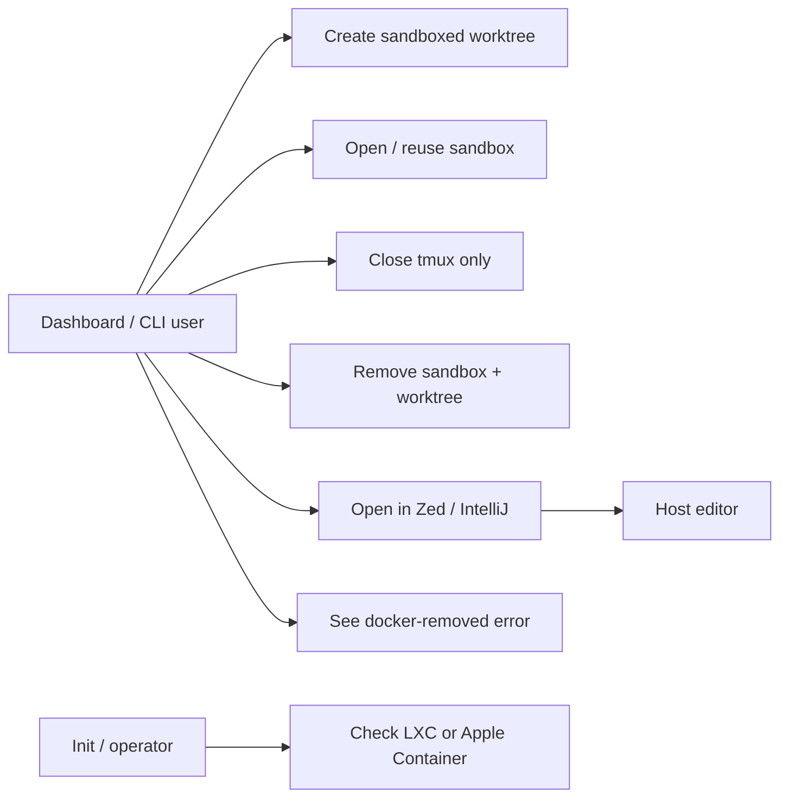
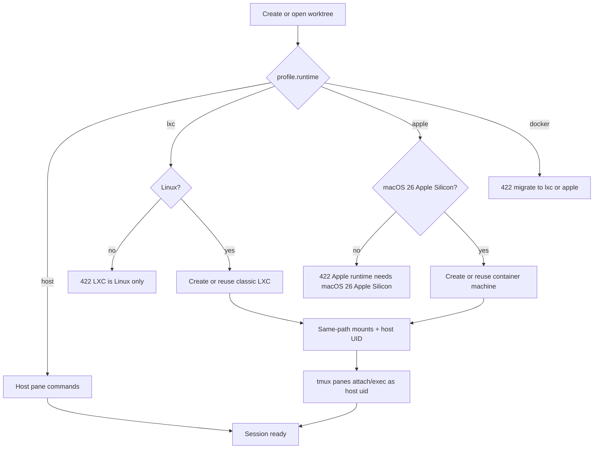
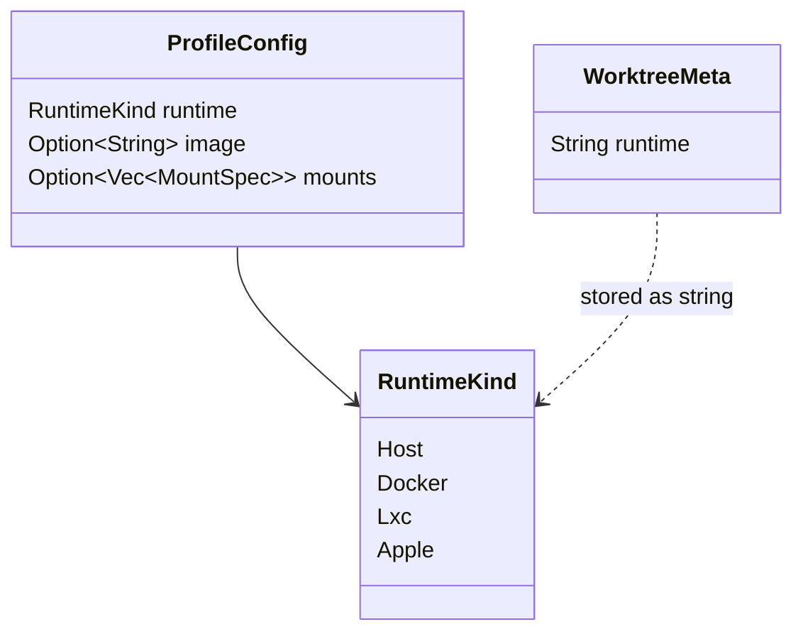
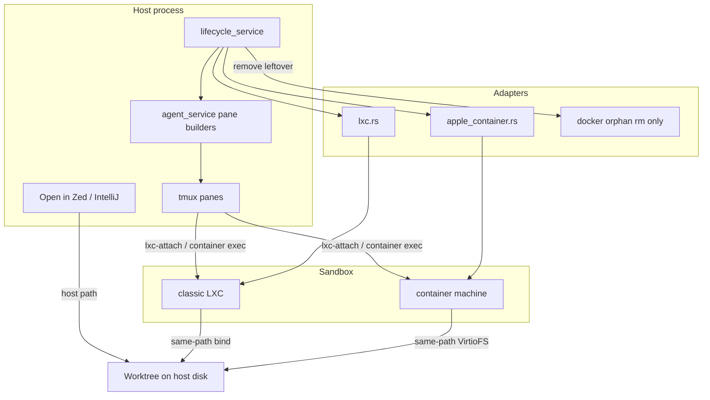
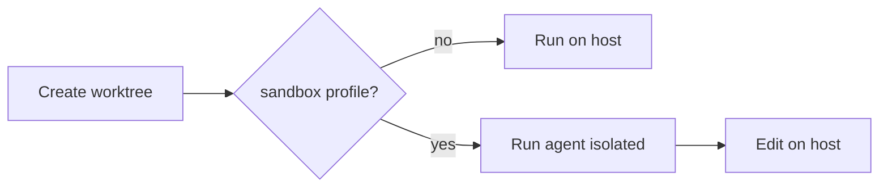
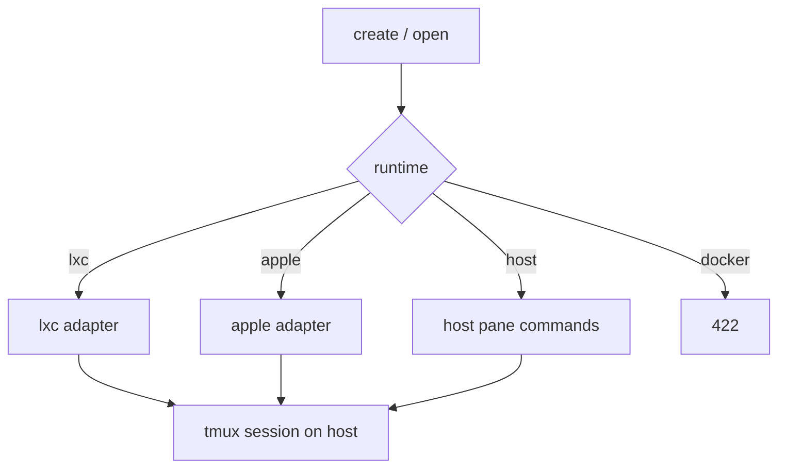
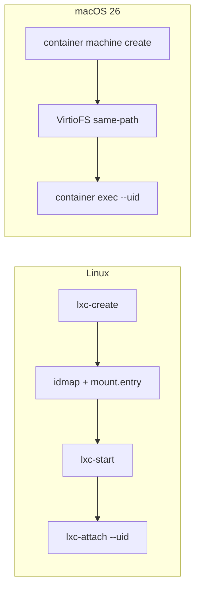
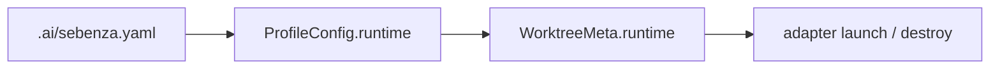
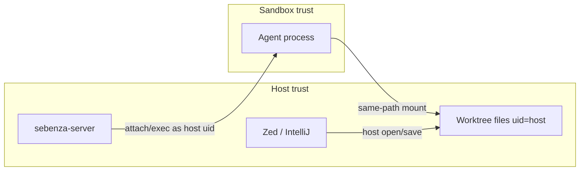

# LXC / Apple worktree sandboxes — Design

## Overview

Replace the Docker worktree sandbox with two platform backends that bind-mount the worktree at the **same absolute path** as the host and keep file ownership as the **host user**, so Zed / IntelliJ "Open in…" keep working:

- **Linux:** classic LXC (`lxc-create` / `lxc-start` / `lxc-attach`). No Incus, no LXD.
- **macOS 26+ Apple Silicon:** Apple Container **machines** (`container machine`).

Docker is dropped as a launchable runtime. Existing `runtime: docker` YAML must still parse; create/open/adopt return 422 with a migration message; remove best-effort cleans leftover containers.

Sandboxes are opt-in via a profile (`runtime: lxc` or `runtime: apple`). Default remains `host`.

## Actors

- **Dashboard / CLI user** — creates, opens, closes, removes worktrees; opens them in a host editor.
- **Agent / shell panes** — run inside the sandbox; cwd is the host worktree path.
- **Host editors** (Zed, IntelliJ) — launch on the host against `${WORKTREE_PATH}`; must keep read/write.
- **Init / operator** — needs a prerequisite check (`lxc-create` + subuid/subgid + `lxc-usernet` on Linux; `container` + `container system start` on macOS).

## Use Cases

- Create a worktree with an `lxc` or `apple` profile and get a long-lived sandbox.
- Open an existing sandboxed worktree (reuse running instance, or start a stopped one).
- Close a worktree (tmux only; sandbox stays).
- Remove / merge a worktree (destroy the sandbox, then the git worktree).
- Open the worktree in Zed / IntelliJ and save files the agent wrote.
- Fail clearly on the wrong OS, a missing CLI, or a missing idmap / `lxc-usernet`.
- Load an old `runtime: docker` profile without dropping the rest of the config; refuse to launch it.

Mermaid approximation of a use-case diagram (`flowchart LR`; Mermaid has no native use-case shape).

## Activity

## Class

New/changed domain types only. No new persisted entities beyond `WorktreeMeta.runtime` strings already on disk.

## Component

## Architecture

### Business Architecture

Sebenza sells agent-agnostic parallel worktrees on the developer's machine. The sandbox is a **profile choice**, not a new product surface: the user still picks a profile at create time. Value is isolation of the agent without breaking the host-editor loop that already exists ("Open in…").

Stakeholders: the local developer only (single-user, loopback server). No org-process change.

Business rules:

- Sandbox is opt-in. Default profile stays `host`.
- Docker is no longer a supported sandbox. Users migrate to `lxc` or `apple`.
- Host editors remain host-side. We do not sell "open the editor in the sandbox".

Decisions: opt-in profile; Docker removed as a capability, not silently remapped. Risk: users with a `docker` profile discover it only at create/open time.

### Application Architecture

Same orchestration points as today's Docker runtime:

- `create_resolved_worktree` / `adopt_unmanaged_worktree` — require `image` for `lxc`/`apple`; refuse wrong OS; refuse `docker`.
- `materialize_runtime_session` — launch/reuse, then build attach/exec pane commands.
- `remove_resolved_worktree` — destroy LXC/Apple; if `meta.runtime == "docker"`, best-effort orphan cleanup.
- Tabs — treat `lxc`/`apple` as sandboxed (refuse / no-op), same as today's Docker.

New adapters: `crates/common/src/adapters/lxc.rs`, `apple_container.rs`. Delete `docker.rs` launch path after the new adapters are wired.

`is_sandboxed(runtime)` is `lxc | apple`. No generic sandbox trait in v1.

Decisions: two adapters, not one abstraction. Risk: duplicated lifecycle branches — mitigate with `is_sandboxed`.

### Technical Architecture

**Linux — classic LXC.** Detect `lxc-create` (not LXD's `lxc`). Unprivileged user containers under `~/.local/share/lxc/`. Name `sebenza-<branch>-<millis>`. Idmap hole maps host uid/gid 1:1 so bind-mounted files stay host-owned. Same-path `lxc.mount.entry` for worktree (RW), `{repo}/.git` (RW), repo (RO), plus credential dirs at the **same** host paths. veth on `lxcbr0` (requires `lxc-usernet`); publish service ports with a host-side `127.0.0.1` proxy. Panes: `lxc-attach` as host uid. Close leaves the container; remove is `lxc-stop -k` + `lxc-destroy -f`.

**macOS — Apple Container machine.** Detect `container` + `container system start`. Refuse off Apple Silicon / macOS &lt; 26. Create with `--home-mount none` plus explicit same-path shares; fall back to `home-mount=rw` only if extra shares are impossible and paths are under `$HOME`. Guest user is the Mac username/UID. Panes: `container exec --uid --workdir`.

**NFRs:** create after image exists should be seconds (LXC) / one lightweight VM boot (Apple). Unit tests never spawn a real container. Linux + macOS Apple Silicon only.

Decisions: classic LXC only; Apple machines not `container run`; no Multipass. Risks: `lxc-usernet` / subuid missing; Apple extra-share limits; vanilla images lack agent CLIs.

### Data Architecture

No new database. Classification: no PHI/PII. State is:

- `profiles.<name>.runtime`: `host | docker | lxc | apple` plus required `image` for sandbox runtimes.
- `WorktreeMeta.runtime` string (`"lxc"` / `"apple"`; old files may still say `"docker"`).
- Instance name is derived, not stored.

Source of truth for "is this sandboxed" is the profile at create time, then `meta.runtime`. YAML without the new keys keeps loading. `runtime: docker` must still deserialize so `config.rs` does not drop the whole `profiles:` map.

### Security Architecture

Trust boundary is the sandbox: the agent process must not see the whole host, must not be privileged, and must not rewrite worktree ownership.

- Unprivileged LXC user namespace. No privileged flag, no host `docker.sock`.
- Idmap hole is **only** the host uid and gid.
- Disk allow-list (worktree, repo, declared mounts, credential dirs).
- Apple: prefer `home-mount=none` + allow-list. Full `$HOME` is a wider boundary and must be documented if used.
- Service proxies bind `127.0.0.1` only.
- SSH/gitconfig/gh mounts stay read-only unless the profile overrides.
- Control token / `runtime.env` live on the worktree path (same as today's Docker).
- Wrong-OS runtime → 422.

STRIDE (high notes): Tampering of host files outside the allow-list (mitigate mounts); Elevation via privileged LXC or a broken idmap (refuse privileged, fail closed on idmap); Information disclosure of `$HOME` on Apple if `home-mount=rw` (prefer none). No HIPAA/PHI in this product.

## Impact Analysis

- **Config:** new runtime values; Docker remains parseable but not launchable.
- **Adapters:** add LXC + Apple; delete Docker launch.
- **Lifecycle / agent_service:** dispatch on three live runtimes; tab refusal applies to `lxc`/`apple`.
- **Init / docs / tech-stack / workflow:** replace Docker sandbox docs with LXC/Apple.
- **Frontend:** profile picker already exists; typed runtime unions if any.
- **macOS Intel / old macOS:** sandbox profile 422; host still works.
- **Existing docker worktrees:** cannot reopen as Docker; remove still tries `docker rm`.

## Open Questions for Refinement

Resolved in planning (recorded so the spec does not re-litigate):

- Classic LXC, not Incus/LXD.
- Apple Container machines on macOS 26 Apple Silicon, not Multipass.
- Docker dropped as launchable; parse + orphan-remove kept.
- Opt-in profile, not always-on.
- Tabs out of scope for v1.

Left to spec/implementation detail:

- Exact `image:` parse for the LXC download template (`ubuntu:24.04` → distro/release/arch).
- Whether `lxc-attach --uid` is available on Ubuntu's LXC; fallback `su`.
- Apple: confirm `container exec` vs `container machine run` for panes, and how extra VirtioFS shares are added.
- Host-side port proxy binary (`socat` / `ncat`) and failure mode if missing.
