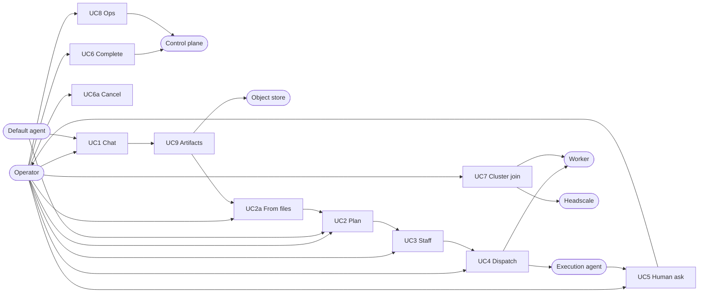
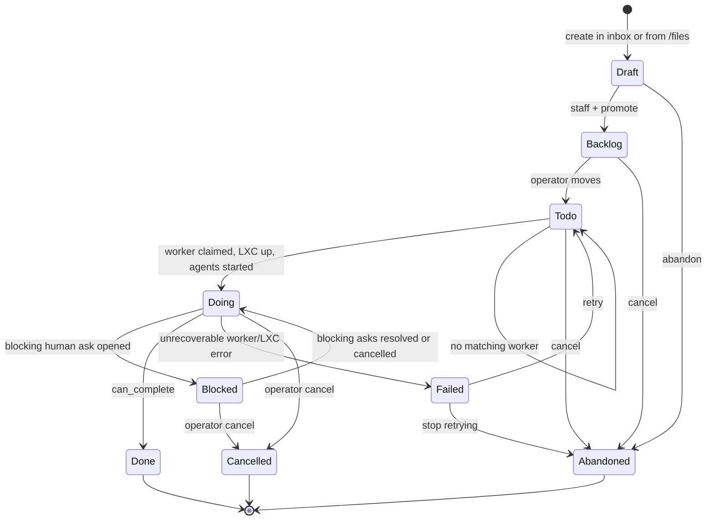
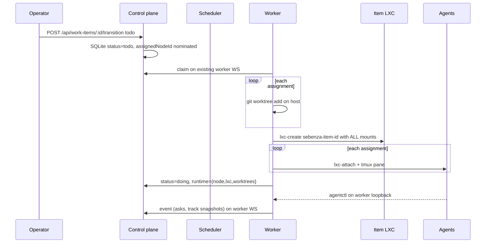
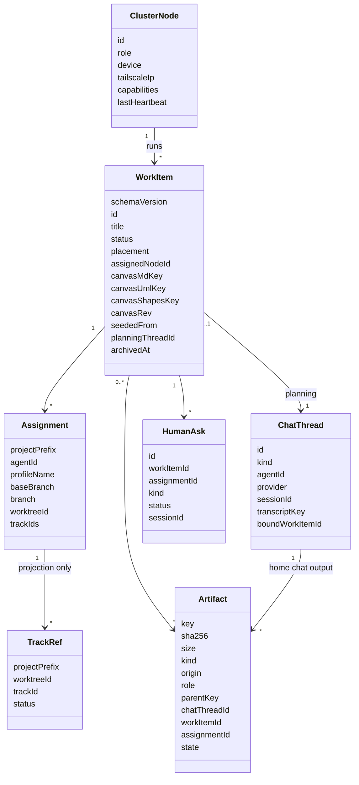
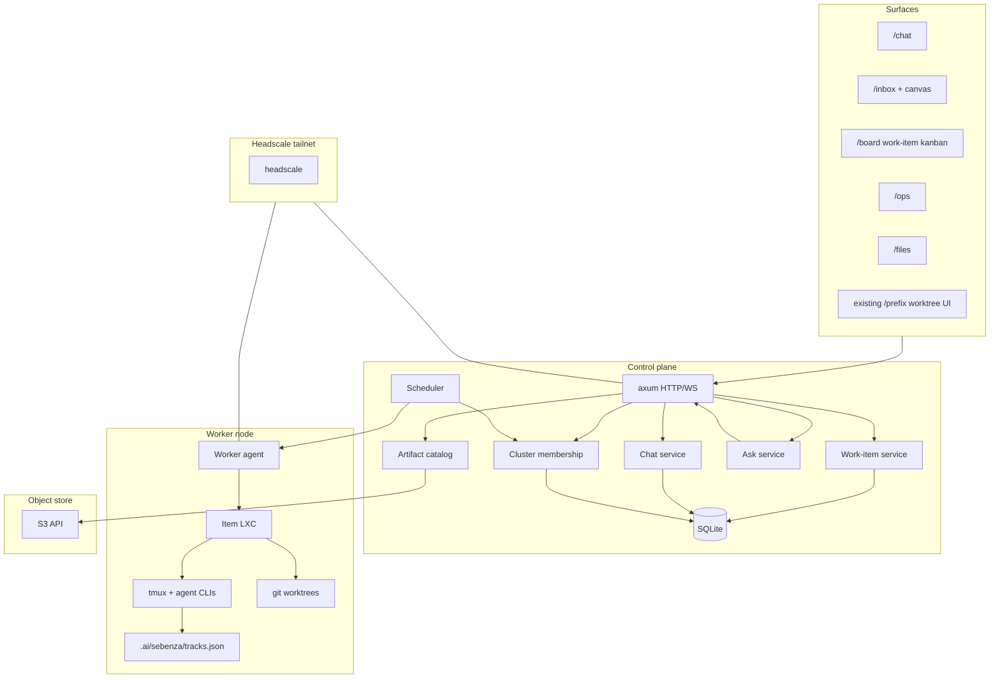

# Design — Continuous Agent Platform

## Overview

Sebenza today is a **single-node worktree orchestrator**: one `sebenza-server` on
loopback, many git worktrees, one agent per worktree in tmux, a per-worktree
tracks Kanban, and optional unprivileged LXC/Apple sandboxes.

This design turns that into a **continuous agent platform**: a control plane
where a human talks to a default agent in home chat (no LXC; files land in
`/files`), turns selected files into a planned work item with a canvas, a
backlog that dispatches teams of agents across projects, workers that join
over a Headscale overlay (server and laptop), one LXC per work item that
shares the host user's credentials, S3-backed artifacts, and an ops view of
the whole system.

The existing execution engine is kept. Worktrees, builtin agent adapters
(claude / grok / codex / opencode), tmux sessions, tracks.json, AskUserQuestion,
and the LXC uid-hole sandbox remain the way work actually runs. What is new is
the **control plane**, the **work-item lifecycle**, **cluster membership**, and
the **surfaces** (Chat, Planning, Ops, Files).

This document supersedes the narrower inbox sketch in `inbox_20260914` as the
platform architecture. That track remains a candidate first implementation
slice (planning inbox + canvas), not a competing product.

## Assumptions

1. **Single operator, not multi-tenant SaaS.** Matches the current product
   non-goal. One human (or a small trusted tailnet) owns the cluster.
2. **Do not host or proxy model inference.** Agents keep talking to their own
   CLIs and subscriptions. The platform orchestrates processes, not tokens.
3. **CLI/UI parity remains.** Every new surface is reachable from
   `sebenza-cli`.
4. **Linux control plane is the cluster home.** LXC is Linux-only; the always-on
   server is Linux. A macOS laptop can join as a worker using the existing
   Apple Container runtime for items placed there.
5. **"LXC VM" means the existing classic unprivileged LXC sandbox**, not a
   kernel VM. Credential sharing needs bind-mounts and a 1:1 uid hole — that is
   container semantics. Incus/LXD VMs are out of scope.
6. **Headscale is the overlay**, not a public ingress. The control plane does
   not bind `0.0.0.0` on the open internet.
7. **Scale is a handful of nodes and tens of concurrent work items**, not
   thousands. Design for operability and correctness first.
8. **Home chat has no work-item LXC.** It still runs in a **chat jail**
   (bubblewrap/landlock, not the per-item sandbox): scratch cwd, agent
   CLIs, no `platform.db` / `cluster.json` / control-token / S3 master
   keys, no loopback to operator routes. Files it produces land in
   `/files` and can seed a work item.

## Actors

| Actor | Kind | Role |
|---|---|---|
| Operator | person | Plans work items, chats, answers asks, moves kanban cards, inspects ops. |
| Default agent | system | Planning partner in Chat and in the inbox canvas. Switchable among builtins. |
| Execution agent | system | A builtin or custom agent running inside a work-item LXC against one project. |
| Control plane | system | Source of truth for work items, asks, cluster membership, artifact metadata. |
| Worker | system | A Sebenza node (server or laptop) that claims placed work and runs LXC + agents. |
| Headscale | system | WireGuard overlay and node identity between control plane and workers. |
| Object store | system | S3-compatible blob store for canvases, transcripts, logs, agent artifacts. |
| Human-ask session | system | A first-class blocked conversation that must be resolved before Done. |

## Use Cases

| ID | Use case | Primary flow | Alternate flows |
|---|---|---|---|
| UC1 | Chat with default agent | Open `/chat`, talk to `workspace.defaultAgent` on the control host (no LXC). Switch builtin or start a new thread. Agent-written files land in `/files`. | Agent lacks `in_app_chat`; custom agent (terminal-only); resume previous thread. |
| UC2 | Plan a work item | Inbox: chat + canvas (markdown, UML/mermaid, shapes). Iterate until the operator is happy. | Seed a draft from `/files` (chat artifacts or other catalog objects); import markdown/design.md; abandon a draft. |
| UC2a | Create work item from files | In `/files` or from a chat thread, select one or more artifacts → create Draft. Matching canvas types become the initial canvas; everything else is attached. | Single file; mixed types; file already attached to another item (copy, do not move). |
| UC3 | Staff a work item | Pick one project+agent, or a team of (project, agent) pairs, plus a placement (`server` / `laptop:<id>` / `any`). Promote to Backlog. | Project not cloned on any worker; agent not installed on the target device. |
| UC4 | Dispatch | Operator moves Backlog → Todo. Scheduler assigns a worker. Worker creates the item LXC, worktrees, and starts agents. Item becomes Doing. | No matching worker; LXC preflight fails; partial project clone. |
| UC5 | Human ask | An execution agent needs input. Platform creates an Ask + alert + session. Item is Blocked-on-human. Operator answers in the session. | Permission prompt (observational today); timeout; ask abandoned. |
| UC6 | Complete | Item may move to Done only when every **blocking** Ask is resolved or cancelled **and** every item-scoped track on every assignment worktree is `done`. | Tracks incomplete; blocking asks open; operator force-closes (refused). |
| UC6a | Cancel / withdraw | Operator (or CLI) cancels a work item that is not Done. Confirm. Worker tears down the item LXC if any. Cancelled is not Done. | From Backlog/Todo (no LXC yet); from Doing/Blocked; from Failed (stop retrying). |
| UC7 | Cluster join | Laptop `sebenza-cli cluster join` over Headscale, advertises capabilities, receives placed work. | Headscale down; stale worker; capability mismatch. |
| UC8 | Inspect ops | `/ops` shows nodes, heartbeats, LXCs, work items, asks, queues, artifact usage, event log. | Worker silent; LXC leaked; artifact store unreachable. |
| UC9 | Store artifacts | Home-chat files, canvases, transcripts, logs, and execution outputs land in the S3 bucket; metadata in the control plane; `/files` is the browser. | Local filesystem backend (all-in-one); remote MinIO/S3/R2. |



## Activity

Work-item lifecycle. The inbox is *planning*, not a kanban column. A draft
becomes a Backlog item only after staffing. Home chat never enters this
machine; it only produces Files that can *seed* a Draft.



Dispatch sequence (Todo → Doing):



Home chat → Files → Draft:

```mermaid
sequenceDiagram
  participant Op as Operator
  participant Chat as Home chat
  participant Files as Artifact catalog
  participant Plan as Inbox

  Op->>Chat: talk (no LXC)
  Chat->>Files: put transcript + agent-written files
  Op->>Files: select artifacts
  Op->>Plan: create Draft from selection
  Plan->>Plan: canvas layers from md/mermaid/shapes; rest attached
```

## Class

New control-plane entities. Existing `WorktreeMeta`, `AgentLifecycle`,
`AgentFeedbackState`, and plugin `tracks.json` stay on the worker.



## Component

Two planes. The control plane is the source of truth. Workers are replaceable
executors. The current `sebenza-server` binary grows a **role**
(`control` / `worker` / `all-in-one`) rather than splitting into new crates on
day one.



## Architecture

### Business Architecture

**What changes for the operator.** Today they create a worktree and talk to an
agent. After this, they have two modes:

1. **Chat** — a standing conversation with whichever builtin they pick. No
   git, no LXC, no backlog. This is "talk to my agent".
2. **Plan → staff → run** — a work item is a unit of *intent*. Planning is
   cheap (chat + canvas). Execution is expensive (LXC, credentials, agents,
   tracks). Promotion to Backlog is the commitment line.

**Business rules.**

| Rule | Statement |
|---|---|
| BR1 | A work item starts as a Draft in the inbox. It is not work until staffed and promoted. |
| BR1a | Home chat is not a work item and has no **work-item LXC**. It runs in the chat jail. Files it produces land in `/files` and may seed a Draft; the thread stays a chat thread. |
| BR1b | Creating a Draft from files **copies** (or snapshots) the selected objects onto the work item. The originals stay in the catalog so they can seed again. |
| BR2 | Staffing is one or more `(project, agent)` assignments plus a placement constraint. |
| BR3 | Todo means "the platform may start agents". Only the operator (or CLI) may move Backlog → Todo. |
| BR4 | Agents move Todo → Doing after the LXC and worktrees exist. Humans do not click Doing. |
| BR5 | A **blocking** HumanAsk (`question` / `ask_user`) surfaces an alert + session and holds the item in Blocked. Observational `permission` asks alert only and do **not** block Done; they auto-close when the worker reports feedback `none`. |
| BR5a | Ask timeout does not auto-resolve. Cancel of an ask is an operator/CLI action and counts as `cancelled` for the gate. |
| BR6 | `can_complete` is computed, not a button. True iff every blocking ask is `resolved` or `cancelled`, every assignment has ≥1 `trackId`, and each of those ids is `done` in **that assignment worktree's** `.ai/sebenza/tracks.json`. `allowEmptyTracks` is false. |
| BR7 | Credentials used by agents are the **worker host user's** subscriptions (Claude/Grok/Codex/OpenCode, `gh`, ssh). Placement is how the operator chooses whose subscriptions run the work. |
| BR8 | Tracks remain the per-repo implementation plan (plugin-owned). The work item is the cross-project envelope, not a replacement for `tracks.json`. |
| BR9 | The operator cannot force-complete. Done is only the computed gate. Ops must show the blocking asks and tracks. |
| BR10 | Staffing is refused unless every assigned project clone exists on **one** worker that also has the required agent binaries and runtime. Split the item rather than coordinating two devices. |
| BR11 | After dispatch, **execution agents** create Sebenza tracks in each assigned worktree (plugin workflow). Planning may seed `design.md` / canvas files into those worktrees; it does not write `tracks.json`. |
| BR12 | A Todo item whose placed worker is missing stays Todo. Ops shows the reason and the operator gets an in-app alert. No off-platform paging in v1. |
| BR13 | Home and planning chat use the **control-host user's** agent CLIs, inside the chat jail. Placement (BR7) applies only after Todo claim. |
| BR14 | Cancel/withdraw is a first-class operator action (UC6a). Cancelled ≠ Done. Confirm. Worker destroys the item LXC if it exists. |
| BR15 | Ad-hoc `/{prefix}` worktree create/open/label/archive/merge/remove remains. Those worktrees are not on `/board` unless attached. Work-item Done means tracks finished, **not** merged/CI-green. Post-Done: existing worktree UI for PR/merge. |
| BR16 | Inbox v1 is consumptive work-item planning, not the old additive reconversion draft. Reuse is catalog snapshots (BR1b) or a new Draft. |

**Value.** One operator supervises a *portfolio of intents* across machines,
not a pile of unrelated worktrees. The laptop can sleep; the server keeps the
board. Work that needs laptop-only creds or files is placed there and pulled
when the laptop is on the tailnet.

**Out of scope for v1.** Billing, multi-tenant orgs, RBAC beyond "operator vs
worker node", marketplace agents, hosted inference.

### Application Architecture

Keep the Cargo workspace. Add services in `crates/common` and routes on
`sebenza-server`. Do not invent a second HTTP stack.

**Roles** (one binary, `SEBENZA_ROLE`):

| Role | Bind | Serves |
|---|---|---|
| `all-in-one` | loopback default; tailnet after `cluster init` | SPA + APIs + local worker loop. Default. |
| `control` | tailnet IP `:5111` (or `tailscale serve`) | SPA, operator APIs, scheduler, catalog, home/planning **chat jail**. No item LXC. |
| `worker` | `127.0.0.1` only | runtime-event ingest, local PTY/lifecycle, item LXC. **No SPA, no tailnet bind.** Drill-down is proxied by control over the worker WS. |

Both `control` and `worker` (and all-in-one) run as the **operator user systemd/launchd unit** (`loginctl enable-linger` on a headless Linux server). Headscale is the system companion.

**Surfaces** (SPA routes, still embedded):

| Route | Replaces / extends |
|---|---|
| `/chat` | New. Global threads, agent switcher, capability-gated. Chat jail, no item LXC. "Create work item" on a thread or its files. |
| `/inbox` | New. Draft work items: chat + canvas split. Seeded empty, from `/files`, or from a chat thread. Promotes to board. |
| `/board` | New. Work-item kanban: Backlog / Todo / Doing / Blocked / Done. |
| `/ops` | New. Cluster, LXCs, asks, queues, artifacts, event log. |
| `/files` | New. Artifact catalog. Home-chat outputs, canvases, execution blobs. Select → create Draft. |
| `/{prefix}/...` | Existing project worktree dashboard, now also reachable as a drill-down from a work item. |

**Chat runtime** (new service). Does **not** go through `conversation_router`
or `/{prefix}/api/agents/worktrees/...`. Reuses `AgentStreamManager` plus
session-log adapters. `ChatThread` is an **index** (id, kind, agent,
provider, sessionId, `transcriptKey`). Message bytes live in the agent
log + a catalogued transcript uploaded on turn end. The messages API
reads that transcript.

Two bindings:

- `kind=home` — not attached to a work item, **no work-item LXC**. Chat jail on the
  control host. Scratch cwd; upload only regular files whose realpath is
  inside the scratch (`O_NOFOLLOW`, size cap, never `control.env`).
  `origin=chat`. Custom agents without `in_app_chat` get a jailed tmux
  pane, not a worktree.
- `kind=planning` — bound to a Draft/Backlog work item. Same
  chat jail as home). Canvas files in the planning workspace. Creating a
  Draft from a home thread does **not** bind that thread; the Draft gets
  a new planning thread and `seededFrom`.

Home chat is how thinking starts without committing to a work item. Plan
is where those files become intent: from a thread ("Create work item")
or from `/files` (multi-select). Creating a Draft snapshots the selected
objects onto the item (BR1b). Markdown / mermaid / shapes JSON populate
the canvas layers; other types (`png`, logs, zip, …) attach as
`WorkItem` artifacts the planning agent can still open.

Reserved URL prefixes (extend `RESERVED_PROJECT_PREFIXES`): `chat`,
`inbox`, `board`, `ops`, `files`, plus existing `api` / `ws` / `assets` /
`registry`. Hub APIs use `createApi("")`; do not overload `activePrefix`.

**ItemRuntime vs WorktreeLifecycle.** Dispatch does not call today's
`lifecycle_service` as-is.

- **ItemRuntime** — create/destroy `sebenza-item-<id>`, multi-repo
  mounts, usernet quota, credential binds, orphan reconcile on
  hello/heartbeat.
- **WorktreeLifecycle** — existing git/meta/tmux/hooks with
  `SandboxLaunchSpec.instance: Option<&str>` meaning "attach, do not
  launch." Close/remove of one worktree must **not** destroy the item
  instance.

Sequence: create **all** host worktrees first, then one LXC with every
mount, then attach. Staffing refuses unless every assignment shares one
runtime + image. `GIT_CONFIG_COUNT` covers every mounted worktree/repo.
Ad-hoc `/{prefix}` create keeps the per-branch LXC path; both count
against the same veth quota.

**Platform agent catalog.** Home/planning never read a project's
`sebenza.yaml`. Builtins always; custom agents from
`~/.ai/sebenza/platform.yaml`. Staffing reads cluster advertisements
(nodes × prefixes × agent binaries × runtime). Each `Assignment` records
`profileName`.

**Worker protocol** (pull-to-connect, push-on-channel; control never
dials the worker): `hello`, `heartbeat`, `claim`/`offer`, `status`,
`event`, `pty` (control proxies drill-down), `tracks.get`,
`conversation.send`, `ask.resolve`, `interrupt`. **Not** `artifact.put`
— blobs are HTTP (below). All-in-one uses the same messages against
`ws://127.0.0.1:5111/api/cluster/worker`.

**HumanAsk produce/resolve.** Server-side observation (stream parser or
agentctl event), not the SPA remaining open. Resolve: operator session →
worker WS → existing send/PTY path. Hub SSE `/api/asks/stream` (not the
unregistered per-prefix notification stream). Until `/ops` ships, the
work-item card shows blockers.

**Canvas sanitization.** Agent-authored markdown/mermaid/shapes are
untrusted. DOMPurify, mermaid `securityLevel: "strict"`, no raw HTML
inject, CSP on the SPA. Planning-workspace sync is a debounce+rev loop
between editor and scratch files.

Execution chat stays the existing worktree conversation (`WorktreeConversationMeta`
+ stream providers). The board drills into it via the worker-WS proxy; it
is not replaced.

**Canvas.** Three layers in one document, stored as artifacts:

| Layer | Format | Editor |
|---|---|---|
| Text | Markdown | Existing `marked` editor (inbox sketch). |
| UML | Mermaid (`classDiagram`, `sequenceDiagram`, `flowchart`, `C4`) | Text + live preview already in the product. |
| Shapes | Excalidraw scene JSON | Embedded Excalidraw editor. |

The agent reads/writes the markdown and mermaid as files. Shapes are JSON the
agent may also edit; the visual editor is for the human. One canvas snapshot
is versioned in S3 on each save.

**Work-item board vs tracks board.** They are different Kanbans:

- `/board` — platform work items (this design).
- Existing `TracksBoard` — per-worktree `.ai/sebenza/tracks.json` (plugin).
  Done-gating *reads* that file; it does not write it. Agents and the plugin
  own track status, same as today.

**Human asks.** Elevate today's `AgentFeedbackState` (`PermissionRequest`,
free-text question, `AskUserQuestion` cards) into a durable `HumanAsk` row:

- Created from runtime events / tool calls.
- Pushes an alert (existing notification SSE + a cluster-wide channel).
- Opens a **session** the operator can answer without hunting the worktree.
- Item status becomes `blocked` while any ask is `open`.
- Permission prompts remain observational for agents whose
  `permission_interception` is false (all current builtins). The ask still
  exists so the operator is pulled to the right terminal.

**Worker protocol.** Workers hold a WebSocket to the control plane (same
stack as the PTY WS). Message list is in **Worker protocol** above.
Control never dials the laptop.

**API sketch** (all also on `sebenza-cli`; added to the ts-rest contract):

```
# Chat
GET/POST        /api/chat/threads
GET/POST        /api/chat/threads/:id/messages
POST            /api/chat/threads/:id/agent          # switch
POST            /api/chat/threads/:id/work-item      # snapshot thread files → Draft

# Work items
GET             /api/work-items
POST            /api/work-items                      # optional artifactKeys[] seeds Draft
GET/PATCH       /api/work-items/:id
GET/PUT         /api/work-items/:id/canvas
POST            /api/work-items/:id/staff            # assignments + placement
POST            /api/work-items/:id/transition       # backlog|todo only from operator
POST            /api/work-items/:id/cancel
POST            /api/work-items/:id/retry            # Failed → Todo

# Asks
GET             /api/asks
GET             /api/asks/:id
POST            /api/asks/:id/resolve

# Cluster
GET             /api/cluster/nodes
POST            /api/cluster/join                    # single-use preauth + hashed join token
DELETE          /api/cluster/nodes/:id
WS              /api/cluster/worker

# Artifacts
GET             /api/artifacts?workItem=&thread=
GET             /api/artifacts/:key                  # redirect or stream
POST            /api/artifacts                       # home-chat control plane or worker upload
POST            /api/artifacts/work-item             # selected keys → new Draft (UC2a)

# Ops (read-mostly)
GET             /api/ops/snapshot
GET             /api/ops/events
```

Existing `/{prefix}/api/worktrees` stays for ad-hoc worktrees (BR15).
Dispatch uses ItemRuntime + WorktreeLifecycle on the worker, not
`lifecycle_service` as-is. Blobs: `POST /api/artifacts` (join-token auth)
for the FS backend; pre-signed PUT when an S3 endpoint is set. Worker WS
is signalling only.

### Technical Architecture

**Deployment topology.**

```
                     operator browser
                            |
                     Headscale tailnet
                            |
                    sebenza-server (control)
                    bind: tailnet IP :5111
                    sqlite + artifact sidecar
                            |
              +-------------+-------------+
              |                           |
     worker@server                  worker@laptop
     LXC per item                   LXC (or Apple) per item
     host uid/gid                   laptop uid/gid
     server subscriptions           laptop subscriptions
```

**Headscale.** Compose, do not embed the protocol. **Adopt if present,
otherwise spawn-and-manage.**

- If `HEADSCALE_URL` is set (or an existing Headscale unit is healthy),
  `cluster init` adopts it.
- Otherwise `sebenza-cli cluster init` installs/enables a Headscale
  systemd unit, creates a tailnet, and writes `cluster.json`. Preauth
  keys are **single-use**, tagged `tag:sebenza-operator` or
  `tag:sebenza-worker`. Headscale ACL: only operator tags reach `:5111`;
  workers reach only the worker WS. Adopt-if-present **must** install
  that ACL — a pre-existing tailnet is not the operator boundary.
- `sebenza-cli cluster join <control-url>` on the laptop: install
  `tailscale` if missing, `tailscale up --login-server <headscale> --authkey`,
  start `sebenza-server --role worker`, connect WS to control.
- Control plane binds the Tailscale IP (or `tailscale serve`). Loopback-only
  remains the default for `all-in-one` without a cluster.
- macOS laptop workers use the existing **Apple Container** runtime, not
  LXC. A Linux laptop is not required.

**Placement and scheduling.**

- Each `ClusterNode` advertises: os, runtime (`lxc`/`apple`/`host`), installed
  builtin agents, cloned project prefixes, remaining usernet veth quota, load.
- Work item `placement`: `{ type: "device", nodeId } | { type: "role",
  role: "laptop"|"server" } | { type: "any" }`.
- Scheduler is a control-plane loop: items in `todo` with no assignee → pick
  a live node matching placement **and** holding every assigned project clone
  **and** the required agent binaries. If none, the item stays `todo` with a
  visible reason in ops.
- Claim is atomic (SQLite transaction). Heartbeat is 10s; dead after 3
  missed (30s). If `doing` and the same LXC is still running, reconnect
  window 15m. After that, `failed` and the operator retries.

**LXC per work item.** Shift from today's *per-worktree* instance to
*per-work-item*:

- Name: `sebenza-item-<work_item_id>`.
- Same unprivileged idmap (1:1 hole for the **worker** host uid/gid), same
  credential bind-mounts (`~/.claude`, `~/.grok`, `~/.codex`, opencode dirs
  RW; `~/.ssh`, `~/.gitconfig`, `~/.config/gh` RO; `SSH_AUTH_SOCK` when
  present).
- Mount **every assigned project** (repo RO, `.git` RW, each worktree RW) at
  the same host paths.
- All agents for the item attach into this one container, so they share
  subscriptions by construction.
- Create at Todo claim **after** all host worktrees exist; destroy on
  Done/Cancelled/Abandoned (configurable keep). Worktree close does not
  destroy the instance.
- `SEBENZA_CONTROL_URL` inside the LXC is the **worker loopback** event
  ingest. The worker relays `event` on its WS. Item LXCs stay off the
  tailnet.
- Per-item (or per-pane) **submit** tokens bound to `workItemId`;
  `control.env` mode 0600. Resolve never lives in a file the agent can
  read.
- Tabs inside sandboxes stay refused (current spec).
- Apple Container is the macOS analogue. Extra VirtioFS shares are
  unsupported today, so Apple falls back to `$HOME` RW — **per-item
  mount isolation is Linux LXC only**. Disclose that. Cluster advertises
  `runtime=apple` only on macOS 26+ Apple Silicon.
- On `hello`/heartbeat: list `sebenza-item-*`, destroy orphans not
  assigned to this node, count kept+leaked+running against veth quota.

`lxc-usernet` quota (today hinted at 10 veths) becomes a real capacity signal
in the worker advertisement. Concurrent items on one node cannot exceed it.

**Object storage.**

- API: S3-compatible. Config: `artifactStore.endpoint`, `bucket`, keys.
- Default all-in-one: a **filesystem backend** behind the same put/get
  API (`~/.ai/sebenza/objects/`). No bundled MinIO/Garage. Control/cluster
  may set `artifactStore.endpoint` to any S3-compatible store. Phase 1
  chat already uses this catalog; phase 5 only adds a remote endpoint and
  a richer `/files` browser.
- Agents do **not** call S3. Chat jail writes scratch; control plane
  uploads after realpath checks. Execution agents write in the LXC;
  worker uploads via `POST /api/artifacts` (FS) or pre-signed PUT (S3).
  Catalog row `state: pending|ready|failed`; put then commit `ready`.
- Artifact keys only `chat/{threadId}/…`, `items/{id}/…`,
  `uploads/{id}/…`; reject `..`. Presign: PUT, prefix-scoped, TTL
  minutes, max size.

**NFR.**

| NFR | Target (v1) |
|---|---|
| Nodes | 1–5 |
| Concurrent work items | tens, bounded by veth quota and RAM |
| Control API latency | < 100ms local tailnet |
| Worker heartbeat | 10s interval; dead after 3 missed (30s); reconnect window 15m while `doing` if the same LXC is up |
| Artifact durability | FS: atomic rename + fsync, not replicated. S3-class only with a remote endpoint |
| Availability | Control plane is single-node SQLite; operator accepts restart. Workers are interruptible. |
| Authn | Operator session (password or Tailscale identity) on every non-loopback bind. Worker join token ≠ operator session. `SEBENZA_CONTROL_TOKEN` is submit-only and per-item. |

**Install.** Keep two binaries. `sebenza-server` is always an **operator
user unit** (linger on headless Linux). Headscale is the system
companion; its HTTP API on loopback, WireGuard port only on the
outside. Unit order: `headscale → tailscaled → sebenza-server`.

### Data Architecture

**Source of truth split.**

| Data | Owner | Store |
|---|---|---|
| Work items, assignments, asks, nodes, artifact catalog, chat thread index | Control plane | SQLite (`~/.ai/sebenza/platform.db`) |
| Canvas blobs, transcripts, logs, agent file artifacts | Object store | S3 keys `chat/{threadId}/...` and `items/{id}/...` |
| Worktree meta, tabs, conversation ids | Worker | existing `meta.json` per worktree |
| Track/phase/task status | Plugin in the worktree | `.ai/sebenza/tracks.json` |
| Cluster join config | Each node | `~/.ai/sebenza/cluster.json` |
| Project registry | Unchanged | `~/.ai/sebenza/projects.json` + plugin `registry.json` |

**Work item (logical).**

```
WorkItem {
  schema_version,
  id, title,
  status,                     // draft|backlog|todo|doing|blocked|done|failed|cancelled|abandoned
  placement, assignedNodeId,
  canvas: { mdKey, umlKey, shapesKey, rev },  // blob keys, not inline bytes
  seededFrom: [artifactKey],
  planningThreadId,
  archived_at,
  assignments: [{
    projectPrefix, agentId, profileName, baseBranch, branch,
    worktreeId?, trackIds: [track_id]   // ids first seen in this worktree after claim
  }],
  runtime: { lxcName, startedAt }?
}

ChatThread {
  id, kind, agentId, provider, sessionId, transcriptKey, boundWorkItemId?
}

Artifact {
  key, sha256, size,
  kind,                       // markdown|mermaid|shapes|transcript|log|blob
  origin,                     // chat|workItem|upload
  role,                       // seed-copy|canvas|dispatch-snapshot|execution|transcript
  parentKey?, chatThreadId?, workItemId?, assignmentId?,
  state                       // pending|ready|failed
}
```

**Done gate (computed, not stored as a toggle).**

```
can_complete(item) iff
  every blocking HumanAsk (kind=question|ask_user) is resolved|cancelled
  AND every assignment has ≥1 trackId
  AND for each assignment.trackId, the assignment worktree's
      .ai/sebenza/tracks.json entry has status == done
```

SQLite `TrackRef` is an Ops projection, not the gate input. Missing or
unreachable worktree file → gate false. Status is only written by the
state machine; PATCH cannot set `status`. `done` is written only when
`can_complete` is true at that instant. Permission asks do not appear in
the predicate.

Track ids are recorded when they first appear in that worktree **after
claim** (worker `event.tracks`). An item with zero tracks cannot complete.

**Classification.** No PHI/PII by product intent. Artifacts may still contain
secrets from agent transcripts (API keys pasted into chat, `.env` contents).
Treat the bucket, SQLite, scratch dirs, and `cluster.json` as
**secret-adjacent**: 0600 files, TLS to S3, no public ACLs, redaction not
attempted in v1 (disclose this).

**Retention.** Archive is a control-plane flag (`archived_at`), not a
bucket expiry. Work items, chat threads, and `origin=upload` archive
independently. Abandoned ≠ archived. Event log is its own SQLite table
(90 days). No automatic deletion. Do not reuse worktree `archive.json`.

**Lineage.** Home-chat files (`origin=chat`) live until archived. Creating
a Draft snapshots selected keys onto `origin=workItem` (canvas layers or
attachments). Planning canvas rev N → dispatch snapshot (immutable copy in
S3) → execution artifacts tagged with assignment id. Ops and `/files` can
answer "which chat produced this" and "which files did this item produce".

**Artifact origin.**

| origin | Producer | S3 prefix | Can seed a Draft |
|---|---|---|---|
| `chat` | Home thread, chat jail | `chat/{threadId}/` | yes |
| `workItem` | Planning canvas or execution | `items/{id}/` | no (already on an item) |
| `upload` | Operator upload in `/files` | `uploads/{id}/` | yes |

### Security Architecture

**Trust boundaries.**

```
[browser] --operator session over tailnet--> [control plane]
                                                    |
                                         hashed join token
                                                    |
[worker loopback HTTP] <--agent submit token-- [item LXC / chat jail]
                                                    |
                                         bind mounts (execution only)
                                                    |
[agent CLI]  (untrusted; prompt injection)
```

**Authn/authz (v1, single operator).**

1. **Bind allowlist:** loopback **or** the tailnet IP. Refuse other
   interfaces unless `SEBENZA_EXPOSE_PUBLIC=1`.
2. **Operator session** (shared operator password or Tailscale identity
   headers) on **all non-loopback** binds. Worker join token ≠ operator
   session. Operator routes (ask resolve, Todo, join mint, node delete)
   reject the agent submit token.
3. **Headscale tags + ACL:** `tag:sebenza-operator` (browser/CLI),
   `tag:sebenza-worker` (worker WS only), `tag:sebenza-control`.
4. **Worker join:** single-use preauth key; join token hashed at rest,
   bound to Tailscale node id on first `hello`. Reconnect requires the
   same binding.
5. **Agent submit token:** per-item (or per-pane), bound to
   `workItemId`/`worktreeId`; `control.env` 0600. Home/planning do not
   receive an execution submit token. Resolve never on disk the agent
   can read (`TODO.md`).
6. **Chat jail:** bubblewrap/landlock. No `platform.db`, `cluster.json`,
   S3 master keys, or loopback to operator routes. Agent creds may be
   visible so the CLI can auth — accepted residual, disclosed (BR13).
7. **Loopback all-in-one:** still unauthenticated *only if no agent
   shares that UID*. With a chat jail, operator routes stay off the
   jail's network namespace even on loopback.

**Data protection.**

- TLS inside the tailnet (Tailscale provides WireGuard; HTTP over it is
  acceptable on v1, HTTPS via `tailscale serve` preferred).
- SQLite and cluster.json mode 0600.
- S3: private bucket, server-side encryption if the provider offers it,
  credentials only on the control plane (workers get pre-signed PUTs, they
  do not hold the master key).
- LXC remains unprivileged. Fail closed if idmap cannot be applied
  (existing spec).

**Threat model (STRIDE, condensed).**

| Threat | Mitigation |
|---|---|
| Spoofed worker | Hashed join token bound to Tailscale node id. |
| Tampered ask resolution | Operator session only; never control.env. |
| Agent reads other items' worktrees | Linux: one LXC, no shared worktree mounts. **Credential/session stores (`~/.claude`, `~/.grok`, …) are cluster-global and RW** — not isolated. Apple: `$HOME` RW. Disclose. |
| Agent exfiltrates host creds | Accepted residual for execution (placement is the control). Chat jail must not auto-upload paths outside scratch. |
| Stored XSS via canvas | Sanitize markdown; mermaid `strict`; untrusted Excalidraw JSON; CSP. |
| Home agent as operator | Chat jail + operator routes unreachable from the jail. |
| Laptop lost | Tailscale expiry + node delete; LXC dies with the machine; control plane keeps the board. |
| Public bind | Refuse `--host 0.0.0.0` unless `SEBENZA_EXPOSE_PUBLIC=1` and a warning. |
| Object store public ACL | Platform creates the bucket with private ACL; ops flags public grants. |

**Compliance.** Not a HIPAA product. No PHI handling. If a user puts health
data in a canvas, that is operator misuse; do not add HIPAA controls in v1.

**Auditing.** Control-plane event log (who transitioned an item, who
resolved an ask, worker claims, LXC create/destroy) is the ops feed. Agent
transcripts are artifacts, not the audit log.

## Impact Analysis

| Area | Impact |
|---|---|
| Product definition | Vision grows from "parallel worktrees" to "continuous agent platform". Chat, board, ops, files, cluster become first-class. Non-goals (no SaaS, no hosted inference) stay. |
| `inbox_20260914` | Scope absorbed here (UC2 / UC2a). Keep the track folder as the **phase-2 implementation home** once this design is approved; do not start a third inbox design. |
| LXC adapter | Instance key changes from branch to work-item id. Multiple worktrees share one container. usernet quota becomes capacity. |
| Frontend | New top-level IA. Existing `/{prefix}` worktree UI remains as execution drill-down. Terminal-first guideline is relaxed **on `/chat` and `/inbox`** (those are chat-first); execution stays terminal-first. |
| Auth | Cluster mode requires operator session + Headscale ACLs. Chat jail on phase 1. Loopback all-in-one no longer means "agent can hit every route". |
| Plugin / tracks | Unchanged on-disk schema. Control plane *reads* track status for the Done gate. |
| Install | Headscale + tailscale clients become optional dependencies, like `lxc-create` and `gh`. |
| Single-binary principle | Still two binaries. Headscale is a companion process, not a third Sebenza binary. |

## Phasing

Do not build this as one track. Suggested implementation tracks after this
architecture is approved:

| Phase | Track | Ships |
|---|---|---|
| 0 | Platform domain + SQLite | WorkItem model, `/board` without dispatch, CLI list/get. |
| 1 | Chat | `/chat`, agent switch, **chat jail**, scratch → `/files`. New chat runtime (`AgentStreamManager`), not `conversation_router`. |
| 2 | Inbox + canvas | Planning chat + markdown/mermaid/shapes + sanitization. Seed from `/files`. Promote. Do **not** implement inbox convert-to-worktrees. |
| 3 | Dispatch on all-in-one | ItemRuntime + WorktreeLifecycle. Done gate. Card shows blockers until `/ops`. Untrusted-plugin scan **blocks** dispatch if dirty. |
| 4 | Human asks | Durable asks, alert, session, blocked state. |
| 5 | Remote artifacts | Optional S3 endpoint + richer `/files` browser. FS catalog already exists from phase 1. |
| 6 | Cluster + Headscale | roles, join, placement, laptop worker. |
| 7 | Ops | `/ops` snapshot, events, LXC inventory, node health. |

Phase 3 is usable without a cluster. Phase 6 is the remote-server story.

## Trade-off Analysis

| Decision | Chosen | Rejected | Why | Cost |
|---|---|---|---|---|
| Planes | Control + worker in one binary, role flag | Separate `sebenza-worker` crate/binary | Install stays two binaries; less packaging. | Worker still ships the SPA it does not serve. |
| Overlay | Headscale + pull-based WS | Public bind + mTLS; Tailscale SaaS; SSH tunnels | Self-hosted, matches "own your infra"; NAT traversal without exposing 5111. | New companion daemon; Linux-first ops. |
| Item isolation | One LXC per work item | One LXC per worktree (today); full VM; gVisor | Credential sharing across a team of agents on one item; uid hole already built. | Items can starve the host; usernet quota caps concurrency; weaker isolation than a VM. |
| Control state | SQLite | JSON files; Postgres | Single operator, one node, transactions for claim/Done gate. | Not HA; revisit at multi-control. |
| Blobs | S3 API, FS default | Agents call S3; git-lfs | Agents keep writing files; platform catalogs. | Eventual consistency between disk and bucket. |
| Canvas UML | Mermaid (already shipping) | PlantUML server; full visual UML CASE | Zero new renderer; agents already emit mermaid. | Not a drag-and-drop UML CASE tool. Shapes cover freeform. |
| Chat vs worktree | Separate home/planning threads | Fake a hidden git repo for every chat | Avoids polluting projects; matches "simple chat". | Two conversation stacks to maintain. |
| Home chat runtime | Chat jail, no work-item LXC | Unsandboxed host user; always item LXC | Files still reach `/files`; Plan is the commitment line; operator APIs stay out of the jail. | Extra isolation to build in phase 1. |
| Seed from files | Copy/snapshot into the Draft | Move, or bind the chat thread as the item | Originals remain reusable; a thread is not silently consumed. | Duplicate bytes in S3; catalog shows both. |
| Object store default | Filesystem backend, S3 API later | Bundle MinIO | Two binaries stay the install; chat can ship files in phase 1. | Local FS is not replicated. |
| Headscale | Adopt if present, else spawn | Always BYO; embed protocol | Cluster works out of the box; existing tailnets still win. | A companion daemon to operate. |
| Force-complete | None in v1 | Operator override | Matches the stated Done gate. | Stuck tracks need ops + agent retry, not a button. |
| Track creation | Execution agents after dispatch | Planning writes tracks.json | Plugin remains source of truth for tracks. | An item can sit in Doing until agents open tracks — ops shows why (BR11). |
| Cross-device item | Refuse (BR10) | Multi-worker item | One LXC, one credential domain. | Operator splits the work item. |
| Missing worker | Stay Todo + in-app alert | Silent wait; PagerDuty | Visible, not noisy. | No SMS/push in v1. |
| Shapes | Excalidraw scene JSON | tldraw / custom | Known file format, agents can emit it. | Frontend dependency. |
| Done | Computed gate | Operator button | Honour "only if all asks and tracks complete". | Items can sit in Doing forever if agents never open a track — ops must show why. |
| Auth v1 | Operator session + Headscale tags | "Anyone on the tailnet" | WireGuard is a path cipher, not a principal. | Small extra login on cluster mode. |

## Open Questions for Refinement

v1 architecture decisions are closed. Left for spec:

1. **Planning-agent seed:** snapshot tree plus a `SEBENZA_ITEM.md`
   pointer (default), vs dropping `design.md` into each worktree.
2. **Excalidraw packaging:** npm embed vs iframe; agent round-trip of
   scene JSON without a browser.
3. **Operator password vs Tailscale identity headers** as the v1
   session mechanism (both satisfy the authn rule).
4. **rusqlite vs sqlx** for `platform.db` (WAL + `schema_version`).
   Must land in `tech-stack.md` before phase 0.

## Architecture verification

Specialist review of this document (2026-09-18). Must-fix findings
were applied in place. Residual risk is accepted and disclosed.

| Domain | First verdict | After fixes |
|---|---|---|
| Business | CONCERNS | Cancel path, closed Done gate, ad-hoc coexistence (BR14–BR16) |
| Application | CONCERNS | ItemRuntime, chat runtime, worker WS proxy, reserved prefixes |
| Technical | CONCERNS | Worktrees-before-LXC, event relay, blob HTTP, heartbeat, user unit |
| Data | CONCERNS | Unified model, worktree-scoped gate, chat SoT, artifact `role` |
| Security | FAIL | Chat jail, operator session, single-use preauth, per-item submit token, canvas sanitization, honest cred-store STRIDE |

Residual: execution agents still share host credential/session dirs
(RW) by design; Apple `$HOME` RW; chat jail still needs the operator
CLI creds to talk to models (BR13). HumanAsk is a control-plane
boundary only if the chat jail and operator session hold.

## What to revisit as the system grows

- Multi-operator RBAC and a real identity provider.
- HA control plane (SQLite → Postgres, or Litestream).
- Pushing work to many workers per item (fan-out).
- Stronger sandboxing (VM, nested kernel) if credential-mount risk is
  unacceptable for some work.
- Permission interception once a builtin can actually gate tool calls
  (grok PreToolUse is the first candidate; see `TODO.md`).
- Embedding Headscale vs remaining a composer.
- Inference proxying (explicitly out of scope until it is not).
