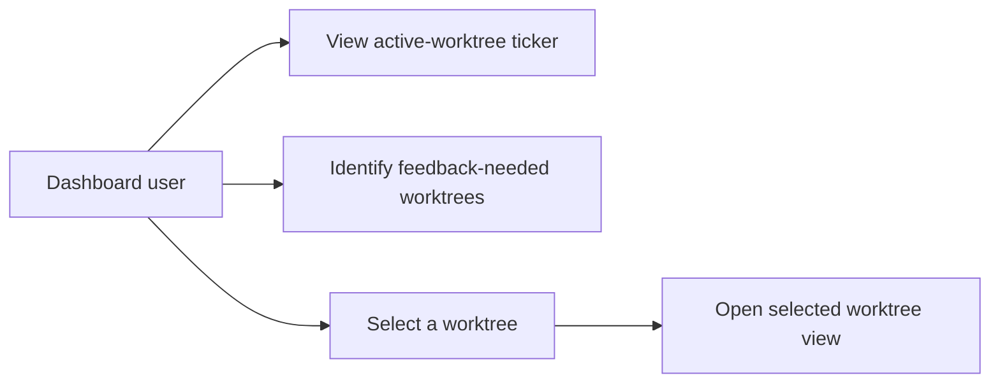
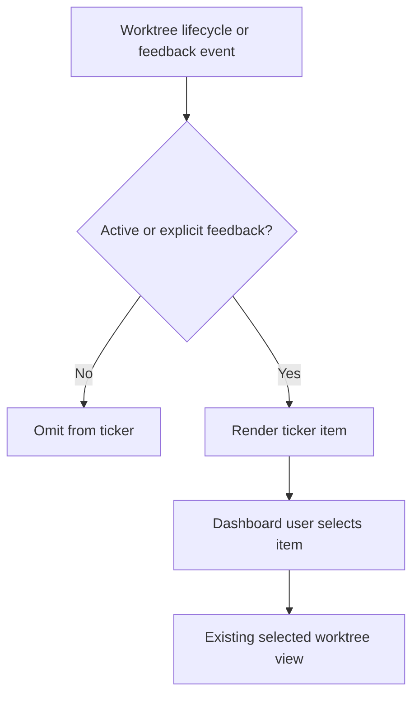
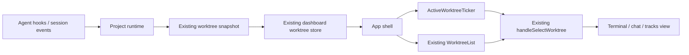
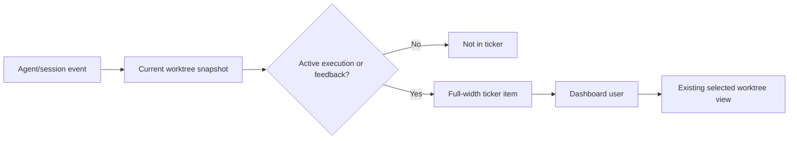
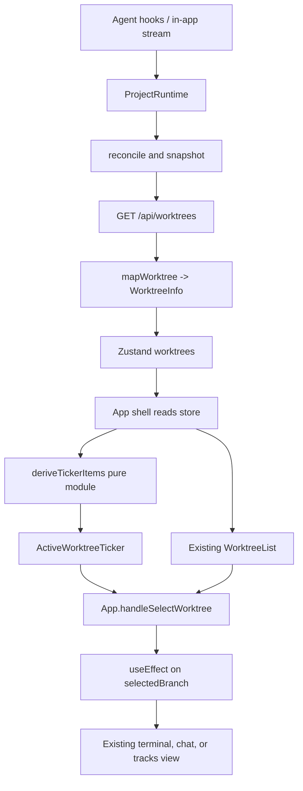
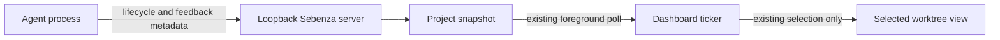
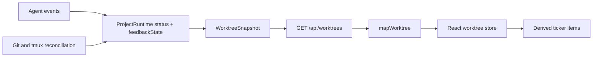
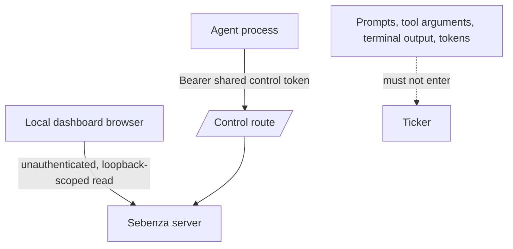

# Running Worktree Ticker — Design

## Overview

Add a full-width ticker above the dashboard workspace so the local dashboard user can see all
active worktrees at a glance and immediately identify worktrees awaiting explicit agent feedback.
Selecting an item opens the existing selected-worktree view. The ticker is a read-only navigation
surface; it does not acknowledge, answer, approve, or otherwise change agent feedback.

Success is qualitative and singular: the user should never have to open a worktree merely to
discover whether it is blocked waiting on them.

## Actors

- **Dashboard user** — the single local developer supervising worktrees.
- **Agent/session runtime** — reports execution lifecycle and explicit feedback events for a
  worktree.

## Use Cases

- View every active worktree in a full-width ticker.
- Identify active worktrees that need an explicit response or approval.
- Select a ticker item to open its existing worktree view.
- See items appear, disappear, and change priority as the normal worktree snapshot refreshes.

The following is a Mermaid flowchart approximation of a use-case diagram.

## Activity

## Component

## Architecture

### Business Architecture

The ticker is an information radiator for the single local dashboard user. It reduces context
switching by showing active execution and elevating work that cannot continue until the user
responds. It is not a lifecycle-management, assignment, notification-acknowledgement, or
multi-user feature.

**Terminology.** The serialized worktree field is `status` (there is no serialized `lifecycle`
field). `status` is the string projection of the runtime's `AgentLifecycle`. Rules below use
`status` to avoid implying a second, duplicate field.

Business rules:

- A ticker item is eligible exactly when:
  `!archived && kind != main && creation == none &&
  (status in {starting, running, awaiting_permission} || feedbackState != none)`.
  Feedback-blocked worktrees remain eligible even when no longer executing.
- The `creation == none` term is explicit rather than implied. Worktree creation is tracked by a
  separate `WorktreeCreationPhase`/`WorktreeCreationSnapshot` (`crates/common/src/domain/model.rs`),
  independent of `AgentLifecycle`, and the snapshot currently hardcodes `creation: None`
  (`crates/common/src/services/snapshot.rs`). Nothing in the data model prevents a worktree in
  creation phase `StartingSession` from also carrying `status = starting`, so "exclude
  creation-only worktrees" must be a term in the predicate, not prose.
- Listing `awaiting_permission` alongside `starting`/`running` is deliberately redundant with
  `feedbackState != none` (the two are set together — see Technical Architecture). The redundancy
  is defensive: the item stays eligible even if the two fields ever diverge.
- Exclude plain idle, stopped, error, and archived worktrees.
- Feedback means an unresolved, explicit agent/session request for a human response or approval;
  it never means generic idle, CI/PR status, errors, or unread notifications.
- Sort feedback-needed items before execution-only items, preserving snapshot order within each
  group. Use the worktree label when available and otherwise its branch.
- Selecting an item has the same behaviour as selecting it in the sidebar. It does not resolve the
  feedback state.

**Main-checkout exclusion.** `kind != main` excludes the main checkout, which the domain model
itself describes as "a real, openable session" and which can therefore run an agent and reach a
feedback-needing state. This is a deliberate, accepted blind spot for the first release: the ticker
is scoped to *worktrees* as parallel units of work, and the main checkout remains visible with its
status in the existing sidebar. If main-checkout blocking proves common in practice, relax this
term rather than adding a second surface.

**CLI/UI parity — in scope.** `feedbackState` is new information, not merely new UI, so parity is
a requirement here rather than a scoping question. `workflow.md` Guiding Principle 8 states that a
feature landing in only one surface is incomplete, and parity is a per-task quality gate. Today
`sebenza-cli worktree list` prints open/closed/archived and the agent name but not `status` at all
(`crates/sebenza-cli/src/worktree.rs`, `print_list`), even though the CLI already deserializes
`status` (`crates/sebenza-cli/src/http.rs`). This track therefore also surfaces `status` and the
feedback marker in `worktree list`, so a CLI-only supervisor sees the same feedback-needed signal
the ticker shows. Parity is genuinely satisfied, not carved out.

Decisions and risks: show only categorical state, never a question body. A worktree can be
running and need feedback; feedback styling and ordering take precedence. The exact supported
feedback sources are agent-dependent and must be truthfully represented.

**How far the success measure can be trusted.** The signal's trustworthiness is bounded by the
current shared control-token model: a compromised or misbehaving co-located agent can suppress or
spoof another worktree's feedback state undetected, silently defeating the one guarantee this
feature exists to provide (Security Architecture, threat 1). This is an accepted v1 trade-off. The
reasoning is that an agent able to forge control-route events already holds broad local privilege
under the product's single-owner "your keys, your machine" trust model, so the marginal risk this
feature adds is small in context — but the ticker should not be read as an integrity-guaranteed
supervision signal until per-worktree token scoping lands.

### Application Architecture

Implement an `ActiveWorktreeTicker` in the App shell, above the sidebar/main workspace. **This
requires restructuring the root layout, not just prepending a sibling.** The current root is a
single flat flex row (`frontend/src/App.tsx`, `
`) with `<aside>`
and `<main>` as direct siblings; there is no existing outer vertical wrapper. A new `flex-col`
wrapper must be introduced around the current row, with the ticker as its first child. Scope and
estimate this as a layout change to the root shell.

The ticker receives derived worktree items, `selectedBranch`, and the existing
`handleSelectWorktree` callback as props. `App` remains the mediator that reads the Zustand store
and passes props down — matching how `WorktreeList` already works (a pure presentational component
fed `notifiedBranches`/`rows`/`onselect`). The ticker must **not** subscribe to the store
independently; that would duplicate the established pattern and add a second render-triggering
subscription.

Reusing `handleSelectWorktree` preserves selection persistence (`selectBranch` →
`saveSelectedWorktree`), filter reveal (`revealWorktreeInFilters`), unread clearing, and
mobile-sidebar closing — all inline in that callback. **Terminal-view reset is preserved
indirectly:** it is not in the callback but in a separate `useEffect` keyed on `selectedBranch`
that calls `setViewMode("terminal")`. The ticker depends on that indirection, so a future refactor
of that effect is a break-point for this feature; the dependency is recorded here and covered by
test.

Put eligibility and ordering in a **pure, separately testable derivation module** (e.g.
`deriveTickerItems.ts`) rather than inline in the component, keeping `ActiveWorktreeTicker`
presentation-only — consistent with how `revealWorktreeInFilters` sits alongside
`handleSelectWorktree`.

The feature reuses the existing `/api/worktrees` snapshot, Zustand `worktrees` state, and
foreground five-second poll, and introduces no route, independent poll, per-worktree conversation
fetch, or browser persistence. **The frontend mapping layer is not pass-through and must be
extended:** `mapWorktree` (`frontend/src/lib/api.ts`) explicitly picks named fields rather than
spreading the snapshot, so a `feedbackState` added only to the Zod contract and the Rust backend
would be silently dropped. Both `mapWorktree` and the `WorktreeInfo` type
(`frontend/src/lib/types.ts`) must carry the new field through.

Render nothing when no worktree qualifies. The ticker is a labelled semantic navigation region
containing buttons; selected state, feedback kind, and label must be available to assistive
technology. Use horizontal scrolling or a bounded overflow affordance, not marquee animation.

Test coverage:

- Frontend derivation: eligibility (including the `creation` and `main` exclusions), feedback-first
  ordering, label-else-branch, selected item.
- Frontend interaction: ticker renders nothing when empty; click invokes selection.
- App level: ticker selection produces the same result as sidebar selection, **including the
  terminal-view reset** that flows through the `selectedBranch` effect.
- Rust: unit test for the corrected `apply_event` match arm, asserting `awaiting_permission`
  yields `AgentLifecycle::AwaitingPermission` **and** `feedbackState = permission_request`, and
  that `AgentStopped`/`RuntimeError` reset `feedbackState` to `none`.

### Technical Architecture

This is primarily a frontend presentation feature backed by a small typed runtime/snapshot
extension. `ProjectRuntime` owns current lifecycle and a minimal provider-neutral
`feedbackState`: `none`, `permission_request`, or `user_question`. The snapshot/API contract
carries that category to the UI; the frontend derives the ticker from `status` and `feedbackState`.

**Remaining work is narrower than it first appears.** `AgentLifecycle::AwaitingPermission`
already exists (`crates/common/src/domain/model.rs`), `awaiting_permission` is already accepted as
a valid lifecycle string (`crates/common/src/domain/events.rs`), snapshot serialization already
maps it (`crates/common/src/services/snapshot.rs`), and `oneshot_watcher_service.rs` already has a
tested branch treating it as non-terminal (resets the idle timer rather than auto-closing) — today
dead code. The only missing wire is a single match arm in `ProjectRuntime::apply_event`
(`crates/common/src/services/project_runtime.rs`), which currently lets `awaiting_permission` fall
through to `_ => AgentLifecycle::Stopped`. Fixing it activates existing correct behaviour rather
than risking a oneshot-watcher regression.

**Why a separate field rather than deriving from `status`.** For permission requests, `status`
alone would nearly suffice. It does not generalise: an agent asking a free-text question is still
`running`, so `AgentLifecycle` has no representation for `user_question`. A single field the ticker
reads is therefore clearer than making the ticker union two orthogonal concepts. To prevent drift,
**the same `apply_event` match arm sets both `lifecycle` and `feedback_state` atomically** — they
are never written from separate code paths.

**Set/clear semantics, stated to match the mechanism that actually exists.**
`RuntimeEvent::AgentStatusChanged` carries only `worktree_id`, `branch`, and a bare `lifecycle`
string (`crates/common/src/domain/events.rs`) — there is no correlation id or explicit clear
signal. For opencode, `permission.replied` emits `status-changed lifecycle="running"`, byte
identical in shape to the `running` emitted by session creation and `tool.execute.before`. So:

- `feedbackState` is **set** by the event that reports the request (`awaiting_permission` →
  `permission_request`; a server-side question event/projection → `user_question`). It is never
  set by client-side transcript scraping.
- `feedbackState` is **cleared** by any subsequent lifecycle-changing runtime event for that
  worktree — including `running`. This is sound for opencode because the observed ordering is
  `tool.execute.before` (running) → `permission.asked` (awaiting_permission) → `permission.replied`
  (running): a genuinely blocked agent does not emit progress while blocked.
- `AgentStopped` and `RuntimeError` **unconditionally** reset `feedbackState` to `none`. Without
  this, an agent that dies while `feedbackState = user_question` would leave the ticker advertising
  "needs feedback" for a dead session forever. Note that today's `AgentStopped`/`RuntimeError` arms
  touch only `lifecycle`/`last_error`, so this reset is a required addition, not existing behaviour.

*Residual risk:* clearing on the next lifecycle event is a heuristic, not a confirmed correlation.
The premise that a blocked agent emits no progress while blocked is a claim about each agent's
execution model, not something Sebenza's own code can guarantee. The concrete case to test is
concurrent tool calls within a single turn: if an agent fires `tool.execute.before` for a second
tool while the first still awaits permission, the resulting `running` event clears a request that
is genuinely still pending and the ticker under-reports. This same clear-on-any-event semantic is
also what makes Security Architecture threat 1 cheap to exploit — suppressing a genuine block
requires only an ordinary `running` event, not a crafted one. The durable fix for both is an
explicit correlation/resolution field on `RuntimeEvent`; see Open Questions.

**First release sets `permission_request` only.** The enum ships with all three variants so the
contract is stable, but `user_question` is **reserved and never set** in this track. No built-in
adapter (`claude_cli`, `codex_session_log`, opencode, `agent_runtime` hooks) currently emits
anything shaped like "the agent asked a free-text question awaiting a human answer", so setting it
would be unverifiable. Adapter work to observe questions is a separate future track; the ticker
must render an unexpected `user_question` correctly if it ever appears, but nothing in this track
produces one.

Emit structured, **content-free** tracing on every `feedbackState` transition (timestamp,
`worktree_id`, event kind, old → new state) — never prompt, tool, or terminal content. The
runtime-event path currently has zero tracing calls of any kind.

No deployment or service change is needed, and no new CLI *operation* — but `sebenza-cli worktree
list` gains `status` and the feedback marker in its output to satisfy parity. Existing polling means the ticker is
eventually consistent; it does not require a new live channel. Because the SPA is embedded into
`sebenza-server` via `rust-embed`, the frontend must be built **before** the backend so the new
`feedbackState` field is present in the embedded bundle.

### Data Architecture

The project-scoped worktree snapshot remains the read model and `ProjectRuntime` remains the
source of truth for current lifecycle/feedback state. Reconciliation continues to own git, tmux,
service, and PR fields and never overwrites the agent sub-state. No ticker entity, endpoint,
database record, local-storage key, or acknowledgement record is introduced.

**Classification.** The ticker may expose only branch/label, selected identity, `status`, and the
categorical feedback kind. This is operational metadata that may incidentally contain project or
personal information; it is not intended PHI/PII. Do not include question text, prompts, tool
inputs/outputs, terminal content, filesystem paths, session IDs, or tokens. The exclusion is
partly structurally enforced rather than merely asserted: `RuntimeEvent` has no field able to
carry such content, and `reported_session_id` is `#[serde(skip)]` on `WorktreeSnapshot`, so it
cannot reach the wire. Keep it that way — adding a free-text field to either type would break the
classification claim.

**Lifecycle and known limitations.** State is in-memory only; `ProjectRuntime` is rebuilt empty on
every server start and reconciliation never repopulates agent state from tmux or session content.
Two consequences, both named rather than assumed away:

- *No false retention.* After a restart, feedback is absent until fresh observable events
  reconstruct it.
- *But real false absence.* A worktree genuinely blocked mid-request when the server restarts
  will not re-emit a status event — by definition, it is waiting on the human. It silently
  disappears from the ticker with no path back. This directly undercuts the feature's core value
  for the restart case and is an accepted first-release limitation; a best-effort reconcile-time
  re-derivation is recorded in Open Questions.

### Security Architecture

The dashboard remains a local, single-user interface: the server binds loopback
(`127.0.0.1:5111`) by default with `--host`/`$SEBENZA_HOST` as an explicit opt-out that warns at
startup. `POST /api/runtime/events` is the only bearer-token-protected route; `GET /api/worktrees`
is **unauthenticated**, gated only by project-prefix lookup. The ticker is a browser read model
and must never receive an agent control token or itself approve/reject a request — enforced
architecturally, since this design adds no endpoint, mutating action, or persistence, and ticker
selection reuses only the existing `handleSelectWorktree` callback.

**Threat model (STRIDE, new data flow):**

| # | Threat | Sev | Position |
|---|---|---|---|
| 1 | **Spoofing / Tampering — cross-worktree feedback forgery.** The control token is a single machine-wide secret (`~/.config/sebenza/control-token`, mode 0600) copied into every worktree's `control.env`. `POST /api/runtime/events` checks only token equality, never that the caller is scoped to the event's `worktree_id`. A compromised agent in worktree A can forge a `permission_request` for worktree B, or send a benign `running` event to **silently clear a genuine block** on B — defeating the feature's purpose. Note that the clear-on-any-lifecycle-event semantic (Technical Architecture) makes the suppression case cheap: it needs an ordinary `running` event, not a crafted one. | **High** | **Accepted residual risk**, deferred to a separate security track. Pre-existing platform weakness, but this feature raises its impact because `feedbackState` becomes a signal the user relies on. **Follow-up scope — done when:** the control token is derived per worktree (e.g. `HMAC(machine secret, worktree_id)`) and written to that worktree's `control.env`; the server recomputes and rejects any event whose `worktree_id` does not match the presented token with 403; pre-existing shared tokens are invalidated rather than left valid alongside; the `control.env` write path in the worktree service is updated accordingly. |
| 2 | **Repudiation — undetectable spoofing.** The runtime-event path has zero tracing, not even on the 401 branch, so forged or brute-forced events leave no trace. | Medium | Partly mitigated **in this track**: content-free tracing of `feedbackState` transitions (see Technical Architecture). **Distinct deferred item** (own acceptance bar, not bundled with threat 1): control-route auth-outcome logging — done when every 401 on `/api/runtime/events` emits a structured record of timestamp, source, and event kind, carrying no payload content. |
| 3 | **Information disclosure — content leakage via the new field.** | Medium | Mitigated by construction, not by convention: `feedbackState` is a closed enum of three categories, and neither `RuntimeEvent` nor `WorktreeSnapshot` gains a free-text field, so there is no carrier for prompt, tool, or terminal content on this path. Severity would return to Medium the moment a free-text field is added to either type. |
| 4 | **Elevation via XSS in branch/label.** | Low | Mitigated: branch and label render as React text (as `WorktreeList` already does), never `dangerouslySetInnerHTML`. Treat both as untrusted local metadata; use existing typed callbacks rather than constructing links or selectors from a branch. |
| 5 | **Clickjacking / framing.** No `X-Frame-Options` or CSP `frame-ancestors` is set anywhere; the router has no middleware layers. A ticker click is selection-only and low impact, but the same unauthenticated surface includes mutating routes. | Low | Not introduced here; named so the non-loopback caveat is concrete rather than generic. |
| 6 | **Incidental sensitive identifiers in branch/label** now surfaced more prominently than in the sidebar (e.g. a branch name containing a record identifier). | Low | Residual, no code change; noted because the surface is more visible. |

Use colour **plus** accessible text for feedback state. A ticker click is a local selection only.
This does not make non-loopback deployments multi-user safe: every route except the control route
is unauthenticated, including the terminal PTY WebSocket. The existing server exposure warning
still applies, unchanged by this feature.

## Impact Analysis

- **Frontend:** new `flex-col` wrapper around the root shell layout; a new ticker
  component/style; a pure `deriveTickerItems` module; tests.
- **Contract:** typed `feedbackState` in the worktree snapshot Zod schema, **plus** `mapWorktree`
  and the `WorktreeInfo` type — the mapping layer whitelists fields and will otherwise drop it.
- **Backend:** `feedback_state` on the runtime agent sub-state; one `apply_event` match arm setting
  `lifecycle` and `feedback_state` atomically for `awaiting_permission`; explicit resets on
  `AgentStopped`/`RuntimeError`; snapshot mapping; content-free tracing on transitions.
- **Agent adapters:** define reliable set/clear signals per provider. Unsupported signals remain
  `none`; never infer feedback from idle. `user_question` is deferred until an adapter can observe
  it.
- **Build order:** build the frontend before `cargo build`, since the SPA is embedded via
  `rust-embed`.
- **Operations:** no new storage, endpoint, service, or deployment topology.
- **CLI:** `sebenza-cli worktree list` renders `status` and the feedback marker, so parity holds
  (Guiding Principle 8). No new CLI operation, only new output.
- **Deferred, tracked separately — two distinct items, not one ticket:**
  1. *Per-worktree control-token scoping* (security, High). Acceptance criteria in the threat table,
     row 1.
  2. *Control-route auth-outcome logging* (security, Medium). Acceptance criteria in the threat
     table, row 2. Independent of item 1 — either can ship first.
- **Accessibility/performance:** semantic buttons with text state, horizontal overflow, no
  auto-scrolling, and negligible derived computation on an already-polled array.

## Open Questions for Refinement

**Resolved during planning (2026-07-29):** first release sets `permission_request` only, with
`user_question` reserved and never set; `starting` is displayed immediately; CLI parity is in
scope for this track. The remaining questions below are still open.

- Should `RuntimeEvent` gain an explicit correlation/resolution field so feedback clearing stops
  being a next-lifecycle-event heuristic? This is the durable fix for the under-reporting risk in
  Technical Architecture.
- Is a best-effort reconcile-time re-derivation of feedback state after server restart worth it, or
  is the false-absence limitation acceptable for the first release?
- Should the main checkout be admitted to the ticker once it is observed to block on feedback in
  practice?
- When creation snapshots stop being hardcoded to `None`, confirm the `creation == none` term still
  expresses the intended exclusion.
- Spec should fix `deriveTickerItems`'s TypeScript signature — presumably `WorktreeInfo[]` in,
  `TickerItem[]` out with a computed feedback flag and sort key, rather than filtering in place.
  The eligibility and ordering *rules* are settled; only the function shape is open.
- Spec should give `apply_event` a per-arm table for `feedback_state`, including the plain
  `starting`/`running`/`idle` arms of `AgentStatusChanged` (implicitly `none`, but better stated
  than inferred).
- Does any supported agent fire a tool-permission request concurrently with other tool activity in
  the same turn? This decides whether the clear-on-next-lifecycle-event heuristic is safe or must
  be replaced by a correlation field before `user_question` ships.

## Addendum — Cross-project visibility (2026-07-29)

Added after the per-project ticker was built, on the user's explicit decision to extend this track
rather than open a new one. Recorded here because the change skips the architect stage, so the
reasoning would otherwise exist nowhere: it alters the selection contract the rest of this design
leans on.

**Problem.** Switching projects hides the other projects' running work. The ticker reads
`GET /api/worktrees`, which is scoped to one project prefix, so it can only ever show the project
being viewed.

**Why it is reachable.** One server process already owns runtime state for every project it serves
(`ProjectManager` holds an `IndexMap<prefix, Arc<ProjectApp>>`, with `list`), and the router
already has a hub tier with no project prefix (`/api/projects`, `/api/registry`, `/api/instances`).
No new state or storage is needed — only a hub-level read.

**Ruled out.** The existing `/api/registry` portfolio aggregates each project's `tracks.json`, i.e.
Sebenza planning tracks, not live agent state. It cannot answer this.

### Decisions

1. **New hub endpoint** `GET /api/active-worktrees`, returning `{ projects: [{ prefix, name,
   worktrees: [...] }] }` built from `ProjectManager::list`. Unauthenticated, like every other
   hub route.
2. **Eligibility stays in one place.** The endpoint returns worktree snapshots; the frontend runs the
   existing `deriveTickerItems` per project and concatenates, so the predicate is not reimplemented
   server-side and cannot drift from the spec.
3. **Items gain a project identity.** `projectPrefix` and `projectName` are added, and item keys
   become `prefix + branch` — branch alone stops being unique across projects. Foreign items display
   their project name so a branch collision is distinguishable.
4. **Ordering is feedback-first across all projects**, then grouped by project in registry order.
   A worktree waiting on the user matters more than which project it belongs to.
5. **Cross-prefix selection is a navigation, not a callback.** Selecting a worktree in the current
   project keeps using `handleSelectWorktree`; selecting one in another project performs
   `window.location.assign('/<prefix>/')`, matching `ProjectSwitcher`. It cannot be client-side:
   `activePrefix` and `apiBase` are derived from `window.location.pathname` at module load, so a
   client-side route change would leave every API call pointed at the old project.
6. **No new timer.** The hub fetch folds into the existing foreground poll cycle. This is a
   deliberate, narrow relaxation of the original "no independent poll" constraint — cross-project
   data provably cannot come from a project-scoped snapshot — but it must not become a second
   interval.
7. **CLI parity** (Guiding Principle 8) requires the same cross-project view from
   `sebenza-cli list --all-projects`.

### Limitations, named rather than discovered later

- **Only loaded projects appear.** Projects are initialized lazily, so a registered project this
  server has not touched since starting holds no runtime state and contributes nothing. This is the
  same in-memory limitation as the restart false-absence case above, widened to project scope.
- **One server instance only.** With multiple instances (`/api/instances`), a server cannot see
  another's runtime state without a network hop. Out of scope.
- **Information disclosure is widened, though not to a new class.** Any client on the port can
  already enumerate every project's path and tracks via `/api/registry`; this adds branch and label
  names across projects to that surface. It does not change the loopback-by-default posture, and the
  accepted control-token threat (row 1) is unaffected.
