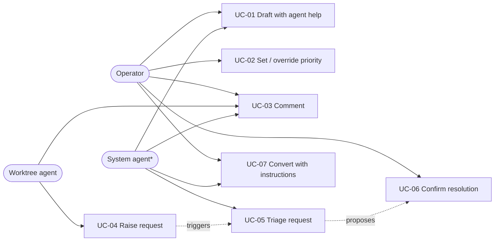
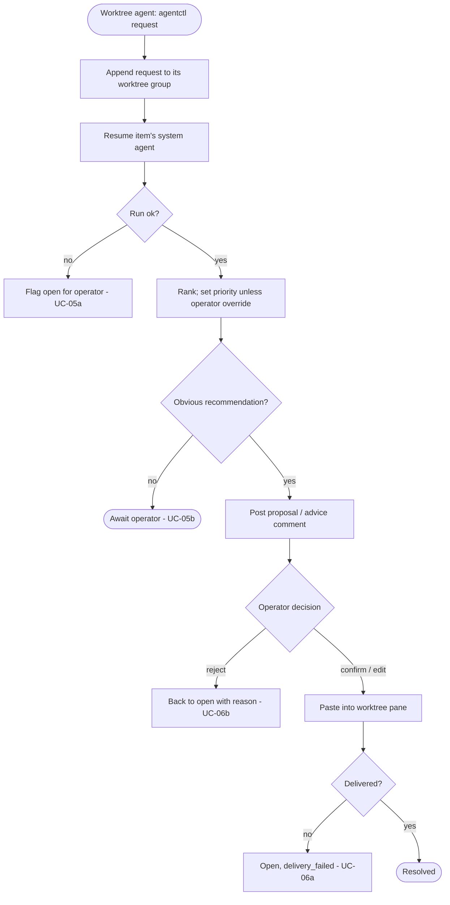
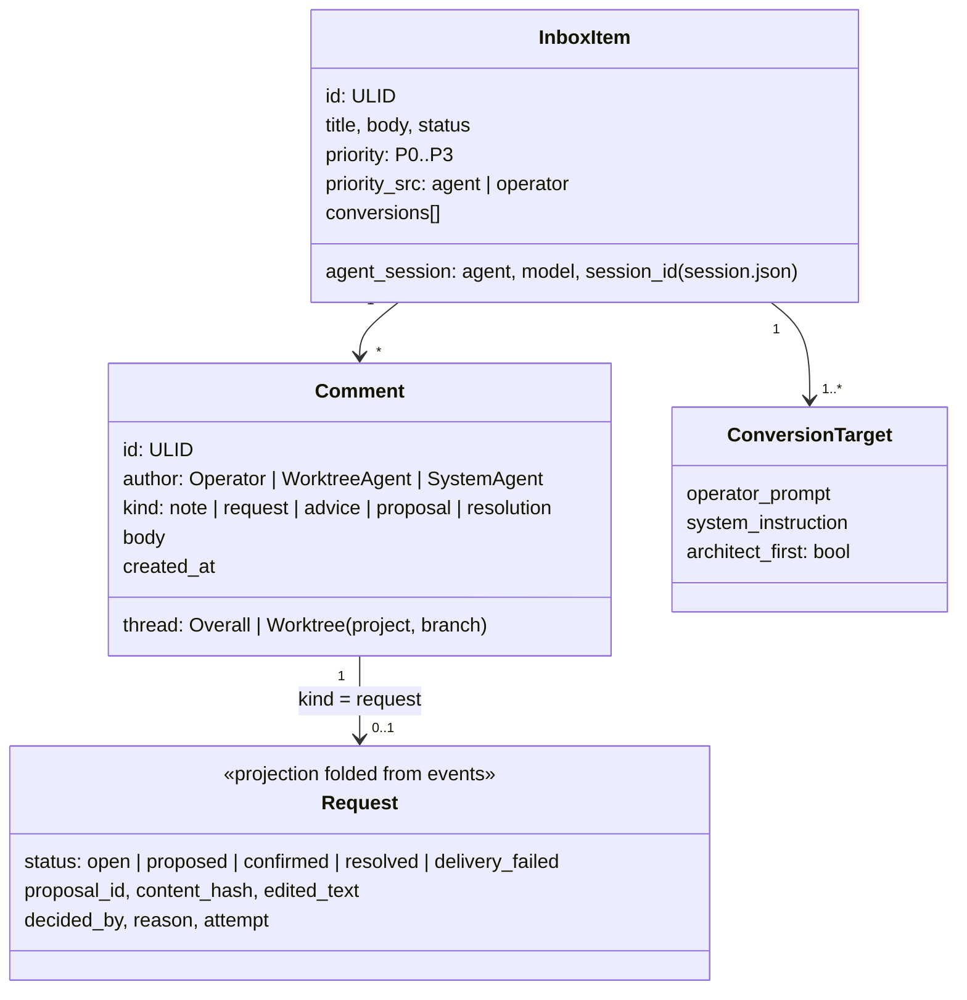
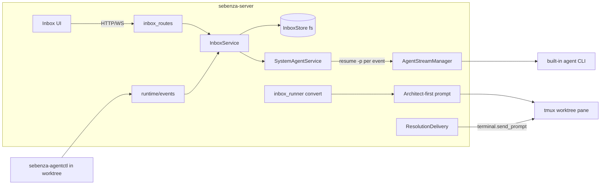
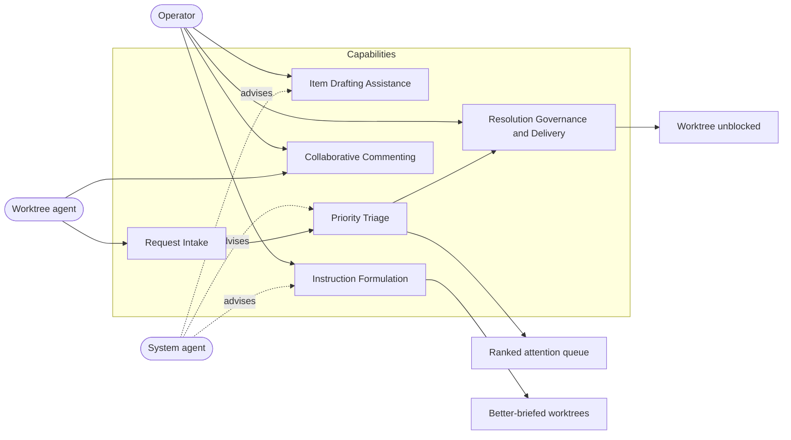
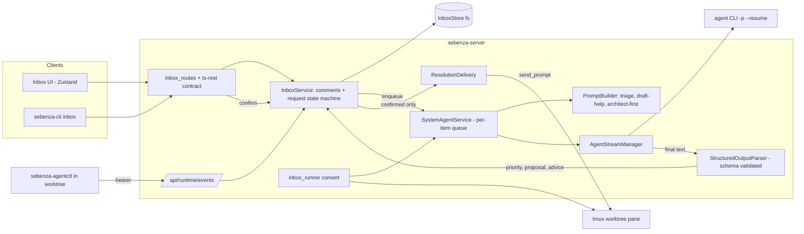
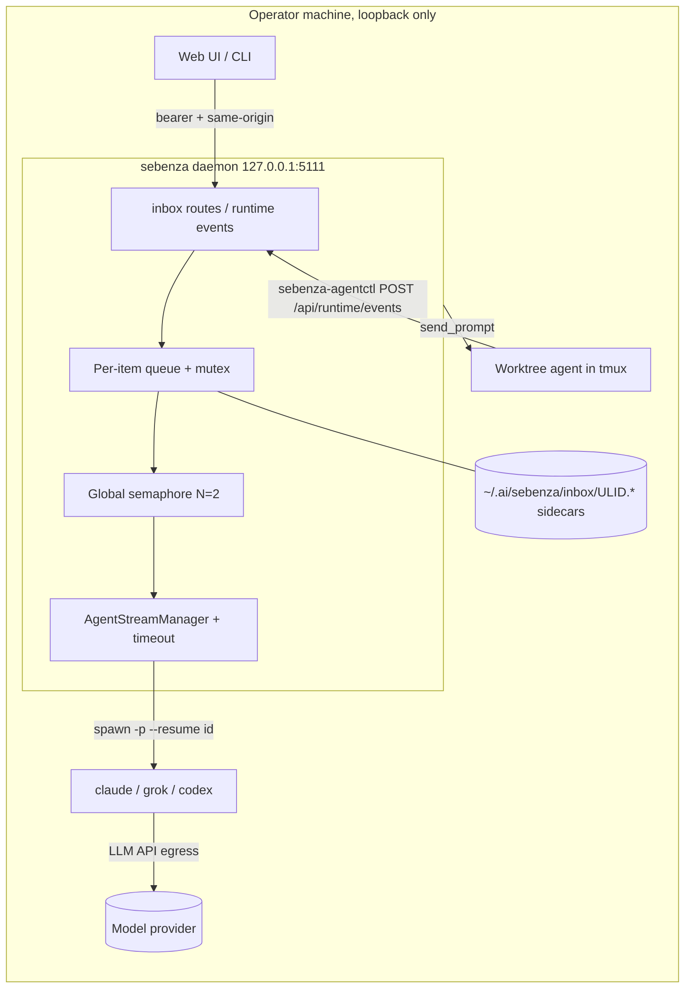
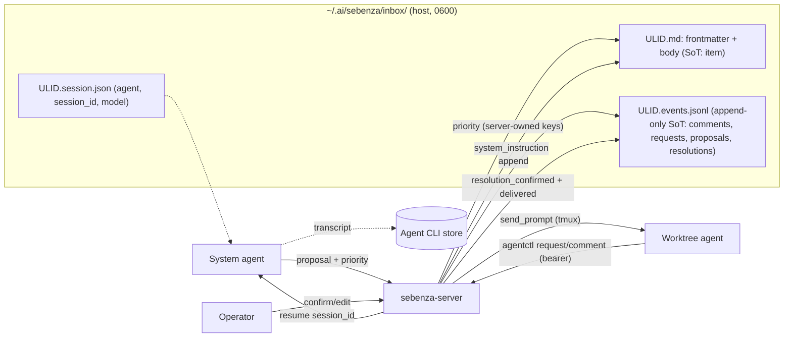
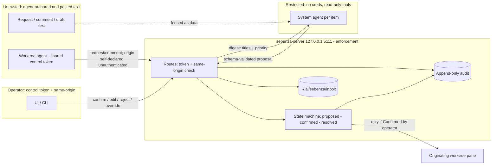

# Design: Sebenza 2.0 — System Agent & Inbox Collaboration

## Overview
Every inbox item gets its own **system agent**: a resumable headless session on a built-in agent CLI, mirroring one agent per worktree. It helps draft the item and triages requests that worktree agents raise against their origin item. Triage sets the item's priority and proposes a resolution or advice. **A human confirms every resolution** before it reaches a worktree — a workflow convention, not yet enforced against worktree agents (T-01). Items gain `P0`–`P3` priority and comments grouped per worktree plus an overall thread. On conversion, the agent formulates each worktree's instruction and launches it architect-first. Extends [inbox_20260914](../inbox_20260914/design.md).

## Actors
- **Operator** — authors items, sets priority, comments, confirms or rejects resolutions, converts.
- **Worktree agent** — raises requests and comments through `sebenza-agentctl`.
- **System agent** *(system actor)* — one resumable headless session per item; drafts, triages, advises, formulates instructions; never delivers unconfirmed.

## Use Cases
- **UC-01 Draft with agent help** — the agent proposes an edit; the operator accepts it into the draft.
  - **UC-01a** Stale hash on save → operator merges.
- **UC-02 Set / override priority** — `P0`–`P3`; an override is sticky (BR-02).
- **UC-03 Comment** — any actor, in a worktree group or the overall thread.
- **UC-04 Raise request** — a worktree agent files it against its origin item; it opens in that worktree's group.
- **UC-05 Triage request** — the item's agent ranks it against an open-item digest, sets priority, and proposes a resolution or advice.
  - **UC-05a** Run fails or times out → open and flagged. **UC-05b** No obvious recommendation → priority only.
- **UC-06 Confirm resolution** — the operator confirms (optionally edits); the resolution is pasted into the worktree pane and resolved.
  - **UC-06a** Worktree gone → `delivery_failed`; operator may redeliver. **UC-06b** Rejected with reason → open.
  - **UC-06c** No proposal → operator authors the resolution directly; same confirm path.
- **UC-07 Convert with formulated instructions** — the agent drafts per-target instructions from the item and comments; the operator edits them; each worktree starts the Sebenza architect with the item description, operator instruction, and system instruction.
  - **UC-07a** Agent unavailable → item note + operator prompt, still architect-first when applicable. **UC-07b** Architect not applicable → direct instruction.

## Activity
Request → triage → confirm (UC-04, UC-05, UC-06).

## Class

## Component

## Architecture

### Business Architecture
Turns the inbox from capture-and-launch into **triage and coordination** for one operator supervising many worktrees. Today a blocked worktree agent has no governed path back, and the operator has no ranked view of what needs attention. The operator is accountable for every decision; the system agent advises with no authority. Value: less context-switching, one attention order, and better-briefed worktrees.

| Rule | Statement |
|---|---|
| BR-01 | Nothing is delivered without a confirm recorded as `actor: operator`; the agent only proposes. Worktree agents holding the shared token are an accepted exception (T-01) |
| BR-02 | An operator priority override is sticky; the agent writes priority only when `priority_src` ≠ operator |
| BR-03 | Inbox order is priority (`P0`–`P3`, default `P2`), then created date |
| BR-04 | A request belongs to exactly one origin item and one worktree group |
| BR-05 | Reject → open with reason; failed triage or delivery → open and flagged; nothing silently dropped |
| BR-06 | The operator may edit every conversion instruction; conversion works without the agent |
| BR-07 | Advice is a comment only and is never delivered to a worktree; only resolutions are delivered |
| BR-08 | Inbox content must not contain PHI; the UI warns and the scan flags likely PHI/PII |

**Decisions**
- BD-1: One agent per item keeps triage context scoped and resolutions attributable.
- BD-2: Mandatory confirmation keeps the operator accountable for what reaches a worktree.
- BD-3: Comment groups mirror how operators think about parallel work.

**Risks**
- BR-R1: Rubber-stamped confirmations — show the diff; measure unedited-accept rate and time-to-resolution from events.
- BR-R2: Priority churn or `P0` inflation erodes trust in the queue.
- BR-R4: Per-item sessions add model cost with no usage visibility.

### Application Architecture
`SystemAgentService` owns one resumable session per item behind a **per-item FIFO queue**, which is required because `start_run` rejects a second active turn (`agent_stream.rs:137`). Each job resumes the session, awaits the final message, and validates it against a schema. A failure is flagged (UC-05a) and never blocks the queue. `InboxService` is the only writer of comments and requests and owns the request state machine. `ResolutionDelivery` wraps `terminal.send_prompt` and is reachable only from confirm. `ArchitectFirstPromptBuilder` is a pure function in `inbox_convert`.

| Interface | Purpose |
|---|---|
| `PATCH /api/inbox/:id/priority {priority\|null}` | Operator sets or clears the override |
| `GET/POST /api/inbox/:id/comments` | Grouped list (overall + per project/branch); operator comment |
| `POST /api/inbox/:id/agent/draft-help` → job | Proposed edit; applied only through the existing hash-gated PUT |
| `POST /api/inbox/:id/requests/:rid/confirm {body?, content_hash}` / `reject {reason}` / `redeliver` / `retry-triage` | UC-06, UC-06a/c, UC-05a |
| `GET /api/inbox/:id/agent/jobs/:jobId` + WS `inbox.job` event | Job status and result for draft-help, triage, convert |
| `POST /api/inbox/:id/convert/instructions` | System instruction per target, for dialog review |
| `POST /api/runtime/events` kinds `inbox.request` / `inbox.comment` | `sebenza-agentctl request\|comment` ingress |
| `sebenza-cli inbox priority\|comment\|requests confirm\|reject\|agent draft-help` | CLI parity |

| State | Event appended | Next |
|---|---|---|
| open | `request_opened`, `rejected {reason}`, `triage_failed` | proposed (proposal) or confirmed (operator-authored, UC-06c) |
| proposed | `proposal {proposal_id}` | confirmed or open (reject) |
| confirmed | `resolution_confirmed {content_hash, edited_text, actor}` | resolved or delivery_failed |
| resolved | `delivered {attempt}` | — |
| delivery_failed | `delivery_failed {attempt, error}` | confirmed (redeliver) |

Agent output (`schema_version: 1`, by `job_kind`, unknown fields rejected): `triage {priority, rationale, recommendation: none|advice|proposal, body?}` · `draft_help {proposed_body, summary}` · `convert {targets: [{project, system_instruction}]}`.

**Decisions**
- AA-D1: Serialize per item in `SystemAgentService`; extend `AgentStreamManager` only to return the final message and session id.
- AA-D2: The agent returns validated JSON and the server applies every mutation.
- AA-D3: `ResolutionDelivery` is called only by `InboxService` after `resolution_confirmed`; idempotent on `(request_id, attempt)`.
- AA-D4: Worktree ingress reuses `/api/runtime/events` with `inbox-origin.json`.

**Risks**
- AA-R1: Extending chat-oriented `AgentStreamManager` may regress in-app chat.
- AA-R2: A tmux paste has no ack, so "resolved" means "sent".
- AA-R3: Coupling growth in `InboxService`.

### Technical Architecture
No new process: each event spawns a short-lived headless child in the loopback daemon, resuming the item's `session_id` from an empty per-item cwd. Verified: claude and grok resume with `-r <id>`, codex with `exec resume <id> --json`; opencode has no headless provider (config error). `start_run` today lacks a concurrency cap, a timeout, an atomic active-run check, and `--model`. Added: semaphore (default 2), 120 s timeout, restart recovery, config `systemAgent { enabled, agent, model, maxConcurrent, timeoutSecs }`.

**Decisions**
- TD-1: Wrap `AgentStreamManager` with a mutex, semaphore, and timeout rather than add a runtime.
- TD-2: On restart, re-enqueue open, unproposed requests from the event fold, deduped on `(request_id, job_kind, attempt)` through the same mutex and semaphore.
- TD-3: A missing or expired session re-seeds from the item plus its last N comments.
- TD-4: Model flag per CLI; unset uses the CLI default.
- TD-5: Interactive jobs (draft-help, convert) take priority over triage; target p95 triage < 5 min.
- TD-6: `systemAgent.enabled` kill switch; timeout kills the process group; child env is an allowlist without `SEBENZA_CONTROL_TOKEN`; metrics for queue depth, timeouts, duration per item.

**Risks**
- TA-R1: Request storms drive spend — cap queue depth and coalesce per item.
- TA-R2: The check-then-insert race double-spawns unless the mutex wraps both.
- TA-R3: Resumed sessions grow without bound — turn cap plus re-seed.
- TA-R4: Resume flags and stream schemas drift across CLI versions — per-agent contract test.

### Data Architecture
The draft `.md` stays the source of truth for the item and gains `priority` and `priority_source`. Store writes are unlocked whole-file rewrites (only `save_body` is hash-gated), so agent and worktree traffic goes to an append-only sidecar `<ULID>.events.jsonl` of immutable events (`comment`, `request_opened`, `proposal`, `rejected`, `resolution_confirmed`, `delivered`, `delivery_failed`, `priority_changed {from, to, source}`, `redacted {target_event_id}`). Request state is a fold over those events. `<ULID>.session.json` holds `{agent, model, session_id}` and is written only by the server. Transcripts stay in the agent CLI store. The audit trail is this event log plus metadata-only `tracing` records; no separate audit store. Lineage chains `request_id → proposal_id → confirmation (edited text kept) → delivery` via `parent_event_id`.

| Data | Class | PHI/PII? | Notes |
|---|---|---|---|
| Frontmatter (title, project, status, timestamps) | Internal | No | Project name may identify a customer |
| `priority`, `priority_source` | Internal | No | Operator value wins |
| Draft body | Confidential, may hold secrets | Prohibited (BR-08) | Secret scan on convert, extended to comments |
| Comments, requests, proposals, resolutions | Confidential, may hold secrets | Prohibited (BR-08) | Immutable; scan warns; operator-initiated `redacted` tombstone masks the body; resolution pasted into tmux |
| `session.json` | Internal, sensitive | No | `session_id` is a capability to resume a transcript |
| Agent transcript | Confidential, likely secrets | Possible | Outside Sebenza's control |
| `system_instruction` | Confidential | Possible | Derived from item + comments; operator-edited |
| Audit records (events + tracing) | Internal | No | Ids and actions, never content |
| `inbox-origin.json`, triage digest | Internal | No | Digest sends titles to the provider; titles may name customers |

**Decisions**
- DD-1: The JSONL sidecar avoids lost updates and leaves the body-hash 409 intact.
- DD-2: The server owns `priority` and `priority_source` as a new author class.
- DD-3: `schema_version` 2 is additive, with a `#[serde(flatten)]` catch-all; writes to newer versions are refused.
- DD-4: Drop keeps the sidecars; Delete removes them before the `.md`; a startup sweep clears orphans.
- DD-5: Server-issued ids; `delivered` is recorded only after `send_prompt` returns.

**Risks**
- DA-R1: Priority writes race editor saves — per-draft mutex plus a hash check.
- DA-R2: Interleaved JSONL appends — single writer, `O_APPEND`, tolerant reader.
- DA-R3: Orphaned transcripts outside Sebenza's control.
- DA-R4: Secrets spread into comments and tmux scrollback — the scan warns only (operator decision); the operator can redact by hand with a tombstone.

### Security Architecture
**Verified:** the one control token guarding mutating inbox routes is exported into every worktree pane (`fs.rs:479`), so worktree agents hold operator credentials. **Operator decision (2026-09-30):** confirmation is a convention for now; scoped tokens are deferred (T-01).

- **Operator:** control token + same-origin.
- **Worktree agent:** the same token via `sebenza-agentctl`; origin item self-declared via `inbox-origin.json`.
- **System agent:** env allowlist without the token, empty cwd, read-only argv built by the server, never yolo.

Delivery requires `confirmed` + content hash, with no auto-confirm path. Audit cannot tell a worktree agent from the operator; `agentctl` adds an unauthenticated `caller: worktree` marker. Untrusted text is fenced as data, shown verbatim, escape-stripped before paste, and delivered only to its origin.

| ID | Threat | STRIDE | Mitigation | Sev |
|---|---|---|---|---|
| T-01 | Worktree agent uses the global token to confirm, prioritise, or convert | E | **Accepted residual (convention).** `agentctl` has no confirm, priority, or convert command; unauthenticated `caller` marker only; scoped tokens deferred. Blast radius includes convert and priority | Critical |
| T-02 | Resolution delivered without human review | E | State machine requires `confirmed` + content hash; no auto-confirm; system agent has no token. Residual bounded by T-01 | Critical |
| T-03 | Injected request text steers a proposal pasted into a terminal (confused deputy) | T | Verbatim confirm view; fenced prompts; no acting tools (the verbatim view is bounded by T-01); length cap; strip escape/tmux key syntax; origin worktree only | High |
| T-04 | System agent with tools or yolo exfiltrates or executes | E | Server-built read-only argv, empty cwd, env allowlist without the control token, never yolo | High |
| T-05 | Worktree agent reads or comments on other items | I | Residual with T-01; digest is titles and priority only | High |
| T-06 | Spoofed worktree identity or origin item | S | Residual with T-01; server cross-checks the claimed worktree path against `conversions[]` (payload-declared, not authenticated) | High |
| T-07 | Secrets in comments or transcripts replayed to models | I | Secret scan **warns** (badge) on comments, requests, proposals; manual redaction; 0600 files; titles-only digest. Residual: flagged text still reaches the model and the pane if confirmed | High |
| T-08 | Unattributable decisions | R | Metadata-only append-only audit of every proposal, priority change, confirm, reject, and delivery; agent-vs-operator attribution not possible under T-01 | Medium |
| T-09 | Request floods exhaust budget | D | Rate limits, queue depth cap, body caps, timeout, dedupe | Medium |
| T-10 | DNS rebinding or cross-site calls to confirm | S | Bearer + same-origin on all new routes; Host allowlist | Medium |
| T-11 | Delivery into a stale or wrong pane | T | Verify the pane's worktree and agent at send; else `delivery_failed` | Medium |
| T-12 | Proposal edited on disk after display (TOCTOU) | T | Confirm binds to the content hash; the server is the status source of truth | Medium |
| T-13 | Agent-authored comment renders script | T | Plain text or sanitised markdown only | Medium |

**Compliance:** PHI is prohibited in inbox content (BR-08); the UI warns and the scan flags likely PHI/PII. The scan is heuristic, so the design assumes a no-PHI environment with no provider BAA. Content is stored in local plaintext and sent to the model provider, and the UI says so. Audit is metadata-only.

**Decisions**
- SD-1: Scoped agent tokens deferred; human confirmation is an accepted convention.
- SD-2: The server still enforces `Confirmed` + content hash before any delivery.
- SD-3: The system agent is credential-less (env allowlist), read-only, and proposal-only.
- SD-4: Append-only, metadata-only audit of proposals, priority, decisions, and delivery.

**Risks**
- SA-R1: Any worktree agent can confirm its own requests with the control token — accepted until scoped tokens land.
- SA-R2: A CLI that cannot be restricted to read-only is refused as the system agent.
- SA-R3: Worktree origin is self-declared via `inbox-origin.json`, so it is not authenticated.

## Impact Analysis
- Frontmatter `schema_version` 2 (`priority`, `priority_source`); `conversions[]` gains `system_instruction`, `architect_first`.
- New `<ULID>.events.jsonl` and `<ULID>.session.json` sidecars; delete and sweep updated.
- New `SystemAgentService`; `AgentStreamManager` returns the final message and session id and passes `--model`.
- New `systemAgent` config; opencode rejected as system agent.
- `ArchitectFirstPromptBuilder` replaces the verbatim `target.prompt`; `ConvertDraftDialog` edits instructions.
- `sebenza-agentctl request|comment` on the existing control token; scoped tokens deferred to a follow-up track.
- New routes in the ts-rest contract, `api.ts`, and `sebenza-cli inbox`.
- `InboxView`: priority sort, grouped comments, request card with confirm/edit/reject.
- Audit grows from one convert line to every decision event.
- Supersedes the deleted platform_20260917 "human asks" plan; this request model is the ask model.

## Open Questions for Refinement
1. Scoped agent tokens (T-01): follow-up track, required before multi-operator or untrusted-agent use — who owns it?
2. Which CLIs qualify as system agent (read-only flag support)?
3. One model for all jobs or a cheap triage model; default concurrency, timeout, and session turn cap?
4. Test harness: codex/grok stream fixtures, pane test seam, stub-CLI path override, Rust coverage tool (test-plan OQ 1–4)?
5. Retention of comments and sessions for Dropped items?
6. Block or redact secret hits in agent comments automatically; can anyone un-redact?
7. On UC-06a with the worktree removed, offer relaunch or a new item (redeliver covers a live pane)?
8. Where are success measures (unedited-accept rate, time-to-resolution, override rate) surfaced?
9. Is a `P0` inflation indicator needed in the UI (BR-R2)?
